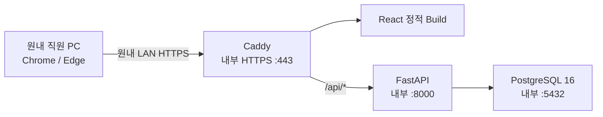

# Clinic Endoscopy Operations System

원내 내부망에서 사용하는 내시경 예약·검사·조직검사 Follow-up 운영
시스템입니다. EMR 또는 PACS를 대체하지 않으며, 현재 구현 범위는
**Phase 4 · Sprint 3B 2단계(Frontend 실제 API 연결) 진행 중**입니다. 환자 기능과
예약 조회·등록은 Frontend까지 실제 API에 연결되어 있습니다. 예약 변경·취소·
No-show·오후 예외 확인·날짜별 일정 예외 관리는 Backend API까지 구현되었고,
화면 연결이 남아 있습니다.

> 실제 환자정보를 입력하지 마세요. Patient 기능은 구현했지만 개발 PC의 Disk
> 암호화와 실제 원내 PC 운영 Gate가 끝나지 않았습니다. Test·Seed는 합성
> 환자정보만 사용합니다.

## 현재 구현 상태

### Sprint 1 완료

- React·TypeScript Frontend와 기존 Queue-First Workbench Prototype
- FastAPI Modular Monolith
- PostgreSQL 16.14과 `iam` Schema
- Alembic 초기 Migration
- 사용자, 직원 Profile, 역할, Permission, Server-side Session
- Argon2id Password Hash
- HttpOnly Cookie, CSRF, Idle·Absolute Session 만료
- 로그인 실패 누적·계정 잠금
- 최초 로그인 임시 Password 강제 변경
- Backend Permission 단위 RBAC
- 최초 Role·Permission·관리자 Seed
- Caddy 내부 HTTPS와 내부망 Subnet 제한
- Docker Compose 기반 `postgres → migrate → backend → caddy` 기동 순서

### Sprint 2 완료

- Patient 등록·검색·상세 조회·정보 정정
- 차트번호 정규화와 Database Unique 중복 차단
- 이름·생년월일·성별 중복 후보 경고
- 검진 연도나이와 일반 만나이 계산 Domain Service
- 나이 비저장, 화면의 나이 옆 `남/여` 표시
- 연락처·특이사항 PostgreSQL `pgcrypto` 암호화 저장
- 변경 전후 값·사유·사용자를 보존하는 Patient History
- 물리 삭제 대신 비활성화·재활성화
- Backend `patient.read/create/update` Permission 검사
- 실제 API 기반 환자 검색·등록·정정 Frontend
- 합성 환자 Seed Script

### Sprint 3A Backend Core 완료

- 단일 내시경 일정 Resource
- 실제 Patient와 연결되는 Appointment·Procedure 저장
- 위 30분, 대장·동시 60분 점유시간 계산
- 월·화·목·금 09:00~12:00, 위 5건·대장 3건 Capacity
- 수·토 09:00~11:00 운영시간
- 일요일, 30분 Grid 밖, 운영 종료 초과 예약 차단
- Backend 시간충돌 재검증과 PostgreSQL Exclusion Constraint
- PostgreSQL 날짜별 Advisory Transaction Lock
- 예약 생성 History와 Schedule Policy Version 보존
- 가능 Slot, 예약 등록·기간조회·상세조회 API
- 3A 이후 추가: 위·대장 동시검사 `세트60`(60분)·`세트90`(90분) 선택
- Prototype 화면: 월간·주간·일간 기간별 이동, 주간·월간·연간 통계(수면/비수면 분리)

### Sprint 3B 1단계 Backend 완료

- 날짜별 휴진·운영시간·수용량·14:00 오후 예외 허용 Rule의 등록·승인·취소와 대체 이력
- 승인 시 새 규칙과 어긋난 기존 예약 목록 반환(자동 취소·이동 없음)
- 예약 변경을 같은 예약의 Revision으로 기록(`row_version` 동시 수정 차단)
- 예약 취소·No-show 기록과 Slot·Capacity 즉시 해제
- 14:00 오후 예외 등록(사유 필수)과 등록자가 아닌 직원의 확인
- 예약별 생성·변경·취소·No-show·확인 History API
- 실제 PostgreSQL에서 Migration, 동시 예약, UTC Session Timezone 통합 Test

### Sprint 3B 2단계 Frontend 연결 진행 중

실제 API에 연결된 화면:

- 로그인 권한에 따른 메뉴, 월간·주간·일간 일정 보드
- 예약 가능 시간 조회와 예약 등록(`409 TIME_CONFLICT` 시 가능 Slot 재조회)
- 당일 위내시경 등록과 관리자가 승인하는 30분 당일 연장 슬롯
- 날짜별 휴진·운영시간·수용량·오후 예외 허용 규칙(`day-policies`)을 일정 보드와
  예약 Form의 판정 기준으로 사용

아직 합성 Fixture로 동작하는 화면:

- 오늘 화면의 우선 처리 Queue, 확인 업무, 통계, 조직검체
- 예약 변경: 실제 예약은 화면에서 변경을 막아 두었고, 변경 Form은 합성 Fixture
  예약에서만 동작합니다(저장되지 않음).
- 예약 취소·No-show·이력 조회, 오후 예외 확인, 일정 예외 관리

개발 품질 기준:

- `scripts/verify.ps1`이 Backend `ruff`·`mypy`·`pytest`와 Frontend `oxlint`·
  `tsc`(src·tests)·Test·Build를 함께 검사합니다.
- PostgreSQL 통합 Test는 Migration을 적용한 Schema와 ORM metadata의 차이도
  검사합니다.

상세 결과는 [Sprint 3B 2단계 보고서](./docs/11-sprint-3b-stage2-frontend-api-report.md)를
참고하세요.

## 전체 로드맵

| 단계 | 범위 | 상태 | 문서 |
|---|---|---|---|
| Phase 1 | 요구사항 기준선·PRD·Decision Log | 완료 | [01](./docs/01-requirements-baseline.md), [02](./docs/02-product-requirements-document.md) |
| Phase 2 | 아키텍처·Database·Scheduling Engine 설계 | 완료 | [03](./docs/03-system-architecture-database-scheduling.md) |
| Phase 3 | UI/UX Prototype 명세 | 완료 | [04](./docs/04-ui-ux-prototype-specification.md) |
| Sprint 1 | 인증·Session·CSRF·RBAC, PostgreSQL·Alembic, Caddy 내부 HTTPS, Docker Compose | 완료 | [05](./docs/05-sprint-1-implementation-report.md) |
| Sprint 2 | Patient 등록·검색·정정 History, 차트번호 중복, 나이 계산, 연락처 암호화 | 완료 | [06](./docs/06-sprint-2-entry-gate.md), [07](./docs/07-sprint-2-implementation-report.md) |
| Sprint 3A | 예약 Backend Core(점유시간·운영시간·Capacity·충돌 차단·API), 세트60/90 | 완료 | [08](./docs/08-sprint-3a-implementation-report.md) |
| **Sprint 3B** | 날짜별 Override, 14:00 오후 예외 승인, 예약 변경·취소·No-show·Revision, 일정·예약 Form 실제 API 전환, PostgreSQL 동시성 통합 Test | **진행 중** (1단계 Backend 완료, 2단계 Frontend 연결 중) | [10](./docs/10-sprint-3b-stage1-backend-report.md), [11](./docs/11-sprint-3b-stage2-frontend-api-report.md) |
| Sprint 4 | 1차·2차 이중확인, PACS 수기확인, 장정결·약제·추가검사 | 예정 | — |
| Sprint 5 | 예약금(정책 Version·거래원장), 취소, No-show, D-1 연락 | 예정 | — |
| Sprint 6 | 실제 검사 완료, Biopsy·CLO 검사대장, 병리 Follow-up·Overdue, Risk Dashboard, 통계 | 예정 | [09 병리 PDF Import 설계안](./docs/09-pathology-pdf-import-security-design.md) |
| Sprint 7 | 영구 Audit Log, Backup·Restore·월간 Restore Test, Windows 운영 Script | 예정 | — |
| 운영 Gate | 실제 서버 PC 반복 시험, 고정 IP·Hostname, 원내 PC HTTPS, 재부팅 자동기동, 디스크 암호화 | 예정 | [06](./docs/06-sprint-2-entry-gate.md) |

실제 환자정보는 Sprint 7과 운영 Gate가 모두 끝난 뒤에만 입력합니다. Design QA
기록은 [docs/qa](./docs/qa/)에 날짜·주제별로 보관합니다.

## 오랜만에 다시 시작할 때

### 원클릭 실행

Repository Root의 `Start-EndoscopyOS.cmd`를 Double-click하면 다음 작업을 자동으로
수행합니다.

1. Docker Engine 상태 확인
2. 필요하면 Docker Desktop 시작 후 준비 대기
3. `.env` 또는 합성 Preview 설정 선택
4. Image Build와 Container 기동
5. HTTPS 응답 확인
6. 기본 Browser에서 Application 열기

바탕화면 실행 아이콘이 필요하면 `Install-Desktop-Shortcut.cmd`를 최초 한 번만
실행합니다. 이후 바탕화면의 `내시경 운영 시스템`을 Double-click하면 됩니다.

종료는 `Stop-EndoscopyOS.cmd`를 사용합니다. 이 명령은 Container만 중지하며
Database Volume을 삭제하지 않습니다. 내부 CA Root 인증서 신뢰 등록은 보안상
자동화하지 않으므로 PC마다 최초 한 번만 별도로 수행합니다.

### 1. 코드만 빠르게 검증

Repository Root에서 다음 순서로 실행합니다.

한 번에 확인하려면 다음 명령만 실행하면 됩니다.

```powershell
.\scripts\verify.ps1
```

개별 명령은 다음과 같습니다.

```powershell
Push-Location backend
.\.venv\Scripts\ruff.exe check app tests
.\.venv\Scripts\mypy.exe
.\.venv\Scripts\pytest.exe -q
.\.venv\Scripts\python.exe -m pip check
Pop-Location

Push-Location frontend
npm run lint
npm run typecheck
npm run build
Pop-Location
```

실제 PostgreSQL·Backend·Browser로 예약 변경·이력·취소 흐름을 확인하는 Smoke Test는
Docker가 필요해 `verify.ps1`과 따로 실행합니다. 매번 일회용 Database Container를
만들고 끝나면 지우며, 합성 계정과 환자만 씁니다. Browser는 설치된 Google Chrome을
씁니다(`E2E_BROWSER_CHANNEL`로 변경 가능).

```powershell
.\scripts\e2e.ps1
```

`backend\.venv` 또는 `frontend\node_modules`가 없다면 아래의 개발·Test 절에
있는 최초 설치 명령부터 실행합니다. Test와 Seed에는 합성 데이터만 사용합니다.

### 2. Docker Application 다시 실행

Root의 `.env`가 이미 구성되어 있을 때 실행합니다.

```powershell
docker compose config --quiet
docker compose up -d --build
docker compose ps
```

정상 상태는 `postgres`, `backend`, `caddy`가 `healthy`이고 `migrate`가
정상 종료된 상태입니다. Browser에서는 `.env`의 `CLINIC_HOSTNAME`에 설정한
내부 HTTPS 주소로 접속합니다.

종료와 재시작은 다음 명령을 사용합니다.

```powershell
docker compose stop
docker compose start
docker compose ps
```

운영 데이터가 있는 환경에서는 Volume을 삭제하는 `docker compose down -v`를
사용하지 마세요.

## Architecture



Host에 공개되는 Port는 Caddy의 HTTPS 하나뿐입니다. FastAPI와 PostgreSQL
Port는 Docker 내부 Network에서만 사용합니다.

## 주요 Directory

```text
endoscopy-os/
├─ frontend/                  React·TypeScript UI
├─ backend/                   FastAPI·SQLAlchemy·인증·RBAC
├─ migrations/                Alembic Migration
├─ deployment/
│  ├─ caddy/                  내부 HTTPS와 보안 Header
│  ├─ postgres/               DB 계정·권한 초기화
│  └─ certificates/           공개 Root 인증서 보관 위치
├─ docker-compose.yml
├─ .env.example
└─ docs/
```

## Windows Docker 방식 실행

### 1. 사전 준비

- Windows 11
- Docker Desktop 또는 Docker Compose 호환 Runtime
- 서버 PC의 고정 내부 IP 또는 DHCP Reservation
- 내부 Hostname과 실제 원내 Subnet
- 관리자 권한 PowerShell

Docker Desktop 설치 가능 여부와 재부팅 후 자동기동은 실제 서버 PC에서
별도로 시험해야 합니다.

### 2. 환경설정 파일 만들기

Repository Root에서 실행합니다.

```powershell
Copy-Item .env.example .env
notepad .env
```

`.env`의 다음 Placeholder를 모두 서로 다른 난수로 바꿉니다.

- `POSTGRES_ADMIN_PASSWORD`
- `POSTGRES_MIGRATION_PASSWORD`
- `POSTGRES_APP_PASSWORD`
- `SESSION_SECRET`
- `FIELD_ENCRYPTION_KEY`

PowerShell에서 48-byte 난수를 만드는 예입니다.

```powershell
$bytes = New-Object byte[] 48
[Security.Cryptography.RandomNumberGenerator]::Create().GetBytes($bytes)
[Convert]::ToBase64String($bytes)
```

명령을 각 Secret마다 다시 실행해야 합니다. `.env`는 Git에 포함되지 않습니다.

다음 값도 실제 원내 환경으로 변경합니다.

- `CLINIC_HOSTNAME`
- `CLINIC_SITE_ADDRESS`
- `CLINIC_ALLOWED_HOSTS`
- `CLINIC_ALLOWED_ORIGINS`
- `CLINIC_ALLOWED_SUBNETS`
- `CADDY_ALLOWED_SUBNETS`

Backend 목록은 쉼표, Caddy 목록은 공백으로 구분합니다.

### 3. 구성 확인과 기동

```powershell
docker compose config --quiet
docker compose build
docker compose up -d
docker compose ps
```

기동 순서는 다음과 같습니다.

1. PostgreSQL Healthcheck
2. Alembic `upgrade head`
3. FastAPI Healthcheck
4. Frontend Artifact 복사
5. Caddy HTTPS 시작

상태 확인 시 `postgres`, `backend`, `caddy`가 `healthy`여야 합니다.

### 4. 최초 관리자 생성

관리자 Password를 `.env`에 장기 보관하지 않기 위해 현재 PowerShell Process에만
잠시 설정합니다.

```powershell
$env:BOOTSTRAP_ADMIN_LOGIN_ID = "clinic.admin"
$env:BOOTSTRAP_ADMIN_DISPLAY_NAME = "관리자"

$securePassword = Read-Host "최초 관리자 Password" -AsSecureString
$passwordPointer = [Runtime.InteropServices.Marshal]::SecureStringToBSTR($securePassword)

try {
    $env:BOOTSTRAP_ADMIN_PASSWORD = [Runtime.InteropServices.Marshal]::PtrToStringBSTR($passwordPointer)
    docker compose --profile tools run --rm seed-identity
}
finally {
    [Runtime.InteropServices.Marshal]::ZeroFreeBSTR($passwordPointer)
    Remove-Item Env:BOOTSTRAP_ADMIN_PASSWORD -ErrorAction SilentlyContinue
    Remove-Item Env:BOOTSTRAP_ADMIN_LOGIN_ID -ErrorAction SilentlyContinue
    Remove-Item Env:BOOTSTRAP_ADMIN_DISPLAY_NAME -ErrorAction SilentlyContinue
}
```

- Password는 12~128자여야 합니다.
- 명령은 Password 원문을 출력하지 않습니다.
- 이미 활성 관리자 계정이 있으면 추가 관리자를 자동 생성하지 않습니다.
- 최초 로그인 직후 임시 Password를 변경해야 업무 화면에 들어갈 수 있습니다.
- 추가 사용자는 관리자 로그인 후 User API를 통해 등록합니다.

개발용 합성 환자 네 명이 필요할 때만 다음 명령을 실행합니다. 운영 환자
초기입력 용도로 사용하지 않습니다.

```powershell
docker compose --profile tools run --rm seed-patients
```

주간표 테스트용 합성 예약은 합성 환자를 확인한 뒤 2026-09-01부터
2026-09-19까지 생성합니다. 같은 명령을 다시 실행해도 동일 환자·날짜·시각의
예약은 중복 생성하지 않으며, 기존 예약과 충돌하는 Seed는 덮어쓰지 않고
건너뜁니다.

```powershell
docker compose --profile tools run --rm seed-appointments
```

기본 범위가 아닌 최대 31일의 테스트 구간은 Backend 컨테이너에서
`python -m app.cli.seed_appointments --start-date YYYY-MM-DD --end-date YYYY-MM-DD`
형식으로 지정할 수 있습니다. 운영 환자나 운영 예약 초기입력에는 사용하지
않습니다.

### 5. 내부 CA 공개 인증서 배포

Caddy 최초 기동 후 공개 Root 인증서를 복사합니다.

```powershell
docker compose cp caddy:/data/caddy/pki/authorities/local/root.crt `
  .\deployment\certificates\clinic-endoscopy-root.crt
```

승인된 직원 PC의 `Local Computer > Trusted Root Certification Authorities`에
공개 Root 인증서만 설치합니다. Caddy CA Private Key가 저장된 Docker Volume은
복사하거나 공유하면 안 됩니다.

### 6. 접속

내부 DNS 또는 직원 PC의 `hosts` 설정이 끝나면 다음 주소로 접속합니다.

```text
https://<CLINIC_HOSTNAME>
```

Browser에 인증서 경고가 없어야 실제 환자정보 운영 Gate를 통과한 것입니다.

### 7. 중지와 상태 확인

```powershell
docker compose ps
docker compose logs --tail 100 backend
docker compose stop
docker compose start
```

운영 데이터가 있는 환경에서 `docker compose down -v`를 실행하면 Database
Volume을 삭제할 수 있으므로 사용하지 않습니다.

## 개발·Test

### Backend

```powershell
python -m venv backend\.venv
backend\.venv\Scripts\python.exe -m pip install -r backend\requirements-dev.txt

Push-Location backend
.\.venv\Scripts\python.exe -m pytest -q
.\.venv\Scripts\python.exe -m pip check
Pop-Location
```

Test는 합성 계정과 Memory Database만 사용합니다.

### Frontend

```powershell
Push-Location frontend
npm ci
npm run typecheck
npm test
npm run build
Pop-Location
```

Vite 개발 서버는 `/api`를 기본적으로 `http://127.0.0.1:8000`으로
Proxy합니다. 개발용 HTTP에서는 Backend의 Cookie 이름과 Secure 설정을
개발 환경으로 명시적으로 변경해야 하며, 운영은 반드시 Caddy HTTPS를 사용합니다.

### Alembic

운영 Migration은 Docker Compose의 `migrate` Service가 자동 수행합니다.
필요할 때 같은 운영 설정으로 Migration만 다시 실행하려면 Repository Root에서
다음 명령을 사용합니다.

```powershell
docker compose run --rm migrate
```

Local Python으로 Alembic을 직접 실행하려면 `DATABASE_URL` 또는
`POSTGRES_USER`·`POSTGRES_PASSWORD`를 별도로 설정해야 합니다. Runtime 계정이
아닌 Migration 전용 계정을 사용하십시오.

## API

| Method | Endpoint | 설명 |
|---|---|---|
| `POST` | `/api/auth/login` | 로그인과 Session·CSRF 발급 |
| `GET` | `/api/auth/me` | Session 확인과 CSRF Rotation |
| `POST` | `/api/auth/logout` | 현재 Session 폐기 |
| `POST` | `/api/auth/change-password` | Password 변경 |
| `GET` | `/api/users` | 사용자 목록 |
| `POST` | `/api/users` | 사용자 생성 |
| `GET` | `/api/users/roles` | 역할과 Permission 조회 |
| `GET` | `/api/users/permissions` | Permission 조회 |
| `PUT` | `/api/users/{id}/roles` | 역할 교체 |
| `PATCH` | `/api/users/{id}/activation` | 계정 활성화·비활성화 |
| `POST` | `/api/users/{id}/unlock` | 로그인 실패로 잠긴 계정 해제 |
| `GET` | `/api/patients` | 이름·차트번호·생년월일·성별 검색 |
| `POST` | `/api/patients` | 환자 등록 |
| `GET` | `/api/patients/chart-number-availability` | 차트번호 중복 사전 확인 |
| `GET` | `/api/patients/{id}` | 연락처·특이사항 포함 상세 조회 |
| `PATCH` | `/api/patients/{id}` | 사유를 포함한 환자정보 정정 |
| `GET` | `/api/patients/{id}/history` | 변경이력 조회 |
| `GET` | `/api/patients/{id}/age` | 기준일·방식별 나이 계산 |
| `PATCH` | `/api/patients/{id}/activation` | 비활성화·재활성화 |
| `GET` | `/api/appointments/availability` | 날짜별 규칙을 반영한 오전·오후 예외 가능 Slot 조회 |
| `GET` | `/api/appointments` | 기간별 실제 예약 조회(월간 6주 Grid까지 최대 42일) |
| `POST` | `/api/appointments` | 오전·14:00 오후 예외·당일 연장 슬롯 예약 생성(지난 날짜 차단) |
| `GET` | `/api/appointments/{id}` | 예약 상세 조회 |
| `GET` | `/api/appointments/{id}/history` | 예약 생성·변경·취소·No-show·확인 이력 |
| `PATCH` | `/api/appointments/{id}` | 사유와 `row_version`을 포함한 일정 변경(Revision) |
| `POST` | `/api/appointments/{id}/cancel` | 사유를 남기고 예약 취소 |
| `POST` | `/api/appointments/{id}/no-show` | 시작시각 이후 No-show 기록 |
| `POST` | `/api/appointments/{id}/confirm-exception` | 등록자가 아닌 직원의 오후 예외 확인 |
| `GET` | `/api/schedule/day-policies` | 날짜별 휴진·운영시간·수용량·오후 예외 허용 조회 |
| `GET` | `/api/schedule/overrides` | 기간별 일정 예외 Rule 조회 |
| `POST` | `/api/schedule/overrides` | 일정 예외 Rule 등록(승인 대기) |
| `POST` | `/api/schedule/overrides/{id}/approve` | 승인과 영향받는 기존 예약 목록 반환 |
| `POST` | `/api/schedule/overrides/{id}/revoke` | 사유를 남기고 Rule 취소 |
| `GET` | `/api/schedule/additional-slots` | 날짜별 승인된 당일 연장 슬롯 조회 |
| `POST` | `/api/schedule/additional-slots` | 오전 일반 Slot이 모두 찬 당일에 30분 연장 슬롯 승인 |
| `POST` | `/api/schedule/additional-slots/{id}/revoke` | 사유를 남기고 연장 슬롯 취소(예약이 연결된 슬롯은 먼저 예약 취소) |
| `GET` | `/health/live` | Process 상태 |
| `GET` | `/health/ready` | Database 포함 준비 상태 |

사용자 관리 API는 `identity.manage` Permission이 필요합니다. 상태 변경 API는
Session Cookie와 함께 `Origin`, `X-CSRF-Token`을 검증합니다.
환자 목록은 연락처·특이사항을 반환하지 않으며 상세 Endpoint에서만 복호화합니다.

## Security 주의사항

- Browser LocalStorage·SessionStorage에 Session·환자정보를 저장하지 않습니다.
- Password, Session Token, CSRF Token 원문은 Database와 Log에 저장하지 않습니다.
- 연락처·특이사항은 `FIELD_ENCRYPTION_KEY`로 암호화하며 이 Key를 잃으면
  복호화할 수 없습니다. Database Backup과 분리해 안전하게 보관해야 합니다.
- 일반 Access Log는 운영 Container에서 비활성화합니다.
- 외부 Port Forwarding, DMZ, UPnP 공개를 사용하지 않습니다.
- 실제 운영 전 Windows Firewall에서 승인된 Subnet의 TCP 443만 허용합니다.
- Caddy와 Backend Subnet 제한은 Windows Docker Desktop NAT 환경에서
  실장비 검증이 필요합니다.

## 알려진 제한사항

- 개발 PC에서 PostgreSQL·Migration·Backend·Caddy 실제 기동, HTTPS 로그인,
  최초 Password 변경, RBAC, Container 재생성 후 데이터 유지까지 통과했습니다.
- 실제 접수실 Main PC의 재부팅 후 자동기동과 다른 원내 PC 접속시험은 아직
  수행하지 않았습니다.
- 개발 PC의 Disk 암호화가 꺼져 있으므로 실제 환자정보를 입력하면 안 됩니다.
- 로그인 실패는 계정 단위 잠금과 Client IP별 제한을 함께 적용합니다. IP별
  실패 기록은 Backend Process Memory에만 있어 재시작 시 초기화됩니다.
- 사용자·역할 변경의 영구 Audit Log는 Sprint 7 범위입니다.
- 예약 변경·취소·No-show와 그 이력은 Backend에 저장되지만, 일정 화면에서
  조회·변경하는 기능은 아직 연결되지 않았습니다(Sprint 3B 2단계 남은 범위).
- PostgreSQL 통합 Test는 `TEST_POSTGRES_URL`을 지정했을 때만 실행됩니다.
  실행 방법은 [Sprint 3B 1단계 보고서](./docs/10-sprint-3b-stage1-backend-report.md)를
  참고하세요.
- Docker Desktop 자동기동, 내부 DNS, Windows Firewall, Caddy Root 인증서
  배포는 실제 서버 PC에서 승인·시험해야 합니다.

상세 결과는 다음 문서를 참고하세요.

- [Sprint 1 구현 보고서](./docs/05-sprint-1-implementation-report.md)
- [Sprint 2 진입 Gate](./docs/06-sprint-2-entry-gate.md)
- [Sprint 2 구현 보고서](./docs/07-sprint-2-implementation-report.md)
- [Sprint 3A 구현 보고서](./docs/08-sprint-3a-implementation-report.md)
- [Sprint 3B 1단계 Backend 보고서](./docs/10-sprint-3b-stage1-backend-report.md)
- [Sprint 3B 2단계 Frontend 연결 보고서](./docs/11-sprint-3b-stage2-frontend-api-report.md)
- [병리 PDF Import 보안 설계안 (Sprint 6 참고)](./docs/09-pathology-pdf-import-security-design.md)
