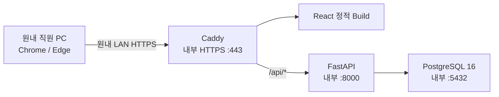

# Clinic Endoscopy Operations System

원내 내부망에서 사용하는 내시경 예약·검사·조직검사 Follow-up 운영
시스템입니다. EMR 또는 PACS를 대체하지 않으며, 현재 구현 범위는
**Phase 4 · Sprint 3A Backend Scheduling Core**까지입니다. 환자 기능은
Frontend까지 실제 API에 연결되어 있고, 예약 기능은 Backend 저장·조회 API까지
구현되었습니다. 주간 일정과 예약 Form의 실제 API 전환은 Sprint 3B 범위입니다.

> 실제 환자정보를 입력하지 마세요. Patient 기능은 구현했지만 개발 PC의 Disk
> 암호화와 실제 원내 PC 운영 Gate가 끝나지 않았습니다. Test·Seed는 합성
> 환자정보만 사용합니다.

## 현재 구현 상태

### Sprint 1 완료

- React·TypeScript Frontend와 기존 Queue-First Workbench Prototype
- FastAPI Modular Monolith
- PostgreSQL 16.14과 `iam` Schema
- Alembic 초기 Migration
- 사용자, 직원 Profile, 역할, Permission, Server-side Session
- Argon2id Password Hash
- HttpOnly Cookie, CSRF, Idle·Absolute Session 만료
- 로그인 실패 누적·계정 잠금
- 최초 로그인 임시 Password 강제 변경
- Backend Permission 단위 RBAC
- 최초 Role·Permission·관리자 Seed
- Caddy 내부 HTTPS와 내부망 Subnet 제한
- Docker Compose 기반 `postgres → migrate → backend → caddy` 기동 순서

### Sprint 2 완료

- Patient 등록·검색·상세 조회·정보 정정
- 차트번호 정규화와 Database Unique 중복 차단
- 이름·생년월일·성별 중복 후보 경고
- 검진 연도나이와 일반 만나이 계산 Domain Service
- 나이 비저장, 화면의 나이 옆 `남/여` 표시
- 연락처·특이사항 PostgreSQL `pgcrypto` 암호화 저장
- 변경 전후 값·사유·사용자를 보존하는 Patient History
- 물리 삭제 대신 비활성화·재활성화
- Backend `patient.read/create/update` Permission 검사
- 실제 API 기반 환자 검색·등록·정정 Frontend
- 합성 환자 Seed Script

### Sprint 3A Backend Core 완료

- 단일 내시경 일정 Resource
- 실제 Patient와 연결되는 Appointment·Procedure 저장
- 위 30분, 대장·동시 60분 점유시간 계산
- 월·화·목·금 09:00~12:00, 위 5건·대장 3건 Capacity
- 수·토 09:00~11:00 운영시간
- 일요일, 30분 Grid 밖, 운영 종료 초과 예약 차단
- Backend 시간충돌 재검증과 PostgreSQL Exclusion Constraint
- PostgreSQL 날짜별 Advisory Transaction Lock
- 예약 생성 History와 Schedule Policy Version 보존
- 가능 Slot, 예약 등록·기간조회·상세조회 API

### 아직 구현하지 않은 범위

- Sprint 3B: 날짜별 Override·14:00 승인 예외·예약 변경과 Frontend 실제 API 전환
- Sprint 4~6: 확인·약제·예약금·검사·조직검사·Follow-up
- Sprint 7: Audit Log, Backup·Restore, Windows 운영 Script

## 오랜만에 다시 시작할 때

### 원클릭 실행

Repository Root의 `Start-EndoscopyOS.cmd`를 Double-click하면 다음 작업을 자동으로
수행합니다.

1. Docker Engine 상태 확인
2. 필요하면 Docker Desktop 시작 후 준비 대기
3. `.env` 또는 합성 Preview 설정 선택
4. Image Build와 Container 기동
5. HTTPS 응답 확인
6. 기본 Browser에서 Application 열기

바탕화면 실행 아이콘이 필요하면 `Install-Desktop-Shortcut.cmd`를 최초 한 번만
실행합니다. 이후 바탕화면의 `내시경 운영 시스템`을 Double-click하면 됩니다.

종료는 `Stop-EndoscopyOS.cmd`를 사용합니다. 이 명령은 Container만 중지하며
Database Volume을 삭제하지 않습니다. 내부 CA Root 인증서 신뢰 등록은 보안상
자동화하지 않으므로 PC마다 최초 한 번만 별도로 수행합니다.

### 1. 코드만 빠르게 검증

Repository Root에서 다음 순서로 실행합니다.

한 번에 확인하려면 다음 명령만 실행하면 됩니다.

```powershell
.\scripts\verify.ps1
```

개별 명령은 다음과 같습니다.

```powershell
Push-Location backend
.\.venv\Scripts\pytest.exe -q
.\.venv\Scripts\python.exe -m pip check
Pop-Location

Push-Location frontend
npm run typecheck
npm run build
npm run test:sites
Pop-Location
```

`backend\.venv` 또는 `frontend\node_modules`가 없다면 아래의 개발·Test 절에
있는 최초 설치 명령부터 실행합니다. Test와 Seed에는 합성 데이터만 사용합니다.

### 2. Docker Application 다시 실행

Root의 `.env`가 이미 구성되어 있을 때 실행합니다.

```powershell
docker compose config --quiet
docker compose up -d --build
docker compose ps
```

정상 상태는 `postgres`, `backend`, `caddy`가 `healthy`이고 `migrate`가
정상 종료된 상태입니다. Browser에서는 `.env`의 `CLINIC_HOSTNAME`에 설정한
내부 HTTPS 주소로 접속합니다.

종료와 재시작은 다음 명령을 사용합니다.

```powershell
docker compose stop
docker compose start
docker compose ps
```

운영 데이터가 있는 환경에서는 Volume을 삭제하는 `docker compose down -v`를
사용하지 마세요.

## Architecture



Host에 공개되는 Port는 Caddy의 HTTPS 하나뿐입니다. FastAPI와 PostgreSQL
Port는 Docker 내부 Network에서만 사용합니다.

## 주요 Directory

```text
endoscopy-os/
├─ frontend/                  React·TypeScript UI
├─ backend/                   FastAPI·SQLAlchemy·인증·RBAC
├─ migrations/                Alembic Migration
├─ deployment/
│  ├─ caddy/                  내부 HTTPS와 보안 Header
│  ├─ postgres/               DB 계정·권한 초기화
│  └─ certificates/           공개 Root 인증서 보관 위치
├─ docker-compose.yml
├─ .env.example
└─ docs/
```

## Windows Docker 방식 실행

### 1. 사전 준비

- Windows 11
- Docker Desktop 또는 Docker Compose 호환 Runtime
- 서버 PC의 고정 내부 IP 또는 DHCP Reservation
- 내부 Hostname과 실제 원내 Subnet
- 관리자 권한 PowerShell

Docker Desktop 설치 가능 여부와 재부팅 후 자동기동은 실제 서버 PC에서
별도로 시험해야 합니다.

### 2. 환경설정 파일 만들기

Repository Root에서 실행합니다.

```powershell
Copy-Item .env.example .env
notepad .env
```

`.env`의 다음 Placeholder를 모두 서로 다른 난수로 바꿉니다.

- `POSTGRES_ADMIN_PASSWORD`
- `POSTGRES_MIGRATION_PASSWORD`
- `POSTGRES_APP_PASSWORD`
- `SESSION_SECRET`
- `FIELD_ENCRYPTION_KEY`

PowerShell에서 48-byte 난수를 만드는 예입니다.

```powershell
$bytes = New-Object byte[] 48
[Security.Cryptography.RandomNumberGenerator]::Create().GetBytes($bytes)
[Convert]::ToBase64String($bytes)
```

명령을 각 Secret마다 다시 실행해야 합니다. `.env`는 Git에 포함되지 않습니다.

다음 값도 실제 원내 환경으로 변경합니다.

- `CLINIC_HOSTNAME`
- `CLINIC_SITE_ADDRESS`
- `CLINIC_ALLOWED_HOSTS`
- `CLINIC_ALLOWED_ORIGINS`
- `CLINIC_ALLOWED_SUBNETS`
- `CADDY_ALLOWED_SUBNETS`

Backend 목록은 쉼표, Caddy 목록은 공백으로 구분합니다.

### 3. 구성 확인과 기동

```powershell
docker compose config --quiet
docker compose build
docker compose up -d
docker compose ps
```

기동 순서는 다음과 같습니다.

1. PostgreSQL Healthcheck
2. Alembic `upgrade head`
3. FastAPI Healthcheck
4. Frontend Artifact 복사
5. Caddy HTTPS 시작

상태 확인 시 `postgres`, `backend`, `caddy`가 `healthy`여야 합니다.

### 4. 최초 관리자 생성

관리자 Password를 `.env`에 장기 보관하지 않기 위해 현재 PowerShell Process에만
잠시 설정합니다.

```powershell
$env:BOOTSTRAP_ADMIN_LOGIN_ID = "clinic.admin"
$env:BOOTSTRAP_ADMIN_DISPLAY_NAME = "관리자"

$securePassword = Read-Host "최초 관리자 Password" -AsSecureString
$passwordPointer = [Runtime.InteropServices.Marshal]::SecureStringToBSTR($securePassword)

try {
    $env:BOOTSTRAP_ADMIN_PASSWORD = [Runtime.InteropServices.Marshal]::PtrToStringBSTR($passwordPointer)
    docker compose --profile tools run --rm seed-identity
}
finally {
    [Runtime.InteropServices.Marshal]::ZeroFreeBSTR($passwordPointer)
    Remove-Item Env:BOOTSTRAP_ADMIN_PASSWORD -ErrorAction SilentlyContinue
    Remove-Item Env:BOOTSTRAP_ADMIN_LOGIN_ID -ErrorAction SilentlyContinue
    Remove-Item Env:BOOTSTRAP_ADMIN_DISPLAY_NAME -ErrorAction SilentlyContinue
}
```

- Password는 12~128자여야 합니다.
- 명령은 Password 원문을 출력하지 않습니다.
- 이미 활성 관리자 계정이 있으면 추가 관리자를 자동 생성하지 않습니다.
- 최초 로그인 직후 임시 Password를 변경해야 업무 화면에 들어갈 수 있습니다.
- 추가 사용자는 관리자 로그인 후 User API를 통해 등록합니다.

개발용 합성 환자 네 명이 필요할 때만 다음 명령을 실행합니다. 운영 환자
초기입력 용도로 사용하지 않습니다.

```powershell
docker compose --profile tools run --rm seed-patients
```

### 5. 내부 CA 공개 인증서 배포

Caddy 최초 기동 후 공개 Root 인증서를 복사합니다.

```powershell
docker compose cp caddy:/data/caddy/pki/authorities/local/root.crt `
  .\deployment\certificates\clinic-endoscopy-root.crt
```

승인된 직원 PC의 `Local Computer > Trusted Root Certification Authorities`에
공개 Root 인증서만 설치합니다. Caddy CA Private Key가 저장된 Docker Volume은
복사하거나 공유하면 안 됩니다.

### 6. 접속

내부 DNS 또는 직원 PC의 `hosts` 설정이 끝나면 다음 주소로 접속합니다.

```text
https://<CLINIC_HOSTNAME>
```

Browser에 인증서 경고가 없어야 실제 환자정보 운영 Gate를 통과한 것입니다.

### 7. 중지와 상태 확인

```powershell
docker compose ps
docker compose logs --tail 100 backend
docker compose stop
docker compose start
```

운영 데이터가 있는 환경에서 `docker compose down -v`를 실행하면 Database
Volume을 삭제할 수 있으므로 사용하지 않습니다.

## 개발·Test

### Backend

```powershell
python -m venv backend\.venv
backend\.venv\Scripts\python.exe -m pip install -r backend\requirements-dev.txt

Push-Location backend
.\.venv\Scripts\python.exe -m pytest -q
.\.venv\Scripts\python.exe -m pip check
Pop-Location
```

Test는 합성 계정과 Memory Database만 사용합니다.

### Frontend

```powershell
Push-Location frontend
npm ci
npm run typecheck
npm run build
npm run test:sites
Pop-Location
```

Vite 개발 서버는 `/api`를 기본적으로 `http://127.0.0.1:8000`으로
Proxy합니다. 개발용 HTTP에서는 Backend의 Cookie 이름과 Secure 설정을
개발 환경으로 명시적으로 변경해야 하며, 운영은 반드시 Caddy HTTPS를 사용합니다.

### Alembic

운영 Migration은 Docker Compose의 `migrate` Service가 자동 수행합니다.
필요할 때 같은 운영 설정으로 Migration만 다시 실행하려면 Repository Root에서
다음 명령을 사용합니다.

```powershell
docker compose run --rm migrate
```

Local Python으로 Alembic을 직접 실행하려면 `DATABASE_URL` 또는
`POSTGRES_USER`·`POSTGRES_PASSWORD`를 별도로 설정해야 합니다. Runtime 계정이
아닌 Migration 전용 계정을 사용하십시오.

## Sprint 1~3A API

| Method | Endpoint | 설명 |
|---|---|---|
| `POST` | `/api/auth/login` | 로그인과 Session·CSRF 발급 |
| `GET` | `/api/auth/me` | Session 확인과 CSRF Rotation |
| `POST` | `/api/auth/logout` | 현재 Session 폐기 |
| `POST` | `/api/auth/change-password` | Password 변경 |
| `GET` | `/api/users` | 사용자 목록 |
| `POST` | `/api/users` | 사용자 생성 |
| `GET` | `/api/users/roles` | 역할과 Permission 조회 |
| `GET` | `/api/users/permissions` | Permission 조회 |
| `PUT` | `/api/users/{id}/roles` | 역할 교체 |
| `PATCH` | `/api/users/{id}/activation` | 계정 활성화·비활성화 |
| `GET` | `/api/patients` | 이름·차트번호·생년월일·성별 검색 |
| `POST` | `/api/patients` | 환자 등록 |
| `GET` | `/api/patients/chart-number-availability` | 차트번호 중복 사전 확인 |
| `GET` | `/api/patients/{id}` | 연락처·특이사항 포함 상세 조회 |
| `PATCH` | `/api/patients/{id}` | 사유를 포함한 환자정보 정정 |
| `GET` | `/api/patients/{id}/history` | 변경이력 조회 |
| `GET` | `/api/patients/{id}/age` | 기준일·방식별 나이 계산 |
| `PATCH` | `/api/patients/{id}/activation` | 비활성화·재활성화 |
| `GET` | `/api/appointments/availability` | 검사 구성별 기본 오전 가능 Slot 조회 |
| `GET` | `/api/appointments` | 기간별 실제 예약 조회 |
| `POST` | `/api/appointments` | 기본 오전 예약 생성 |
| `GET` | `/api/appointments/{id}` | 예약 상세 조회 |
| `GET` | `/health/live` | Process 상태 |
| `GET` | `/health/ready` | Database 포함 준비 상태 |

사용자 관리 API는 `identity.manage` Permission이 필요합니다. 상태 변경 API는
Session Cookie와 함께 `Origin`, `X-CSRF-Token`을 검증합니다.
환자 목록은 연락처·특이사항을 반환하지 않으며 상세 Endpoint에서만 복호화합니다.

## Security 주의사항

- Browser LocalStorage·SessionStorage에 Session·환자정보를 저장하지 않습니다.
- Password, Session Token, CSRF Token 원문은 Database와 Log에 저장하지 않습니다.
- 연락처·특이사항은 `FIELD_ENCRYPTION_KEY`로 암호화하며 이 Key를 잃으면
  복호화할 수 없습니다. Database Backup과 분리해 안전하게 보관해야 합니다.
- 일반 Access Log는 운영 Container에서 비활성화합니다.
- 외부 Port Forwarding, DMZ, UPnP 공개를 사용하지 않습니다.
- 실제 운영 전 Windows Firewall에서 승인된 Subnet의 TCP 443만 허용합니다.
- Caddy와 Backend Subnet 제한은 Windows Docker Desktop NAT 환경에서
  실장비 검증이 필요합니다.

## 알려진 제한사항

- 개발 PC에서 PostgreSQL·Migration·Backend·Caddy 실제 기동, HTTPS 로그인,
  최초 Password 변경, RBAC, Container 재생성 후 데이터 유지까지 통과했습니다.
- 실제 접수실 Main PC의 재부팅 후 자동기동과 다른 원내 PC 접속시험은 아직
  수행하지 않았습니다.
- 개발 PC의 Disk 암호화가 꺼져 있으므로 실제 환자정보를 입력하면 안 됩니다.
- 로그인 실패 제한은 계정 단위입니다. Source IP별 영구 실패 Bucket은 아직
  구현하지 않았습니다.
- 사용자·역할 변경의 영구 Audit Log는 Sprint 7 범위입니다.
- Patient 기본정보 변경 History는 구현했지만 예약 History는 Sprint 3에서
  Patient ID에 연결합니다.
- Docker Desktop 자동기동, 내부 DNS, Windows Firewall, Caddy Root 인증서
  배포는 실제 서버 PC에서 승인·시험해야 합니다.

상세 결과는 다음 문서를 참고하세요.

- [Sprint 1 구현 보고서](./docs/05-sprint-1-implementation-report.md)
- [Sprint 2 진입 Gate](./docs/06-sprint-2-entry-gate.md)
- [Sprint 2 구현 보고서](./docs/07-sprint-2-implementation-report.md)
