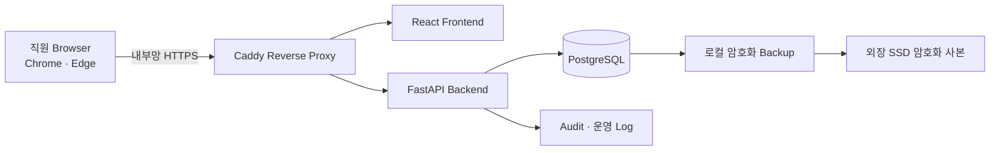

# Clinic Endoscopy Operations System 요구사항 기준선

- 문서 상태: 기준선 승인 — 핵심 Decision 확정, 운영정책 일부 검토 필요
- 단계: 1단계 / 요구사항·안전 경계·아키텍처 기준선
- 작성일: 2026-07-30
- 핵심 Decision 승인일: 2026-07-30
- 대상 환경: 의원 내부망, Windows 11 서버 PC, Chrome·Microsoft Edge

## 1. 이번 단계의 범위

이 문서는 구현 전에 다음 내용을 고정하기 위한 기준선이다.

1. 이미 확정된 업무 요구사항
2. 구현 전체에서 지켜야 하는 안전 불변조건
3. 설정으로 관리할 항목
4. 아직 임의로 확정하면 안 되는 운영정책
5. 다음 단계에서 상세 설계할 시스템 경계

이번 단계에서는 애플리케이션 코드, Database Schema, 화면, 배포 Script를 구현하지 않는다.

기준선 작성 시작 당시 Application Source Tree와 Git 저장소는 없었다. 현재도 문서 외 Source Code와 Git 저장소는 생성하지 않았다.

### 1.1 승인 이력

2026-07-30 사용자 검토로 다음 권장안을 확정했다.

- `DEC-01`: 월요일~토요일 기본 운영, 일요일 기본 차단, 14:00 예약은 월요일~토요일 중 관리자가 허용한 날짜만 가능
- `DEC-04`: 예약확정·D-1 확인·내원·검사 중은 Slot과 수용량을 점유하고 취소·변경 전 이력은 미점유, No-show는 예정시각 경과 후 상태가 확정될 때까지 점유
- `DEC-05`: 1차 확인자와 2차 확인자는 서로 다른 활성 사용자
- `DEC-06`: 이름·차트번호·생년월일·성별·검사 시행 여부·각 검사 수면 여부·검사 예정일 변경 시 관련 확인 무효화, 단순 메모 변경은 유지
- `DEC-07`: 로그인 `User`와 의료진 `StaffProfile`을 분리하고 의사 승인 행위에 두 식별자를 함께 기록
- `DEC-08`: 추가 예외는 승인된 추가 Slot 또는 수용량 증가로만 처리하며 동일 Resource의 시간 중복은 허용하지 않음

추가 사용자 검토로 다음 사항을 확정했다.

- `DEC-25`: 조직검체 웹 관리대장 MVP에는 `Biopsy`와 `CLO`만 포함하고 `Stool` 대장은 포함하지 않음
- `DEC-26`: 결과보고일은 씨젠 사이트에 최초 조직검사 결과가 게시된 날짜 하나만 저장하고 별도의 원내 결과 도착일은 관리하지 않음
- `DEC-27`: 외부 검사기관과 접수번호 조합을 Unique로 하고 접수번호는 Pathology Case에 귀속
- `DEC-28`: 신규 운영일부터 새 시스템에만 입력하고 과거 Excel은 Import하지 않으며 조회용 원본으로 보관
- `DEC-29`: 인계자·인수자의 개별 로그인 확인은 요구하지 않고 관리자가 실제 인계·인수 사실을 확인한 뒤 기록
- 나이 표기: 검진은 `검사연도 - 출생연도`, 검진이 아닌 검사는 검사일 기준 만 나이를 사용

그 밖의 Decision은 PRD의 Decision Log에서 확정·미확정 상태를 계속 관리한다.

## 2. 시스템 목적과 경계

### 2.1 확정된 요구사항

- 종이 스케줄표의 빠른 주간 가독성을 유지한다.
- 환자 예약, 검사 준비, D-1 확인, 검사 완료, 조직검사 Follow-up을 한 시스템에서 추적한다.
- 여러 직원이 원내 Windows PC의 Browser에서 동시에 사용한다.
- 모든 환자정보는 직원이 직접 입력한다.
- 시스템은 EMR 또는 PACS를 대체하지 않는다.
- 초기 버전은 EMR, PACS, 문자발송 시스템과 연동하지 않는다.
- 환자정보를 외부 Cloud Database나 외부 AI API로 전송하지 않는다.
- 외부 인터넷에 공개하지 않으며 Port Forwarding을 사용하지 않는다.
- Test, Seed, Screenshot에는 합성 환자정보만 사용한다.

### 2.2 설계상 가정

- 초기 운영은 접수실 메인 PC 한 대가 Application Server, Database Server, Reverse Proxy 역할을 함께 수행한다.
- 업무시간 중 서버 PC가 켜져 있고 유선 LAN 연결과 고정 내부 IP가 유지된다.
- 초기 검사 Resource는 1개지만 Schema와 Scheduling Engine은 Resource 추가를 수용할 수 있게 설계한다.
- EMR·PACS 연동 가능성은 내부 Domain Model과 외부 연동 Adapter 경계를 분리하는 수준으로만 준비한다.

### 2.3 알려진 제한사항

- 서버 PC의 전원, Windows Update, Docker Desktop, 저장장치 또는 유선 LAN 장애가 발생하면 전 직원의 접속이 중단될 수 있다.
- 단일 서버 PC 구성은 고가용성(High Availability)을 제공하지 않는다.
- 수동 입력이므로 EMR·PACS 정보와 불일치할 가능성을 시스템만으로 제거할 수 없다.
- 내부망은 신뢰 구역이 아니므로 로그인, Backend 권한검사, HTTPS, Audit가 모두 필요하다.

## 3. 업무와 데이터의 안전 불변조건

아래 항목은 화면 구현 방식과 관계없이 Backend와 Database 설계에서 보호해야 한다.

### 3.1 환자와 인적사항

1. 환자의 나이는 현재값으로 직접 저장하지 않는다. 검진 예약은 `검사연도 - 출생연도`로 검진 표기 나이를 계산하고, 검진이 아닌 예약은 생년월일과 검사 예정일을 기준으로 만 나이를 계산한다.
2. 차트번호는 정규화 규칙을 적용한 뒤 중복을 검사한다.
3. 이름, 차트번호, 생년월일, 성별은 핵심 인적사항으로 취급한다.
4. 과거 기록을 재현할 수 있도록 이중확인 당시 값은 Snapshot으로 보존한다.
5. 일반 Application Log에는 이름, 생년월일, 연락처, 복용약, 검사결과를 기록하지 않는다.

### 3.2 검사와 수면 정보

1. 검사 종류를 단일 문자열 하나로 저장하지 않는다.
2. 위내시경 시행 여부와 대장내시경 시행 여부를 독립적으로 표현한다.
3. 위내시경 수면 여부와 대장내시경 수면 여부를 각각 저장한다.
4. 시행하는 검사에는 해당 수면 여부가 필수이고, 시행하지 않는 검사의 수면 값은 허용하지 않는다.
5. 예약에는 위 또는 대장 검사 중 최소 하나가 포함되어야 한다.
6. 환자 수, 위내시경 건수, 대장내시경 건수, 점유시간을 서로 다른 개념으로 집계한다.

### 3.3 Scheduling

1. 동일 Resource의 시간이 겹치는 활성 예약은 생성하거나 변경할 수 없다.
2. 충돌과 수용량 검사는 Frontend 안내 후 Backend에서 다시 수행한다.
3. 예약 변경은 새 시간과 검사 구성으로 전체 규칙을 다시 평가한 뒤 반영한다.
4. 동시 요청에도 중복 예약이 생기지 않도록 Database Transaction과 Database 수준 제약을 함께 사용한다.
5. 수용량 예외가 승인되어도 물리적으로 동일한 Resource의 시간 중복은 허용하지 않는다.
6. 날짜별 예외는 Source Code가 아니라 승인·사유·적용기간·변경 전후 값을 가진 데이터로 저장한다.
7. 일반 오전 예약과 14:00 오후 예외 예약은 규칙 적용과 통계 집계를 분리한다.
8. 취소·변경된 이전 예약은 이력으로 남기되 현재 수용량 계산에서는 활성 예약만 집계한다. 어떤 상태를 “활성”으로 볼지는 `DEC-04`에서 확정한다.

### 3.4 이중확인

1. 1차 확인, 2차 확인, PACS 입력 완료를 각각 기록한다.
2. 이름, 차트번호, 생년월일, 성별, 검사 시행 여부, 각 검사 수면 여부가 확인되지 않으면 검사 준비 완료로 바꿀 수 없다.
3. 확인 뒤 핵심 값이 바뀌면 관련 확인을 자동 무효화하고 재확인을 요구한다.
4. 무효화된 확인 기록도 삭제하지 않고 당시 값, 확인자, 확인시각, 무효화 사유를 보존한다.
5. 검사 예정일 또는 일반·검진 구분 변경으로 계산 나이와 계산방식이 달라지면 PACS 입력 Snapshot에 영향을 주므로 관련 확인을 무효화한다.

### 3.5 약제 안전

1. 시스템은 약 복용 지속 또는 중단 여부를 자동 결정하지 않는다.
2. 약제 Master의 참고 중단기간과 환자별 의사 결정값을 분리한다.
3. 의사 확인 전에는 “약제 중단 여부는 담당 의사의 확인이 필요합니다.” 경고를 표시한다.
4. 의사 확인자, 결정일, 실제 결정한 중단일수, 예외 판단, 환자 안내, 실제 중단 확인을 Audit 가능한 형태로 보존한다.
5. 참고자료를 이용한 예정일 계산은 가능하더라도 의사 결정으로 표현하거나 환자 지시로 자동 전환하지 않는다.

### 3.6 변경·취소·No-show·예약금

1. 예약 변경 전후 값과 사유는 Append-only History로 보존한다.
2. 취소와 No-show 기록은 삭제하지 않는다.
3. 취소 또는 No-show 누적 3회 이상은 “제한 검토 대상” 경고만 생성하며 자동 거절하지 않는다.
4. 예약 제한은 관리자 확인, 사유, 시작·종료 조건을 가진 별도 결정으로 기록한다.
5. 예약금의 납부, 환불, 보류, 환불 불가, 예외 환불은 단순 Boolean 하나가 아니라 상태와 금액 이력으로 추적한다.
6. 금액 변경 및 환불 정책 변경은 과거 거래 의미를 바꾸지 않도록 적용 당시 정책과 금액을 보존한다.

### 3.7 검사 완료와 조직검사

1. 조직검사 있음으로 검사 완료 정보를 저장하면 Pathology Case를 정확히 한 번 생성한다.
2. 같은 요청이 재전송되어도 Pathology Case가 중복 생성되지 않도록 Idempotency를 보장한다.
3. 조직검사 상태 변경, 의사 확인, 환자 통보, Follow-up 완료 이력을 보존한다.
4. Overdue 판정 기준일과 업무 마감 기준은 설정 또는 정책으로 명시하며 임의의 날짜를 사용하지 않는다.

### 3.8 사용자·권한·Audit

1. Password는 검증된 Password Hash로만 저장한다.
2. 모든 수정 권한은 Backend에서 역할과 행위 단위로 검사한다.
3. 중요 변경은 사용자, 시각, 대상, 행위, 변경 전후 값, 사유, 요청 식별자를 Audit Log에 기록한다.
4. Audit Log는 일반 사용자가 수정하거나 삭제할 수 없다.
5. Browser LocalStorage에 환자정보를 영구 저장하지 않는다.
6. 로그인 실패 제한, Session 만료, 일정 시간 미사용 시 자동 로그아웃을 적용한다.

### 3.9 상태 모델

예약 업무 전체를 하나의 `status` 필드로 합치지 않는다. 최소한 다음 상태 축은 서로 독립적으로 관리한다.

- 예약 상태
- 준비 상태
- 1차·2차·PACS 확인 상태
- D-1 업무 상태
- 검사 시행 상태
- 약제 검토 상태
- 예약금 납부 상태와 환불 상태
- 병리 진행 상태

예를 들어 D-1 연락 불가나 약제 확인 미완료는 예약 취소와 같은 의미가 아니다. 각 상태 전환의 허용 조건은 2단계에서 별도 State Machine으로 설계한다.

## 4. 확정된 Scheduling 기본 규칙

### 4.1 점유시간과 집계

| 검사 구성 | 환자 수 | 위 건수 | 대장 건수 | 점유시간 |
|---|---:|---:|---:|---:|
| 위 단독 | 1 | 1 | 0 | 30분 |
| 대장 단독 | 1 | 0 | 1 | 60분 |
| 위·대장 동시 | 1 | 1 | 1 | 60분 |

기본 시간 단위는 30분이다.

- 예약 점유구간은 시작은 포함하고 종료는 제외하는 `[시작, 종료)`로 판단한다. 따라서 09:00~10:00 예약 뒤 10:00 시작 예약은 중복이 아니다.
- 월·화·목·금의 위 5건과 대장 3건은 각각 독립적인 상한이다. Resource가 1개이므로 두 상한을 항상 동시에 모두 채울 수 있다는 의미는 아니다.
- 수면 여부, 추가검사, 장정결제 종류가 기본 점유시간을 바꾸는지는 현재 요구사항에 없으므로 자동 가산하지 않는다.

### 4.2 월·화·목·금 오전

| 항목 | 기본값 |
|---|---|
| 검사 가능 구간 | 09:00 이상, 12:00까지 종료 |
| 위 단독 마지막 시작 | 11:30 |
| 대장 단독 마지막 시작 | 11:00 |
| 위·대장 동시 마지막 시작 | 11:00 |
| 일반 위 수용량 | 최대 5건 |
| 일반 대장 수용량 | 최대 3건 |

- 위·대장 동시 예약은 각 수용량에서 1건씩 차감한다.
- 수용량이 남아도 종료시각 또는 Resource 충돌 조건을 만족하지 못하면 예약할 수 없다.

### 4.3 수·토 오전

| 항목 | 기본값 |
|---|---|
| 검사 가능 구간 | 09:00 이상, 11:00까지 종료 |
| 전체 사용 가능 시간 | 120분 |
| 위 단독 마지막 시작 | 10:30 |
| 대장 단독 마지막 시작 | 10:00 |
| 위·대장 동시 마지막 시작 | 10:00 |

- 고정 환자 수가 아니라 실제 점유 구간과 총 120분 한도로 판단한다.
- 위 단독만 배치하면 자연스럽게 최대 4명이다.
- Resource가 1개인 동안에는 비중첩 조건을 만족하면 총 점유시간도 120분을 넘을 수 없다. 두 조건은 향후 Resource 수 증가에 대비해 별도로 모델링한다.

### 4.4 14:00 오후 예외

- 일반 예약과 분리된 별도 예약 유형이다.
- 시작시각은 14:00이다.
- 검사 종류와 무관하게 최대 환자 1명이다.
- 위 단독, 대장 단독, 위·대장 동시를 허용한다.
- 오전 일반 수용량과 별도로 추가할 수 있다.
- 예외 사유, 등록자, 확인자, 확인시각, 메모가 모두 필요하다.
- 통계는 일반 예약 건수, 오후 예외 예약 건수, 전체 실제 검사 건수를 분리한다.
- “실제 검사 건수”는 예약 건수가 아니라 실제 검사 시행 기록을 기준으로 집계하는 방식을 권장하며 `DEC-17`에서 확정한다.

### 4.5 날짜별 예외

다음 항목은 관리자 설정 데이터로 관리한다.

- 검사 시작·종료시각 변경
- Slot 차단·추가
- 위·대장 수용량 변경
- 오후 예외 허용·차단
- 추가 예외 예약
- 휴진일·검사 불가일
- 담당자 부재·장비 점검
- 장정결 불량 재검·원장 승인 예외

모든 예외에는 적용 날짜 또는 기간, 규칙 종류, 기존 값, 변경 값, 사유, 등록자, 승인자, 생성시각이 필요하다.

## 5. 권장 시스템 경계

다음 구조는 상세 설계 전의 기준선이며 아직 구현 완료가 아니다.

권장 Application Module:

- Identity & Access: 로그인, Session, 사용자, 역할, 권한
- Patient Registry: 환자 기본정보, 중복 검사, 예약 제한
- Scheduling: Resource, 운영시간, 수용량, 예외, 충돌검사
- Appointment Operations: 예약, 변경, 취소, No-show, History
- Preparation: 장정결제, 추가검사, 복용약, 수술력, Medication Review
- Verification: 1차·2차 확인, PACS 입력 확인, 무효화
- D-1 Tasks: 연락 시도, 준비 확인, 재연락
- Procedure: 당일 준비, 실제 검사, 중단, 완료
- Pathology: 자동 Case 생성, 결과, 통보, Follow-up, Overdue
- Payments: 예약금, 환불, 보류, 예외
- Admin Settings: Master, 정책 Version, 날짜별 예외, 승인
- Audit & Operations: Audit 조회, Backup 상태, 장애 점검

### 5.1 보안·운영 기준선

- LAN에 공개하는 Application Port는 원칙적으로 Caddy의 TCP 443 하나로 제한한다.
- PostgreSQL, FastAPI 내부 Port, Caddy Admin API는 LAN에 직접 공개하지 않는다.
- Windows Firewall은 허용된 직원용 Subnet 또는 단말 범위로 제한한다.
- Session은 Browser LocalStorage Token보다 `Secure`, `HttpOnly`, `SameSite` Cookie와 서버 측 폐기를 지원하는 방식을 우선 검토한다.
- 계정 비활성화 또는 역할 변경 시 기존 Session을 폐기한다.
- 공유 Application 계정을 금지하고 사용자 계정은 삭제보다 비활성화한다.
- Runtime, Migration, Backup·Restore용 Database 권한을 분리하고 Application 계정에 PostgreSQL Superuser 권한을 주지 않는다.
- 서버 시각 동기화를 유지하고 Audit 시각은 UTC로 저장한 뒤 화면에서 Asia/Seoul 기준으로 표시한다.
- 서버 PC 자동 로그인은 기본 전제로 삼지 않는다. 재부팅 후 Application 자동 기동 가능 여부는 실제 장비에서 검증한다.
- 접수 PC 겸용은 Single Point of Failure이므로 UPS, 절전 해제, 디스크 공간 감시, Windows Update 시간 통제가 필요하다.

### 5.2 Backup·Restore 기준선

- 실행 중인 PostgreSQL Data Directory나 Docker Volume 폴더를 단순 복사하지 않는다.
- `pg_dump --format=custom` 기반의 일관된 Logical Backup을 기본안으로 사용한다.
- Backup Manifest에는 생성시각, PostgreSQL Version, Application Version, Alembic Revision, 파일 크기, SHA-256을 기록한다.
- 외장 SSD는 Drive Letter만 신뢰하지 않고 Volume Label 또는 고유 식별자를 함께 검사한다.
- 외장 SSD 복사 뒤 Hash를 다시 계산해 일치해야 성공으로 처리한다.
- Backup 성공·실패와 Restore 실행은 운영 Log와 Audit 대상에 포함한다.
- 무결성 Hash 확인만으로 복구 가능성을 보장하지 않는다. 월 1회 격리된 임시 Database에 실제 Restore Test를 수행한다.
- `restore-backup.ps1`은 운영 Database를 즉시 덮어쓰지 않고 새 Database에 복원·검증한 뒤 명시적으로 전환하는 흐름을 기본으로 한다.
- 외장 SSD를 항상 연결하면 Ransomware와 도난에 함께 노출되므로 BitLocker가 적용된 SSD 2개 교대·분리 보관을 권장안으로 둔다.

Frontend는 한 개의 긴 Form 대신 다음 흐름으로 분리한다.

1. 환자 검색·등록
2. 일정과 검사 구성
3. 준비사항
4. 약제·의사 확인
5. 예약금·최종 확인

주간 화면은 월요일부터 토요일까지 6개 열을 유지하고, 상세정보는 오른쪽 Drawer에서 연다.

## 6. 설정 가능한 항목

### 6.1 사용자 요구로 명시된 설정

- Resource 수와 활성 상태
- 날짜별 운영시간·Slot·수용량·예외
- 장정결제 Master
- 기본 예약금과 환불정책
- 약제 Master와 참고자료

### 6.2 설정화를 권장하지만 승인 필요한 항목

- 기본 운영 요일과 휴진일
- 검사 구성별 기본 점유시간과 적용 Version
- D-1 대상 산정시각과 마감시각
- Pathology 단계별 목표기한과 Overdue 기준
- 자동 로그아웃 시간
- 로그인 실패 허용 횟수와 잠금시간
- 예약 제한 경고 기준 횟수
- Backup 보존기간과 암호화 방식

정책값은 변경 시점 이후 예약에 적용하고, 과거 기록에는 적용 당시 Version과 평가 결과를 남기는 방식을 권장한다.

## 7. 추가 확인이 필요한 운영정책

다음 항목은 다음 단계의 Schema와 상태 전이에 직접 영향을 주므로 사용자 승인이 필요하다.

| ID     | 확인 항목                      | 권장안                                                                     | 미확정 시 영향                 |
| ------ | -------------------------- | ----------------------------------------------------------------------- | ------------------------ |
| DEC-01 | 기본 운영 요일과 14:00 예외 허용 요일   | 월~토 운영, 일요일 기본 차단, 14:00은 월~토 중 관리자가 허용한 날짜만 가능                         | Calendar와 기본 Rule 생성 불가  |
| DEC-02 | 휴일·월요일 예약의 D-1 의미          | 검사 전 “직전 운영일”에 Task 생성, 화면에는 실제 검사 전날 여부도 함께 표시                         | D-1 대상 누락 가능             |
| DEC-03 | 같은 날짜에 여러 예외가 겹칠 때 우선순위    | 구체적인 Slot 차단을 최우선으로 하고, 상충하는 승인 예외는 저장 단계에서 차단                          | 서로 다른 가능 여부 계산           |
| DEC-04 | 수용량을 점유하는 예약 상태            | 예약확정·D-1확인·내원·검사중은 점유, 취소·변경 전 기록은 미점유. No-show는 예정시각이 지나 상태 확정 전까지 점유  | 수용량 통계와 충돌검사 불일치         |
| DEC-05 | 1차 확인자와 2차 확인자의 동일인 허용 여부  | 서로 다른 활성 사용자만 허용                                                        | 이중확인의 독립성 결정             |
| DEC-06 | 확인 무효화 대상 핵심 변경 범위         | 인적사항, 검사 시행·수면, 검사 예정일 변경 시 무효화. 단순 메모는 유지                              | 재확인 과다 또는 누락             |
| DEC-07 | “확인자·승인자·검토 의사”의 계정 체계     | 직원 User와 의료진 Staff Profile을 분리하고, 승인 행위는 로그인 User와 의사 Profile을 함께 기록    | 의사 결정의 책임 추적 불가          |
| DEC-08 | 추가 예외 예약의 정확한 의미           | 승인된 추가 Slot 또는 수용량 증가로만 구현하고 Resource 중복은 절대 금지                         | 관리자 우회가 충돌을 만들 위험        |
| DEC-09 | 조직검사 Overdue 기준            | 의뢰, 결과, 의사 확인, 환자 통보, Follow-up마다 별도 목표일 설정                             | Risk Dashboard 기준 불명확    |
| DEC-10 | 환불정책의 구체 조건                | 정책 Version만 먼저 구현하고 자동 판정은 승인된 규정이 있을 때 추가                              | 금전 상태 자동화 불가             |
| DEC-11 | 환자·Audit·Backup 보존 및 정정 정책 | 물리 삭제를 기본 금지하고 정정 이력·비활성화 사용, 법적 보존기간은 별도 확인                            | 삭제 권한과 Backup 보존 설계 불가   |
| DEC-12 | 외장 SSD 암호화와 복구키 보관         | Windows BitLocker 사용 가능 여부와 복구키 이중 보관 절차 확인                             | 자동 Backup과 장애복원 절차 확정 불가 |
| DEC-13 | 내부 HTTPS 인증서 배포            | 원내 전용 CA와 직원 PC 신뢰 인증서 배포를 권장                                           | Browser 인증서 경고 또는 운영 부담  |
| DEC-14 | 서버 PC 재부팅 후 자동 시작 조건       | 전용 Windows 운영계정, 자동 로그인 의존 최소화, Container·Service 자동 시작                 | 무인 복구와 보안 정책 결정          |
| DEC-15 | 취소·No-show 3회 산정 방식        | 환자 귀책의 유효한 취소와 No-show 합산 3회, 전 기간 기준으로 시작하되 운영정책 승인 필요                 | 경고 오탐·누락                 |
| DEC-16 | 예약 변경과 재예약의 Identity       | 일정 변경은 같은 예약의 Revision, 취소 뒤 재예약은 연결된 새 Appointment로 생성                 | History와 집계 방식 결정        |
| DEC-17 | “전체 실제 검사 건수”의 의미          | 실제 완료·부분완료된 위·대장 시행 기록 기준으로 집계                                          | 통계가 예약량과 혼동              |
| DEC-18 | Resource 증가 시 수용량 범위       | 기본 수용량은 의원 전체 기준, Resource별 별도 Override를 허용하는 안 검토                      | 다중 Resource 확장 구조 결정     |
| DEC-19 | 날짜별 종료시각 변경과 마지막 시작        | 검사 종료시각에서 점유시간을 빼 자동 계산하고 명시적 Slot 예외만 별도 허용                            | 상충 설정 발생                 |
| DEC-20 | 30분 경계 밖 추가 Slot 허용        | 초기에는 30분 경계만 허용                                                         | UI·충돌 계산 복잡도             |
| DEC-21 | 오후 등록자와 확인자의 분리            | 서로 다른 활성 사용자만 허용                                                        | 예외 승인 독립성                |
| DEC-22 | 병리 Case와 검체의 관계            | 검사 1건에 Case 1개, 여러 채취 부위는 여러 Specimen으로 시작하되 외부기관 의뢰번호 구조 확인            | 병리대장 중복·누락               |
| DEC-23 | 차트번호 중복 처리                 | 정규화된 차트번호에 Database Unique Constraint 적용, 임시 차트번호는 별도 Namespace 사용      | 환자 오연결 위험                |
| DEC-24 | 보안·Backup 운영 목표            | 허용 Subnet, Session 정책, Audit 조회 기록 범위, RPO·RTO, 보존세대, 실패 알림, 복구키 책임자 확정 | 실제 운영 승인 불가              |

## 8. 다음 단계 진입 조건

2단계 Domain Model·Database Schema 설계는 다음 조건을 만족한 뒤 시작한다.

1. 이 문서의 확정 요구사항과 불변조건을 사용자가 승인한다.
2. 최소한 `DEC-01`, `DEC-04`, `DEC-05`, `DEC-06`, `DEC-07`, `DEC-08`을 결정한다.
3. 나머지 항목은 “권장안으로 설계하되 운영 전 재검토” 또는 “설계 보류” 중 하나로 표시한다.

특히 실제 환자정보를 입력하기 전에는 `DEC-12`, `DEC-13`, `DEC-14`, `DEC-24`와 월간 Restore Test 절차까지 확정·검증해야 한다.

## 9. 공식 기술 참고자료

- [Docker Desktop for Windows 권한 요구사항](https://docs.docker.com/desktop/setup/install/windows-permission-requirements/)
- [Caddy 내부 TLS 설정](https://caddyserver.com/docs/caddyfile/directives/tls)
- [PostgreSQL pg_dump](https://www.postgresql.org/docs/current/app-pgdump.html)
- [Microsoft BitLocker 구성](https://learn.microsoft.com/en-us/windows/security/operating-system-security/data-protection/bitlocker/configure)

## 10. 구현 상태

### 구현 완료 항목

- 없음

### 문서화 완료 항목

- 요구사항 기준선 초안
- 안전 불변조건 초안
- Scheduling 기본 규칙 정규화
- 시스템 경계와 Module 후보
- 미확정 운영정책 Decision List

### 미구현 항목

- Git 및 Project Scaffold
- Domain Model과 Database Schema
- Scheduling Engine과 자동화 Test
- Backend API
- Frontend 화면
- 인증·권한·Audit
- Docker Compose·Caddy·내부 HTTPS
- PowerShell 설치·운영·Backup·Restore Script
- Native Windows Service 대체안
- 운영자·복구·인수 문서
