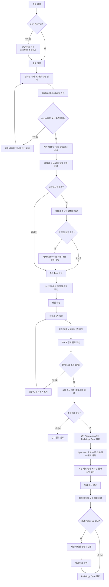
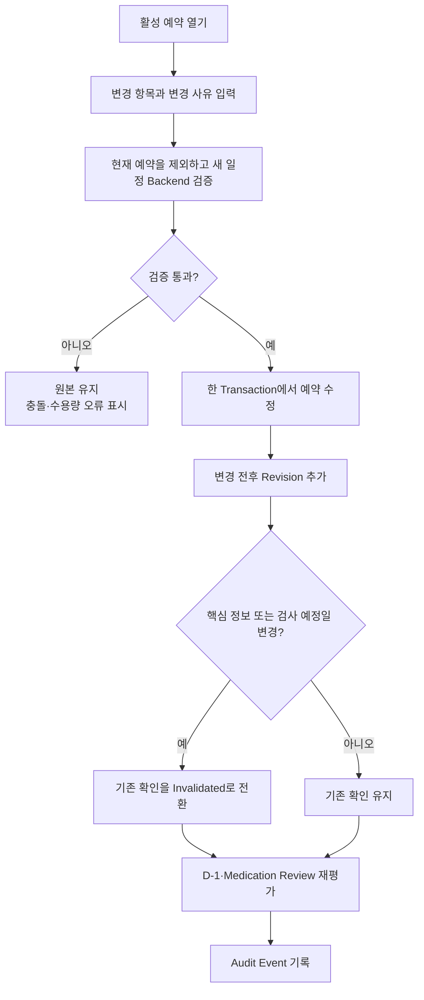
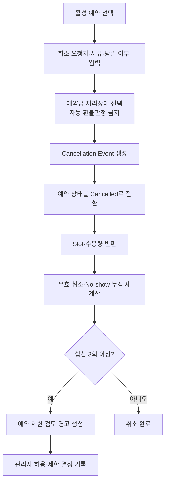
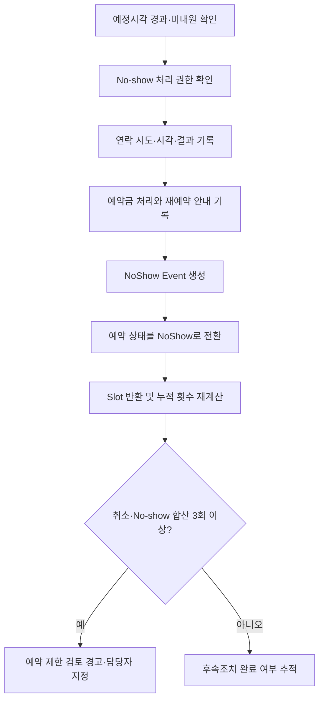
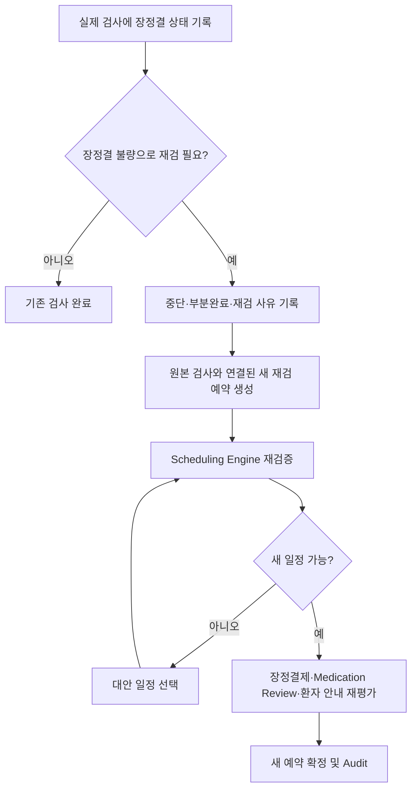
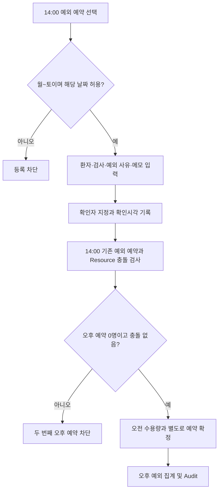
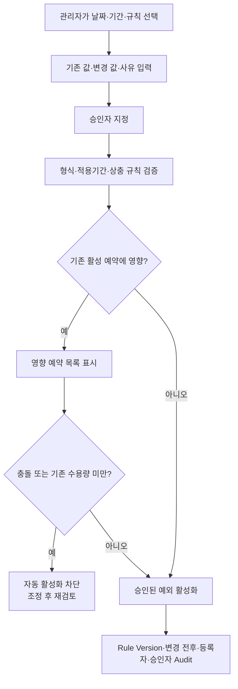
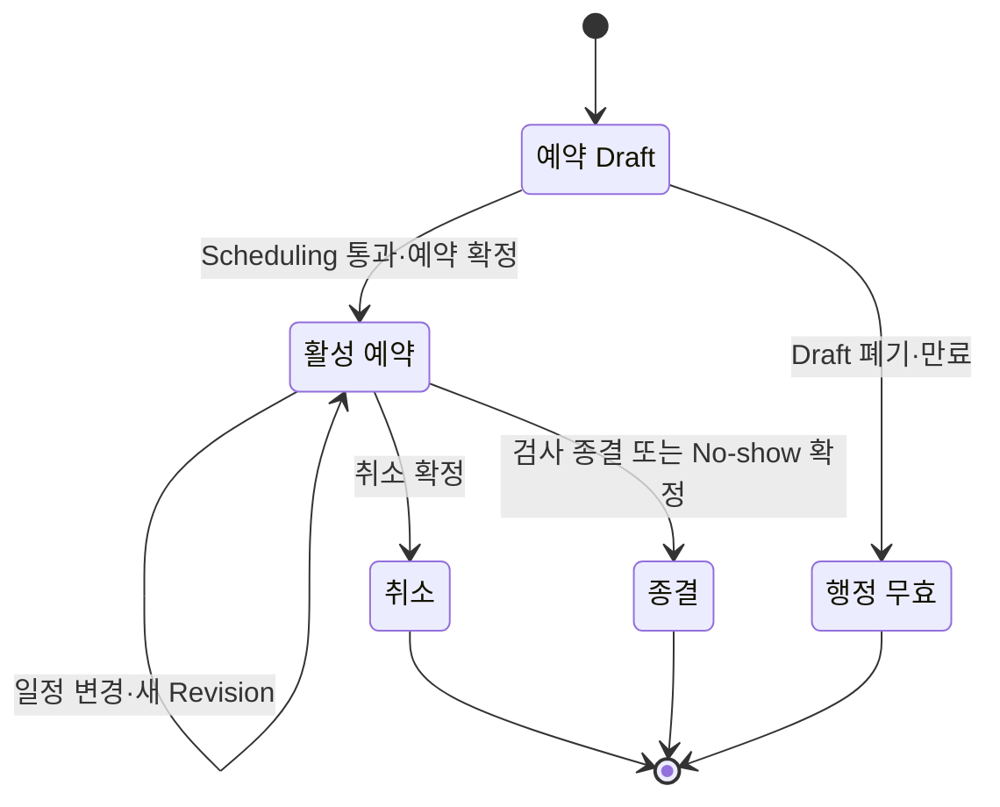

# Clinic Endoscopy Operations System 제품 요구사항 문서

- 문서명: Product Requirements Document (PRD)
- 문서 Version: 0.1
- 문서 상태: 검토 초안
- 작성일: 2026-07-30
- 적용 단계: Phase 1 — Requirements Analysis and PRD
- 선행 문서: [01-requirements-baseline.md](./01-requirements-baseline.md)
- 구현 상태: Source Code 미작성

## 0. 문서 목적과 표기

이 문서는 원내 내시경 예약·검사·조직검체 Follow-up 업무를 개발 가능한 요구사항으로 변환한다. 기능 범위, 입력, 처리 규칙, 정상·오류 결과, Acceptance Criteria를 정의하며 Database Schema나 API 구현 코드는 포함하지 않는다.

### 0.1 요구사항 수준

| 구분 | 의미 |
|---|---|
| 확정 | 사용자 요구 또는 2026-07-30 승인으로 고정된 규칙 |
| 설계상 가정 | 상세 설계를 진행하기 위해 제시한 권장안이며 운영 전 확인 필요 |
| 설정 가능 | 관리자 설정 또는 Version이 있는 정책 데이터로 관리할 값 |
| 미확정 | 임의 구현하지 않고 Decision이 확정될 때까지 차단할 항목 |

### 0.2 핵심 용어

| 용어 | 정의 |
|---|---|
| 예약(Appointment) | 한 환자의 한 검사 예정일·시각에 대한 운영 단위 |
| 검사 계획(Procedure Plan) | 예약에 포함된 위내시경 또는 대장내시경의 독립 계획 단위 |
| 활성 예약 | Scheduling의 Slot과 수용량을 점유하는 예약 |
| 일반 오전 예약 | 요일별 오전 운영시간과 일반 수용량 규칙을 적용하는 예약 |
| 오후 예외 예약 | 오전 수용량과 분리하여 14:00에 최대 1명을 허용하는 별도 예약 유형 |
| Resource | 같은 시간에 한 환자만 점유할 수 있는 내시경실·장비·인력의 통합 Scheduling 단위 |
| Pathology Case | 조직검체의 의뢰, 결과, 의사 확인, 환자 통보, Follow-up을 묶는 관리 단위 |
| Specimen | 한 Pathology Case 안의 조직 채취 부위와 수량 단위 |
| D-1 Task | 검사 전 연락과 준비사항을 확인하는 업무 단위 |
| 핵심 정보 | 이름, 차트번호, 생년월일, 성별, 검사 예정일, 위·대장 시행 여부, 각 검사 수면 여부 |
| 실제 검사 건수 | 예약 건수가 아니라 실제 시행 기록에 저장된 위·대장별 건수 |
| 검진 표기 나이 | 검진 예약에서 `검사연도 - 출생연도`로 계산한 나이 |
| 만 나이 | 검진이 아닌 예약에서 생년월일과 검사일을 기준으로 계산한 국제식 나이 |

## 1. 프로젝트 개요

### 1.1 해결하려는 현장 문제

- 종이·Excel·직원 기억에 분산된 예약, 준비, 약제 확인, 예약금, 검사 결과, 조직검체 Follow-up을 한 흐름으로 연결한다.
- 같은 시간대 중복 예약과 요일별 수용량 초과를 등록 시점에 차단한다.
- 환자 인적사항과 검사·수면 정보를 2명이 확인하고 PACS 입력 완료까지 추적한다.
- D-1 미연락, 약제 의사 확인 미완료, 조직검사 결과·통보 지연을 Risk Dashboard에서 식별한다.
- 취소·No-show·환불·예외 승인·핵심 정보 변경의 책임과 이력을 보존한다.
- 서버 장애 후 검증된 Backup으로 복구할 수 있는 운영절차를 제공한다.

### 1.2 기존 종이표와 관리대장의 장점

- 월요일부터 토요일까지 한 주 업무량을 빠르게 훑을 수 있다.
- 시간, 환자, 검사 종류, 준비 상태를 한 줄에서 확인할 수 있다.
- 별도 메뉴 이동 없이 메모하고 직원 간 인계할 수 있다.
- 첨부 관리대장은 조직검체의 접수·검체 위치·수량·인계·인수·결과를 한 행에서 확인할 수 있다.
- `Biopsy`, `CLO`, `Stool`을 분리해 각 검사대장의 목적이 명확하다.

### 1.3 기존 종이표와 Excel 관리대장의 한계

- 두 직원이 동시에 수정할 때 충돌을 차단할 수 없다.
- 검사시간·수용량·오후 예외 규칙을 일관되게 자동 검증할 수 없다.
- 변경 전 값, 수정자, 승인자, 확인 당시 값을 신뢰성 있게 보존하기 어렵다.
- 나이가 고정 입력값으로 남아 검사 예정일 기준 계산값과 달라질 수 있다.
- 환자, 예약, 실제 검사, 검체, 결과, Follow-up 사이에 Referential Integrity가 없다.
- 결과 게시, 의사 확인, 환자 통보, 재검 완료의 마감과 Overdue를 자동 추적할 수 없다.
- 고정된 Dashboard 수식 범위는 신규 행이 범위를 넘어가면 집계에서 누락될 수 있다.
- 실제 환자정보가 포함된 파일의 복사, 이메일 전송, USB 보관을 통제하기 어렵다.

### 1.4 시스템 도입 목표

| 목표 | 측정 기준 |
|---|---|
| 예약 안전성 | 동일 Resource 시간 중복 0건, Backend 수용량 초과 승인 없는 등록 0건 |
| 인적사항 정확성 | 준비 완료 예약의 1·2차 확인 및 PACS 확인 누락 0건 |
| 준비업무 가시성 | D-1·약제·장정결 미완료자를 날짜별 Dashboard에서 조회 가능 |
| 조직검체 추적성 | 모든 Case의 현재 상태, 담당자, 기한, 인계·인수, 마지막 조치 확인 가능 |
| 이력 추적성 | 중요 변경의 사용자·시각·사유·변경 전후 값 조회 가능 |
| 복구 가능성 | 월 1회 Restore Test 성공 기록 유지 |
| 현장 사용성 | 주간 화면에서 월~토 일정과 핵심 경고를 한 화면에서 확인 |

### 1.5 시스템이 해결하지 않는 범위

- EMR 또는 PACS의 진료기록·영상 저장 기능을 대체하지 않는다.
- 약 복용 지속·중단 여부를 자동으로 결정하거나 환자에게 자동 지시하지 않는다.
- 초기에는 EMR, PACS, 문자발송, 외부 검사기관 시스템과 연동하지 않는다.
- 환자용 Portal, 온라인 예약, 외부 인터넷 접속을 제공하지 않는다.
- 병리 결과를 진단하거나 의학적 의미를 자동 판정하지 않는다.
- 외부 Cloud Database나 외부 AI API로 환자정보를 전송하지 않는다.

### 1.6 첨부 조직검체 관리대장 반영

참고 파일은 읽기 전용으로 분석했다. 실제 환자 행과 결과값은 이 문서에 복사하지 않았으며, 열 구조와 업무 패턴만 반영했다.

#### 시트 구조

| 기존 시트 | 확인된 업무 범위 | 시스템 반영 방향 |
|---|---|---|
| Biopsy | 검사일, 외부 접수번호, 환자 식별, 위탁일, 검사 종류, 검체 위치·수량, 접수·인계·인수, 결과보고일, 결과, 특이소견, 비고 | Pathology Case, Specimen, Specimen Transfer, Result, Follow-up으로 분리 |
| CLO | 검사일, 환자 식별, CLO 결과 | 실제 검사에 연결된 CLO Test Result로 관리 |
| Stool | 접수일, 환자 식별, 검사 항목, 정량 결과, 결과보고일, 대장내시경일, 조직결과 | 과거 Excel 조회 범위로만 유지하며 MVP 웹 관리대장에는 포함하지 않음. 예약의 분변잠혈 여부·양성 여부 필드는 별도로 유지 |
| 분석 대시보드 | 월별·검사종류별·성별·연령대별 집계 | 고정 Cell 범위가 아닌 Database Query 기반 통계로 대체 |

#### 기존 열과 Domain Model Mapping

| 기존 열 | 시스템 필드 또는 Entity | 변환 규칙 |
|---|---|---|
| 검사일 | `ExamExecution.exam_date` | 예약 예정일이 아니라 실제 검사일을 기준으로 저장 |
| 접수번호 | `PathologyCase.external_accession_number` | Pathology Case에 귀속하고 외부 검사기관+접수번호 조합을 Unique로 저장 |
| 차트번호·수진자명·성별 | `Patient` 참조 + `VerificationSnapshot` | 대장에 중복 입력하지 않고 환자 참조, 확인 당시 값은 Snapshot 보존 |
| 나이 | 파생값 + 확인 Snapshot | 검진은 `검사연도 - 출생연도`, 검진이 아니면 검사일 기준 만 나이. 현재값은 저장하지 않고 확인 당시 값·방식·기준일만 Snapshot으로 보존 |
| 위탁일 | `PathologyCase.referred_at` | 날짜와 입력자를 함께 기록 |
| 접수인 | `PathologyCase.registered_by_user_id` | 로그인 사용자 식별자로 기록 |
| 검사종류 | `ProcedureExecution` 참조 | `colon`·`stomach` 문자열만 저장하지 않고 실제 위·대장 시행 단위와 연결 |
| 검사위치 | `Specimen.collection_site` | 여러 부위는 Specimen 여러 건으로 분리 |
| 검체수량 | `Specimen.quantity` | 1 이상의 정수, 부위별 수량 저장 |
| 인계인·인수인 | `SpecimenTransfer` | 관리자가 실제 인계·인수를 확인한 뒤 인계자·인수자 StaffProfile, 확인시각, 메모를 Event로 기록. 당사자 로그인·전자서명은 요구하지 않음 |
| 결과보고일 | `PathologyResult.result_reported_on` | 씨젠 사이트에 최초 조직검사 결과가 게시된 날짜만 저장. 별도 원내 도착일은 저장하지 않음 |
| 조직검사결과 | `PathologyResult.summary` | 민감정보 권한과 Audit 적용, 원문 전체 저장 범위는 확인 필요 |
| 특이소견·비고 | Case Note | 목적별 Note로 분리하고 작성자·시각 보존 |
| CLO 결과 | `CloTestResult` | 양성·음성·판정불가·미입력의 명시적 상태로 변환 |
| 분변잠혈 정량 결과 | MVP 웹 대장 범위 밖 | 과거 `Stool` Excel은 조회용으로 보존하고 자동 Import하지 않음 |
| CFS 검사일·조직결과 | 예약 입력의 분변잠혈·양성·대장검사 진행 여부 | MVP에서는 기존 요구의 구조화된 예약 필드만 유지하고 별도 Stool 대장은 후속 범위로 둠 |

## 2. 사용자 역할

### 2.1 역할별 권한 Matrix

| 역할 | 주요 업무 | 조회 권한 | 생성 권한 | 수정 권한 | 승인 권한 | 삭제·비활성화 권한 |
|---|---|---|---|---|---|---|
| 관리자 | 사용자·정책·예외·예약 제한·Master·Audit·Backup 관리 | 전체 운영정보, Audit, Backup 상태. 병리 결과는 업무상 필요 범위 | 사용자, 정책, 날짜별 예외, 모든 운영 레코드 | 전체 운영정보 정정. 모든 정정은 사유와 Audit 필수 | 날짜별 예외, 오후 예외 확인, 예약 제한, 예외 환불. 의학적 약제 결정은 의사 `StaffProfile` 필요 | 사용자·Master 비활성화 가능. 환자·예약·취소·No-show·Audit·금전·병리 기록 물리 삭제 불가 |
| 원무 담당자 | 환자·예약·예약금·취소·No-show·D-1 | 환자 기본정보, 일정, 준비·약제 확인 상태, 예약금, 경고. 병리 상세결과는 기본 제한 | 환자, 예약, 변경 요청, 결제·환불 처리, 취소·No-show, D-1 연락 | 본인 역할 범위의 현재값 정정, 사유 필수 | 승인 불가. 관리자 또는 의사 확인을 요청 | 물리 삭제 불가. 임시저장 폐기만 가능하고 Audit 대상 |
| 내시경 담당자 | 당일 확인·PACS·준비·검사 완료·조직검체 | 당일·과거 검사, 준비정보, 약제 의사결정, 병리 Case | 2차 확인, PACS 확인, 실제 검사, CLO 결과, Specimen, Pathology Case 보완 | 검사 시행·검체·병리 진행정보 정정, 사유 필수 | 2차 확인·PACS 확인 가능. 약제 중단 결정은 의사 `StaffProfile` 필요 | 물리 삭제 불가. 오류 기록은 무효화 Event로 정정 |
| 조회 전용 | 일정·환자정보 조회 | 부여된 부서 범위의 일정과 최소 필요 환자정보 | 없음 | 없음 | 없음 | 없음 |

### 2.2 공통 권한 원칙

- Frontend 메뉴 숨김과 별도로 모든 API에서 Backend 권한검사를 수행한다.
- 사용자 계정은 공유하지 않으며 퇴사·역할 변경 시 삭제 대신 비활성화한다.
- 로그인 `User`와 의료진 `StaffProfile`을 분리한다.
- 의사의 Medication Review에는 기록한 로그인 사용자와 판단한 의사 Profile을 함께 남긴다.
- 병리 결과, 복용약, 연락처처럼 민감도가 높은 필드는 역할별 최소 필요 범위로 제한한다.
- 조회 전용 사용자의 Export와 인쇄는 기본 차단하고 허용 여부를 별도 권한으로 관리한다.

## 3. 핵심 Workflow

### 3.1 End-to-End Workflow

### 3.2 예약 변경 Workflow

### 3.3 취소 Workflow

### 3.4 No-show Workflow

### 3.5 장정결 불량 재검 Workflow

### 3.6 오후 14:00 예외 예약 Workflow

### 3.7 날짜별 예외 규칙 등록 Workflow

## 4. Functional Requirements

### 4.1 우선순위 정의

| 우선순위 | 의미 |
|---|---|
| P0 | 합성데이터 Pilot과 실제 운영 전 반드시 구현·검증 |
| P1 | 초기 운영 안정성과 효율에 필요하나 안전한 수동 대안이 존재 |
| P2 | 후속 고도화 |

모든 Acceptance Criteria는 합성 환자정보로 자동화 Test 또는 명시된 수동 Test를 수행한다.

### 4.2 PAT — 환자

| Requirement ID | 설명 | 사용자 | 입력 | 처리 규칙 | 정상 결과 | 오류 결과 | 우선순위 | Acceptance Criteria |
|---|---|---|---|---|---|---|---|---|
| PAT-001 | 환자 등록·기본정보 정정 | 원무, 관리자 | 차트번호, 이름, 생년월일, 성별, 연락처, 특이사항 | 내부 Patient ID를 생성하고 필수값·형식을 Backend에서 검증한다. 정정 전후 값과 사유를 보존한다. | Patient ID와 최신 정보 반환 | 누락·형식 오류 `422`, 권한 부족 `403`; 부분 저장 없음 | P0 | 유효한 합성 환자 등록 시 고유 ID가 생성되고 조회 전용 사용자의 등록·수정 API는 거부된다. |
| PAT-002 | 차트번호 중복 방지·환자 검색 | 원무, 내시경, 관리자, 조회 전용 | 차트번호 또는 이름·생년월일·성별 | 차트번호 정규화 후 Database Unique 제약을 적용한다. 이름만 같은 환자를 자동 병합하지 않는다. 검색결과는 역할별 최소정보만 반환한다. | 기존 환자 후보 또는 신규등록 가능 상태 반환 | 중복 `409 CHART_NUMBER_DUPLICATE`; 모호한 검색은 후보 표시 | P0 | 같은 정규화 차트번호를 동시에 등록해도 1건만 성공하고 동명이인은 별도 후보로 남는다. |
| PAT-003 | 일반·검진별 나이 계산 | 조회 권한 사용자, 시스템 | 생년월일, 검사 예정일 또는 실제 검사일, 일반·검진 구분 | 검진은 `검사연도 - 출생연도`, 검진이 아니면 검사일 기준 만 나이를 계산한다. 현재 나이는 Patient·Appointment에 저장하지 않는다. | 나이값·계산방식·기준일 표시 | 기준일 없음·날짜역전 `422 AGE_CALCULATION_INVALID` | P0 | 검진 연도나이와 일반 만나이의 생일 전후·윤년 Test가 통과하고 원본 나이 Column이 없다. |
| PAT-004 | 반복 취소·No-show 경고와 예약 제한 | 원무, 관리자 | 유효한 취소·No-show Event, 검토 메모, 제한 결정·사유·종료일 | 유효 Event에서 횟수를 계산하고 합산 3회 이상이면 검토 경고만 만든다. 자동 거절하지 않으며 관리자 결정 후에만 제한한다. | 경고, 검토상태, 허용·제한 결정 표시 | 일반 사용자의 제한 결정 `403`; 사유 누락 `422` | P0 | 3번째 유효 Event에서 경고가 생성되며 관리자 허용 결정 시 예약을 계속할 수 있다. |

### 4.3 SCH — Scheduling Engine

| Requirement ID | 설명 | 사용자 | 입력 | 처리 규칙 | 정상 결과 | 오류 결과 | 우선순위 | Acceptance Criteria |
|---|---|---|---|---|---|---|---|---|
| SCH-001 | 기본 운영일·시간표 | 원무, 관리자, 시스템 | 예약일, 시작시각, 검사 구성 | 월~토 운영, 일요일 차단, 오전 첫 시작 09:00을 적용한다. 14:00은 월~토 중 관리자가 허용한 날짜만 가능하다. | 날짜별 Slot과 가능 여부 반환 | 휴진·일요일·미허용 14:00은 `409 SCHEDULE_CLOSED` | P0 | 일요일 예약은 생성되지 않고 승인된 날짜에만 14:00 Slot이 노출된다. |
| SCH-002 | 월·화·목·금 오전 규칙 | 원무, 관리자, 시스템 | 검사 구성, 시작시각, 기존 일반 예약 | 위 30분·마지막 11:30, 대장·동시 60분·마지막 11:00, 12:00 종료, 위 5건·대장 3건 독립 상한을 모두 검사한다. 동시검사는 양쪽에 1건씩 포함한다. | 시간·수용량을 모두 만족하면 가능 | 수용량 `409 CAPACITY_EXCEEDED`, 종료시각 `409 END_TIME_EXCEEDED` | P0 | 위 5건 또는 대장 3건 뒤 동일 종류가 차단되고 동시검사는 두 상한에 각각 반영된다. |
| SCH-003 | 수·토 오전 점유시간 규칙 | 원무, 관리자, 시스템 | 검사 구성, 시작시각, 기존 점유구간 | 09:00~11:00, 단일 Resource, 총 점유 120분 이하와 비중첩을 검사한다. 고정 환자 수 상한은 두지 않는다. | 허용 조합 예약 가능 | 11:00 초과·120분 초과·중복은 `409 SCHEDULE_CONFLICT` | P0 | 위 4명, 동시 2명, 위 2명+동시 1명이 허용되고 120분 초과는 거부된다. |
| SCH-004 | 활성 예약 점유 판정 | 시스템 | 예약 상태, 상태 전환시각 | 예약확정·D-1 확인·내원·검사중은 점유한다. 취소·변경 전 Revision은 미점유다. No-show는 예정시각 경과 후 확정 전까지 점유한다. | 현재 유효 예약만 가용성에 반영 | 알 수 없는 상태 `409 INVALID_APPOINTMENT_STATE` | P0 | 취소 즉시 Slot이 열리고 No-show 미확정 건은 계속 충돌을 발생시킨다. |
| SCH-005 | Backend 재검증·동시성 제어 | 원무, 관리자, 시스템 | 예약·변경 요청, Resource, 날짜·시각 | 저장 Transaction 안에서 운영시간·수용량·예외·점유를 다시 검사하고 Database 제약 또는 동등한 잠금을 사용한다. | 경쟁 요청 중 1건만 확정 | 후행 요청 `409 SCHEDULE_CONFLICT`; 부분 저장 없음 | P0 | 같은 Slot 동시 요청에서 정확히 1건만 성공하고 API 직접 호출도 동일하게 차단된다. |
| SCH-006 | 14:00 오후 예외 | 원무, 관리자 | 날짜, 검사 구성, 예외사유, 등록자, 확인자·시각, 메모 | 허용 날짜 14:00에 검사 종류와 무관하게 최대 1명만 허용한다. 오전 수용량과 분리 집계한다. | 예외 Metadata가 포함된 오후 예약 생성 | 미허용일·필수정보 누락·두 번째 예약은 `409` 또는 `422` | P0 | 오전 정원이 찬 날 1건은 가능하고 같은 날 두 번째 14:00 요청은 실패한다. |
| SCH-007 | 날짜별 운영 예외 | 관리자 | 날짜·기간, 규칙, 전후 값, 사유, 등록자, 승인자 | 운영시간, Slot, 수용량, 오후 허용, 휴진, 검사불가, 부재, 장비점검을 Version으로 저장한다. 승인 전 미적용이다. | 적용기간에만 Rule 변경 | 누락·기간 역전·상충은 `422`; 기존 설정 미덮어쓰기 | P0 | 승인 전 일정에 영향이 없고 종료일 뒤 기본 Rule로 복귀한다. |
| SCH-008 | 추가 예외 Slot·수용량 통제 | 관리자, 시스템 | 승인된 추가 Slot 또는 수용량 증가 | 승인 범위 안에서만 추가 가능성을 열고 동일 Resource의 시간 중복은 어떤 예외로도 허용하지 않는다. | 승인 범위의 추가 예약 가능 | 강제저장·미승인 초과·중복 `409 EXCEPTION_NOT_ALLOWED` | P0 | 수용량을 늘려도 시간이 겹치면 실패하고 승인된 Slot과 일치하는 요청만 성공한다. |

### 4.4 APT — 예약

| Requirement ID | 설명 | 사용자 | 입력 | 처리 규칙 | 정상 결과 | 오류 결과 | 우선순위 | Acceptance Criteria |
|---|---|---|---|---|---|---|---|---|
| APT-001 | 구조화된 예약 등록 | 원무, 관리자 | 환자, 예정일·시각, 위 시행·수면, 대장 시행·수면 | 위·대장을 독립 Procedure Plan으로 저장한다. 최소 1개 검사가 필요하고 시행 검사의 수면 여부는 필수다. Scheduling 통과 후 확정한다. | 예약 ID, 검사별 계획, 점유시간 생성 | 검사 미선택·수면 누락 `422`, 충돌 `409` | P0 | 위·대장·동시 예약이 각각 환자 1명과 올바른 검사 건수·점유시간으로 저장된다. |
| APT-002 | 일반·검진 조건 입력 | 원무, 관리자 | 일반/검진, 본인부담, 일반검진, 분변잠혈·양성·대장검사 진행 | 조건부 필드를 Backend에서 검증한다. 미시행 항목의 하위 값은 허용하지 않는다. | 일관된 검진 분류 저장 | 모순된 조합 `422 CONDITIONAL_FIELD_INVALID` | P0 | 검진 선택 시 본인부담이 필수이고 분변잠혈 미시행 시 양성값 저장이 차단된다. |
| APT-003 | 장정결제·추가검사 입력 | 원무, 내시경, 관리자 | 장정결제, 수령·안내, 불량재검, 피검사, CLO, 초음파, 간암검진, 본인부담 안내 | 장정결은 대장 포함 시만 활성화한다. 불량 재검은 사유가 필요하며 활성 Master만 신규 선택한다. | 준비·추가검사 정보 저장 | 조건 불일치·비활성 Master 신규선택 `422` | P0 | Master 비활성화가 과거 예약을 변경하지 않고 대장 미포함 예약에는 장정결 값이 저장되지 않는다. |
| APT-004 | 예약 수명주기 전환 | 원무, 내시경, 관리자 | 현재 상태, Action, 사용자, 시각 | 예약 확정·내원·검사 진행·완료·취소·No-show의 허용 전이만 수행한다. D-1·준비·확인은 별도 상태 축으로 관리한다. 전환과 Audit을 원자적으로 저장한다. | 목표 상태와 전환 이력 반환 | 불가능한 전이 `409 INVALID_STATE_TRANSITION` | P0 | 취소 예약을 검사중으로 전환할 수 없고 D-1 상태 변경이 예약 수명주기를 덮어쓰지 않는다. |
| APT-005 | 예약 변경·Revision | 원무, 관리자 | 변경항목, 전후 값, 사유, 새 일정·검사 구성 | 새 일정을 전체 재검증하고 기존 Revision을 보존한다. 핵심정보·검사예정일 변경은 관련 확인을 무효화한다. | 새 Revision과 무효화 결과 반환 | 충돌·사유누락 시 전체 Rollback | P0 | 변경 실패 시 원본이 유지되고 성공 시 전후 값과 사유가 조회된다. |
| APT-006 | 월간·주간·일간·History 조회 | 권한별 전체 사용자 | 기간, 환자, 상태, 검사, 위험 필터 | 주간은 월~토 6열이다. 카드에 핵심상태를 표시하고 약제·수술·취소·변경은 Drawer에서 권한별 조회한다. | 일정과 환자 History 표시 | 권한 없는 상세 `403`; 대량 범위 Pagination | P0 | 주간 열 순서가 월~토이고 카드와 Drawer가 요구된 정보를 분리 표시한다. |
| APT-007 | 서버측 임시저장 | 원무, 관리자 | 작성중 예약, 저장시각 | 임시저장은 Slot을 점유하지 않고 서버에 사용자별로 저장한다. Browser Storage에는 PHI를 쓰지 않으며 만료시간은 설정한다. 확정 시 전체 Scheduling을 다시 검증한다. | 본인 Draft 복구·확정 가능 | 타 사용자 접근 `403`, 만료 `410`, 확정충돌 `409` | P1 | Draft만으로 Slot이 차단되지 않고 만료 후 복구되지 않으며 확정 경쟁 시 최신 검증이 적용된다. |

### 4.5 VER — 이중확인·PACS 수기확인

| Requirement ID | 설명 | 사용자 | 입력 | 처리 규칙 | 정상 결과 | 오류 결과 | 우선순위 | Acceptance Criteria |
|---|---|---|---|---|---|---|---|---|
| VER-001 | 1차 인적사항 확인 | 원무, 관리자 | 핵심정보, 계산된 나이·계산방식·기준일, 확인방법·메모 | 확인 당시 값과 예약 Version을 Immutable Snapshot으로 저장한다. | 확인자·시각·Snapshot 기록 | 핵심값 누락 `422`, Version 불일치 `409 VERIFICATION_STALE` | P0 | 모든 핵심값이 있을 때만 확인되고 나이값·`SCREENING_YEAR_AGE` 또는 `FULL_AGE` 방식이 Snapshot에 남는다. |
| VER-002 | 독립된 2차 확인 | 내시경, 관리자 또는 권한 있는 원무 | 2차 확인값, 방법·메모 | 1차 확인자와 다른 활성 로그인 User가 동일 Version을 확인해야 한다. | 유효한 2차 확인 추가 | 동일·비활성 사용자 또는 값 불일치 `409 SECOND_REVIEWER_INVALID` | P0 | 같은 계정의 2차 확인이 거부되고 다른 활성 사용자의 일치 확인은 성공한다. |
| VER-003 | PACS 입력 완료 수기확인 | 내시경, 관리자 | 완료 여부, 확인자·시각·방법·메모 | 실제 연동이 아닌 수기 확인으로 표시하고 유효한 인적·검사 Snapshot에 연결한다. | 당일 목록에 완료 표시 | 필수정보·유효 Snapshot 없음 `422` 또는 `409` | P0 | PACS API 호출 없이 확인 기록만 생성되며 확인자·시각을 조회할 수 있다. |
| VER-004 | 핵심변경 무효화·준비 Gate | 시스템, 내시경, 관리자 | 변경 Event, 현재 확인 Version | 이름·차트번호·생년월일·성별·검사 시행·수면·예정일·일반/검진 구분 변경 시 1·2차·PACS 확인을 삭제하지 않고 무효화한다. 단순 메모는 유지한다. | 사유·시각과 재확인 대상 표시 | 무효화 실패 시 핵심변경 Rollback; Gate 우회 `409 VERIFICATION_REQUIRED` | P0 | 나이 계산방식이 바뀌는 일반/검진 변경 후 준비완료가 차단되고 과거 Snapshot은 남는다. |

### 4.6 MED — 약제·수술력·의사 검토

| Requirement ID | 설명 | 사용자 | 입력 | 처리 규칙 | 정상 결과 | 오류 결과 | 우선순위 | Acceptance Criteria |
|---|---|---|---|---|---|---|---|---|
| MED-001 | Medication Master Version 관리 | 관리자 | 성분명, 상품명, 분류, 참고 중단기간, 주의사항, 출처, 검토일, 검토의사, 활성상태 | 참고자료임을 명시하고 수정 시 새 Version을 만든다. 과거 환자 Review의 참조를 바꾸지 않고 물리 삭제하지 않는다. | 새 Version 또는 비활성화 기록 | 출처·검토정보 누락 `422`, 권한부족 `403` | P0 | Master 변경 전후 Version이 모두 조회되고 기존 Review 내용은 유지된다. |
| MED-002 | 대장내시경 복용약·수술력 확인 | 원무, 내시경, 관리자 | 복용약 목록 또는 없음 확인, 분류별 복용 여부, 수술·심혈관 시술력, EMR 기록 | 대장 포함 시 필수다. 빈 입력과 “복용약 없음 확인”을 구별하고 여러 분류 동시 선택을 허용한다. | 검토 필요 여부와 누락항목 계산 | 확인 자체 없음 `409 MEDICATION_REVIEW_REQUIRED` | P0 | 명시적 ‘없음’은 통과하고 단순 빈 목록은 준비완료를 통과하지 못한다. |
| MED-003 | 의사 확인 주체 기록 | 권한 있는 사용자, 의료진 | 검토 필요, 입력 User, 의사 StaffProfile, 확인일·메모 | 로그인 User와 의사 StaffProfile을 분리하고 둘 다 기록한다. 의사 확인 전 고정 경고를 유지한다. | 입력자와 판단 의사 동시 기록 | 비활성·의사자격 없음·식별자 누락 `422 PHYSICIAN_CONFIRMATION_INVALID` | P0 | 확인 조회 시 User와 의사 Profile이 함께 표시되고 StaffProfile만으로 로그인할 수 없다. |
| MED-004 | 약별 의사 결정·개별 예외 | 의사 확인을 기록할 권한 사용자 | 실제 복용약, 지속·중단 결정, 중단일수·예정일, 사유, 의사 Profile | Medication Review Item별로 저장한다. Master 참고기간을 자동 복사하지 않고 지속 복용 등 개별 예외 사유를 보존한다. | 약별 개별 결정과 근거 기록 | 의사 확인 없는 결정·예외사유 누락 `409` 또는 `422` | P0 | 여러 약에 서로 다른 결정이 저장되고 참고기간과 다른 판단도 의사·사유가 있으면 기록된다. |
| MED-005 | 환자 안내·실제 확인·일정변경 재검토 | 원무, 내시경, 관리자 | 환자안내, 예정일, 실제중단 확인일, 확인자·시각, 일정변경 | 의사 결정 뒤에만 안내·실제 확인을 기록한다. 일정 변경 시 기존 결정은 보존하고 `재검토 필요`로 표시한다. 시스템은 새 중단일을 자동 확정하지 않는다. | 현재 유효성·과거결정·재검토 경고 표시 | 의사결정 전 안내완료 `409`; 날짜역전 `422` | P0 | 일정 변경 후 경고가 재표시되고 이전 의사결정·안내 이력은 삭제되지 않는다. |

### 4.7 DEP — 예약금

| Requirement ID | 설명 | 사용자 | 입력 | 처리 규칙 | 정상 결과 | 오류 결과 | 우선순위 | Acceptance Criteria |
|---|---|---|---|---|---|---|---|---|
| DEP-001 | 금액·환불정책 Version | 관리자 | 기본금액, 적용기간, 환불정책, 활성상태 | 초기 기본금액 20,000원을 설정으로 두고 새 예약에 당시 정책·금액 Snapshot을 저장한다. 소급 변경하지 않는다. | 적용일 이후 새 Version 사용 | 음수·기간중복 `422`, 권한부족 `403` | P0 | 정책 변경 전후 예약이 각각 생성 당시 금액·정책을 유지한다. |
| DEP-002 | 대상·납부·고지·동의 | 원무, 관리자 | 대상, 실제금액, 납부 여부·일·방법, 규정고지, 환자동의 | 금액은 KRW 정수다. 납부 완료 시 날짜·방법이 필수이며 고지와 동의를 독립 기록한다. | 납부 Transaction과 상태 표시 | 누락·음수·중복납부 `422` 또는 `409` | P0 | 납부 완료 시 거래 1건이 생성되고 고지·동의 미완료는 각각 경고된다. |
| DEP-003 | 취소·No-show 환불 결정 | 원무, 관리자 | 완료·보류·불가, 예외환불, 날짜·금액, 불가사유, 메모, 승인자 | 환불상태는 상호 배타적이고 예외환불은 승인 유형이다. 자동 결정하지 않으며 환불액은 납부액 이하이다. | 환불 결정·담당자·승인 이력 | 상태충돌·초과금액·사유누락 `422`, 미승인 예외 `403` | P0 | 보류와 완료를 동시에 저장할 수 없고 예외환불은 승인자·사유가 있어야 완료된다. |
| DEP-004 | 납부·환불 원장·정정 | 원무, 관리자 | 거래, 정정사유, 역거래 승인 | 기존 거래를 수정·삭제하지 않고 오류는 역거래와 새 거래로 처리한다. 현재 잔액은 원장에서 계산한다. | 거래순서·잔액·정정관계 조회 | 직접 수정·삭제 `409 LEDGER_IMMUTABLE` | P0 | 정정 전 거래와 역거래가 모두 남고 원장 합계와 표시 잔액이 일치한다. |

### 4.8 CON — D-1 확인

| Requirement ID | 설명 | 사용자 | 입력 | 처리 규칙 | 정상 결과 | 오류 결과 | 우선순위 | Acceptance Criteria |
|---|---|---|---|---|---|---|---|---|
| CON-001 | D-1 Task 중복 없는 생성 | 원무, 시스템 | 검사일, 활성예약, D-1 산정정책 | `CALENDAR_DAY` 또는 `PREVIOUS_OPERATION_DAY` 정책으로 대상일을 계산한다. 배포 시 정책 선택이 필수이며 예약·검사일당 1건만 생성한다. 일정변경 시 이전 Task는 이력 종료한다. | 새 검사일 기준 Task 생성 | 정책 미설정은 운영준비 오류로 표시하고 임의 날짜로 생성하지 않음 | P0 | 두 정책의 월요일·휴일 사례 Test가 통과하고 같은 예약에 중복 Task가 없다. |
| CON-002 | 연락시도·준비 Checklist | 원무, 관리자 | 시도시각·결과, 통화·문자·연락불가, 진행·변경·취소, 금식·장정결·약·내원시간, 메모 | 시도별 Append-only로 저장하고 완료조건을 Backend에서 검사한다. | 최신 상태와 전체 시도 이력 | 필수확인 누락 `422 D1_CHECKLIST_INCOMPLETE` | P0 | 1차 연락불가 뒤 재시도를 추가해도 두 기록이 모두 남고 누락상태는 완료되지 않는다. |
| CON-003 | 미완료 Risk·재연락 | 원무, 관리자, 내시경 | 재연락시각, 담당자, 미완료사유 | 미완료·연락불가·약제 재확인 건을 Dashboard에 표시하고 변경·취소 Workflow로 연결한다. | 우선순위와 담당자 표시 | 담당자·재연락시각 누락 `422`; 연결 실패 시 원본 유지 | P0 | 미완료 건이 Dashboard에 나타나며 취소 처리 후 D-1과 취소 기록이 연결된다. |

### 4.9 CAN — 취소

| Requirement ID | 설명 | 사용자 | 입력 | 처리 규칙 | 정상 결과 | 오류 결과 | 우선순위 | Acceptance Criteria |
|---|---|---|---|---|---|---|---|---|
| CAN-001 | 취소 Event·Slot 해제 | 원무, 관리자 | 취소시각, 요청자, 사유, 직원대응, 재예약 가능 | 취소 Event를 Append-only로 만들고 예약을 종료한다. 당일 여부는 Asia/Seoul 날짜로 계산하며 Transaction 완료 후 Slot을 반환한다. | 취소 이력과 가용 Slot 반환 | 완료·No-show 예약 취소 `409`, 사유누락 `422` | P0 | 취소 직후 동일 Slot이 가능하고 취소 Event·처리 사용자가 보존된다. |
| CAN-002 | 취소와 환불·재예약 분리 | 원무, 관리자 | 예약금 처리, 환불상태, 재예약 여부·메모 | 취소와 환불 결정을 분리한다. 환불 미결정이면 후속 Task를 만들고 재예약은 연결된 새 Appointment로 생성한다. | 환불·재예약 진행 추적 | 기존 취소예약 재활성화 `409` | P0 | 취소 뒤 환불보류 Task가 남고 재예약은 새 ID와 원예약 연결을 가진다. |
| CAN-003 | 취소 누적·정정 | 원무, 관리자, 시스템 | 취소 Event, 정정사유 | 삭제하지 않은 모든 유효 취소를 경고 횟수에 포함한다. 입력오류는 무효화 Event로 정정하고 집계에서 제외한다. 제외사유 확대는 `DEC-15`로 관리한다. | 경고·제한검토 갱신 | 정정사유 없음 `422`, 중복검토 방지 | P0 | 유효 취소와 No-show 합계 3건에서 검토가 1건 생성되고 무효화 후 집계만 감소한다. |

### 4.10 NOS — No-show

| Requirement ID | 설명 | 사용자 | 입력 | 처리 규칙 | 정상 결과 | 오류 결과 | 우선순위 | Acceptance Criteria |
|---|---|---|---|---|---|---|---|---|
| NOS-001 | No-show 후보·확정 | 원무, 관리자 | 예정시각, 현재시각, 확정자·시각 | 예정시각 전에는 확정하지 못한다. 경과 후 확정 전까지 Slot을 점유하고 직원 확정 Transaction 뒤 종료한다. | No-show Event와 상태 저장 | 조기확정 `409 NO_SHOW_TOO_EARLY`; 완료·취소 건 `409` | P0 | 예정시각 전 실패하고 경과 후 미확정 상태는 점유하며 확정 이력이 남는다. |
| NOS-002 | 연락·후속조치 | 원무, 관리자 | 연락시도·결과, 예약금, 재예약안내, 제한검토, 담당자, 완료 | 시도별 기록하고 예약금은 DEP Workflow에 연결한다. 후속완료에는 담당자와 결과가 필요하다. | 전체 연락·후속상태 표시 | 결과 없이 완료 `422`; 원장 직접수정 차단 | P0 | 여러 시도가 순서대로 보존되고 DEP 거래와 No-show 후속조치가 연결된다. |
| NOS-003 | 누적경고·관리자 검토 | 시스템, 원무, 관리자 | 유효 No-show·취소 Event | 합산 3회 경고를 만들되 자동 거절하지 않는다. 관리자만 허용·기간제한을 결정한다. | 신규예약 화면에 경고·검토 표시 | 중복 Task 방지, 비관리자 결정 `403` | P0 | 기준 도달 시 경고가 나타나고 관리자 결정 전에는 자동으로 예약을 거절하지 않는다. |

### 4.11 PRO — 검사 진행·완료

| Requirement ID | 설명 | 사용자 | 입력 | 처리 규칙 | 정상 결과 | 오류 결과 | 우선순위 | Acceptance Criteria |
|---|---|---|---|---|---|---|---|---|
| PRO-001 | 당일 검사 업무목록 | 내시경, 관리자, 조회 권한 사용자 | 날짜, 상태, 담당자 | 시간순으로 핵심 인적사항, 검사·수면, 준비·D-1·약제·확인·PACS 경고를 표시하고 상세는 권한별 Drawer로 제공한다. | 당일 우선업무·위험 표시 | 권한 없는 상세 `403`; 일부 오류는 항목별 표시 | P0 | 준비 미완료가 명확히 표시되고 조회 전용 사용자는 수정할 수 없다. |
| PRO-002 | 내원·준비·검사 시작 Gate | 내시경, 관리자 | 내원시각, 준비 Checklist, 유효 확인, 약제 Review, PACS 확인 | 유효한 핵심 확인과 필수 약제 Review 없이 준비완료를 차단한다. PACS 완료 확인 없이 검사시작을 차단할지는 `DEC-31`로 확정하며 그전에는 경고와 별도 권한 확인을 요구한다. | 상태·사용자·시각 기록 | 누락항목과 `409 PREPARATION_INCOMPLETE` | P0 | API 직접호출로 핵심 준비 Gate를 우회할 수 없고 미확정 PACS Gate 동작은 설정 Test로 검증된다. |
| PRO-003 | 실제 검사 시행 결과 | 내시경, 관리자 | 시행 여부, 실제 시작·종료, 위·대장별 완료, 장정결, 중단·사유, 메모 | 계획과 실제를 분리하고 위·대장 결과를 각각 저장한다. 종료는 시작 이후이고 중단에는 사유가 필수다. | 완료·부분완료·중단과 실제시각 기록 | 시간역전·모순·사유누락 `422` | P0 | 동시계획 중 한 검사만 시행한 경우 부분완료로 저장되고 원 계획은 보존된다. |
| PRO-004 | 조직검체·CLO·재검 후속 생성 | 내시경, 관리자 | 조직검체 여부, CLO 시행·결과, 채취정보, 재검 여부·시기 | 조직검체가 있으면 Pathology Case를 Idempotent하게 생성한다. CLO는 별도 검사결과, 재검은 Follow-up Task로 관리한다. | Case·검사결과·Task 식별자 반환 | 필수 채취정보 누락 `422`; 재시도 시 중복 생성 없음 | P0 | 동일 완료 요청 재전송에도 Case 1건만 존재하고 CLO만 시행하면 병리 Case가 생성되지 않는다. |

### 4.12 PAT-H — 조직검체·검사대장

| Requirement ID | 설명 | 사용자 | 입력 | 처리 규칙 | 정상 결과 | 오류 결과 | 우선순위 | Acceptance Criteria |
|---|---|---|---|---|---|---|---|---|
| PAT-H-001 | Pathology Case 생성·상태전이 | 내시경, 관리자, 시스템 | 검사·환자 참조, 채취, 의뢰·결과·확인·통보 Milestone | 제시된 병리 상태를 허용 전이로 관리한다. 잘못 생성된 Case는 삭제하지 않고 무효화한다. | 현재상태·전이이력·담당자 표시 | 순서위반·필수 Milestone 누락 `409 PATHOLOGY_STATE_INVALID` | P0 | 씨젠 최초 결과 게시일 없이 의사확인 대기로 전환할 수 없고 무효화 Case도 감사 조회된다. |
| PAT-H-002 | Biopsy 웹 관리대장 | 내시경, 관리자, 권한 있는 조회 사용자 | 검사·환자·위탁·접수·검체·인계·결과 데이터 | 기존 17개 열의 조회 순서를 지원하되 환자는 참조하고 나이는 일반/검진 계산정책으로 파생한다. 검사 종류는 실제 Procedure와 연결한다. | 기존 양식과 대응되는 웹 대장 표시 | 검체수량 <1, 날짜역전, 환자 불일치 `422` | P0 | 합성 Case의 열 Mapping이 정확하고 기관+접수번호가 Case에 귀속되며 현재 나이는 저장하지 않는다. |
| PAT-H-003 | Specimen·관리자 인계확인 | 관리자 | 채취부위, 수량, 인계자·인수자 StaffProfile, 확인시각, 메모 | Case 1:N Specimen으로 저장한다. 관리자가 실제 인계·인수를 확인한 뒤 하나의 Append-only Transfer Event로 기록하며 당사자 로그인은 요구하지 않는다. | 관리자 확인자와 인계·인수 대상·시각·이력 표시 | 존재하지 않는 검체·수량오류·비관리자 기록 `422` 또는 `403` | P0 | 여러 검체 Transfer가 관리자 User Audit와 함께 남고 인계·인수자의 개별 Session은 필요하지 않다. |
| PAT-H-004 | CLO 웹 관리대장 | 내시경, 관리자, 권한 있는 조회 사용자 | 검사일, 환자, CLO 시행·결과 | 실제 검사에 연결하고 `PENDING`, `NEGATIVE`, `POSITIVE`, `INDETERMINATE`, `NOT_PERFORMED`를 구분한다. | 기존 5개 열과 대응되는 목록·상세 | 검사참조 없음·허용되지 않은 결과 `422 CLO_RESULT_INVALID` | P0 | 미입력과 음성이 같은 값으로 처리되지 않고 합성 기록이 검사 상세와 연결된다. |
| PAT-H-005 | Stool·CFS 별도 대장 | 후속 범위 | 접수일, 환자, 검사항목, 정량결과, CFS, 병리 | MVP에는 구현하지 않는다. 기존 예약의 분변잠혈·양성·대장검사 진행 여부만 구조화해 유지한다. | 후속 Roadmap 항목 | MVP API·메뉴 제공 안 함 | P2 | MVP 기능목록과 Database ERD에 Stool 전용 대장 Table이 포함되지 않는다. |
| PAT-H-006 | Biopsy·CLO 검색·정렬·필터 | 내시경, 관리자, 권한 있는 조회 사용자 | 기간, 상태, 검사종류, 담당자, Overdue | Biopsy와 CLO View를 Database Query로 Pagination·정렬·필터한다. | 화면에 정확한 결과 집합 표시 | 비허용 필드 조회 `403`, 잘못된 필터 `422` | P0 | 고정 Cell 범위 없이 신규 행이 검색·통계에 포함되고 화면 건수와 Query 결과가 일치한다. |
| PAT-H-007 | 승인된 대장 Export | 별도 Export 권한 사용자 | 조회조건, 목적, 형식, 재인증 | `DEC-30` 확정 전 비활성화한다. 허용 시 현재 필터만 Export하고 파일 생성·다운로드를 Audit하며 보존시간 후 폐기한다. | 승인된 XLSX/CSV 생성 | 권한·재인증·목적 없음 `403`; 실패 시 불완전 파일 미제공 | P1 | 정책 비활성 상태에서는 누구도 Export할 수 없고, 활성 Test에서는 화면과 행 수·열 순서가 일치하며 Audit이 남는다. |

### 4.13 FUP — 결과 통보·재검 Follow-up

| Requirement ID | 설명 | 사용자 | 입력 | 처리 규칙 | 정상 결과 | 오류 결과 | 우선순위 | Acceptance Criteria |
|---|---|---|---|---|---|---|---|---|
| FUP-001 | 결과 게시·담당 의사 확인 | 내시경, 관리자, 의료진 | 씨젠 최초 결과 게시일, 요약·특이소견, 입력 User, 의사 StaffProfile, 확인시각·메모 | 최초 게시일과 의사확인을 별도 Milestone으로 기록하고 User와 의사 Profile을 함께 저장한다. 별도 원내 도착일은 저장하지 않는다. | 의사확인 대기 또는 완료 표시 | 게시일 없는 결과 확인·식별자 누락 `409` 또는 `422` | P0 | 게시일 입력만으로 통보완료가 되지 않고 원내 도착일 Field가 없으며 의사확인 기록에 두 식별자가 나타난다. |
| FUP-002 | 환자 통보·재검 계획 | 내시경, 관리자 | 통보시도·일·방법·담당자, 재검 여부·예정일·담당자, 메모 | 통보시도를 Append-only로 저장한다. 실패는 완료가 아니며 재검 필요 시 예정일·담당자가 필수다. | 통보상태·재검 Task 생성 | 의사확인 전 최종통보, 필수값누락 `409` 또는 `422` | P0 | 연락실패 뒤 재시도 이력이 모두 남고 재검 Case에는 예정일·담당자가 표시된다. |
| FUP-003 | 단계별 Overdue·완료 | 내시경, 관리자 | 단계별 기한정책, 현재상태, 완료근거 | 의뢰·결과·의사확인·통보·재검의 기한을 따로 계산한다. 완료에는 필수 Milestone이 필요하다. | 지연단계·경과시간·담당자 표시 | 기한정책 없음은 설정경고; 조건없는 완료 `409` | P0 | 고정시각 Test에서 경계 전후 판정이 정확하고 완료 Case는 활성 Overdue에서 제외된다. |

### 4.14 SEC — 보안

| Requirement ID | 설명 | 사용자 | 입력 | 처리 규칙 | 정상 결과 | 오류 결과 | 우선순위 | Acceptance Criteria |
|---|---|---|---|---|---|---|---|---|
| SEC-001 | 로그인·Password·Session | 전체 사용자, 관리자 | ID, Password, 로그인시도, 마지막활동 | Adaptive Password Hash, 실패 제한·잠금, 미사용 로그아웃, Secure·HttpOnly·SameSite Cookie를 사용한다. | 제한된 Session 발급 | 계정존재를 노출하지 않는 동일 오류·잠금 기록 | P0 | DB·Log에 평문 Password가 없고 실패한도·미사용 만료 Test가 통과한다. |
| SEC-002 | Backend RBAC·User/StaffProfile 분리 | 관리자, 전체 사용자 | User, 역할, StaffProfile, Action | 모든 API에서 역할·Permission을 검사한다. User는 인증, StaffProfile은 직원·의사 주체로 분리한다. | 허용 Action만 수행 | Frontend 우회도 `403`; 비활성 식별자 승인 불가 | P0 | 조회 전용 사용자의 직접 수정 API가 실패하고 StaffProfile 자체로 로그인할 수 없다. |
| SEC-003 | 내부망 HTTPS·접근범위 | 관리자, 시스템 | 내부 IP·Hostname, 허용 Subnet, 인증서 | Caddy HTTPS를 적용하고 허용된 내부망만 접속시킨다. 외부 Port Forwarding은 구성하지 않는다. | 원내 Chrome·Edge HTTPS 접속 | 비허용 IP는 Proxy·Firewall 단계 차단 | P0 | 허용망 HTTPS는 성공하고 비허용망·DB/FastAPI 직접 Port는 접근할 수 없다. |
| SEC-004 | Client·Log·외부전송 PHI 제한 | 시스템, 전체 사용자 | 화면데이터, Browser 저장소, URL, Log, 외부 Endpoint | LocalStorage·SessionStorage에 PHI를 영구 저장하지 않는다. 일반 Log·URL에서 식별자·약·결과 원문을 제외하고 외부 AI·Cloud DB로 보내지 않는다. | 인증 Session 동안 최소정보만 표시 | 민감정보 Log·외부 Endpoint 검출 시 배포 차단 | P0 | Browser 저장소·정상/오류 Log Scan에서 지정 PHI 원문이 발견되지 않는다. |

### 4.15 AUD — Audit Log

| Requirement ID | 설명 | 사용자 | 입력 | 처리 규칙 | 정상 결과 | 오류 결과 | 우선순위 | Acceptance Criteria |
|---|---|---|---|---|---|---|---|---|
| AUD-001 | 중요행위 Audit | 시스템, 관리자 | User, 당시역할, Action, 대상, 전후 값, 사유, 시각, Request ID | 핵심정보, 예약, 확인, 약제, 금전, 취소·No-show, 병리, 예외, 권한, Backup·Restore를 업무변경과 같은 Transaction에서 기록한다. | 누가·언제·무엇을·왜 변경했는지 조회 | Audit 저장 실패 시 업무변경 Rollback | P0 | 중요 변경마다 Audit이 연결되고 실패 주입 시 업무만 단독 저장되지 않는다. |
| AUD-002 | 불변성·정정 Event | 시스템, 관리자 | 정정대상, 사유, 새 Event | 기존 Audit·업무이력을 수정·삭제하지 않고 Correction/Reversal Event로 정정한다. | 원본·정정·현재 유효값 조회 | 직접 수정·삭제 `409 AUDIT_IMMUTABLE` | P0 | 관리자도 원 Audit을 바꿀 수 없고 정정 뒤 모든 관계가 식별된다. |
| AUD-003 | 관리자 조회·민감정보 최소화 | 관리자 | 기간, 사용자, 대상, Action, 결과 | 관리자만 조회한다. 최소 Snapshot만 기록하고 조회·Export 행위도 Audit한다. | 조건별 결과 제공 | 비관리자 `403`, 대량범위 제한 | P1 | 일반 사용자는 접근할 수 없고 관리자의 Audit 조회·내보내기도 기록된다. |

### 4.16 BAK — Backup·Restore·Windows 운영

| Requirement ID | 설명 | 사용자 | 입력 | 처리 규칙 | 정상 결과 | 오류 결과 | 우선순위 | Acceptance Criteria |
|---|---|---|---|---|---|---|---|---|
| BAK-001 | 일일·업무종료 Backup | 관리자, 시스템 | 일정, Database, 로컬·외장 대상, 암호화 설정 | Task Scheduler가 `pg_dump --format=custom` Backup을 만들고 로컬 SSD와 암호화 외장 SSD에 저장한다. 1TB·4TB 용량에 종속되지 않는다. | 파일·시각·크기·상태 기록 | 미연결·공간부족 시 운영 DB 유지, 실패 기록 | P0 | 예약 실행 성공과 외장 SSD 제거 실패 Test 모두 서비스 중단 없이 기록된다. |
| BAK-002 | Manifest·무결성·상태 | 관리자, 시스템 | Dump, PostgreSQL·App Version, Alembic Revision, SHA-256, Volume ID | 원자적 파일명 전환, Manifest 생성, 복사 후 Hash 재검증을 수행하고 최근 성공·실패·연결상태를 표시한다. | 검증된 Backup만 `verified` | Hash 불일치·불완전 파일은 격리·실패 | P0 | 파일 변조가 탐지되고 고정 Drive Letter가 달라도 올바른 Volume만 대상으로 인식한다. |
| BAK-003 | 안전한 Restore·월간 Test | 관리자, 운영자 | Backup, Target, 확인문구, 작업자·사유 | 운영 DB를 바로 덮지 않고 새 DB에 복원·검증한다. 월 1회 격리 환경에서 실제 Restore Test를 하고 결과·시간을 기록한다. | 검증된 복원 또는 Test 결과 | Hash·Version·Target·접속조건 미충족 시 시작 안 함 | P0 | 합성 Backup이 격리 DB에 복원·대사되고 손상파일은 시작 전에 차단된다. |
| BAK-004 | Windows Script·Native 대체안 | 관리자 | 설치경로, 구성, 서비스·Backup 경로 | 요구된 8개 PowerShell Script의 인터페이스와 명확한 Exit Code를 제공한다. Docker Compose 기본안과 Native Windows Service 대체 절차를 문서화한다. | 반복 가능한 설치·운영 절차 | 구성누락·위험한 복원·Update는 사전검사 중단 | P1 | 합성환경에서 관리자 Runbook만으로 설치·상태·Backup·복원 절차를 재현할 수 있다. |

## 5. Business Rules

### 5.1 일반 규칙

| Rule ID | 영역 | 조건 | 확정 규칙 | 검증 결과 |
|---|---|---|---|---|
| BR-G-001 | Resource | 초기 운영 | 활성 Resource는 1개이며 동일 Resource의 예약구간은 겹칠 수 없다. Resource 수는 설정 구조를 갖되 다중 Resource 운영기능은 별도 검증 전 비활성화한다. | 겹치면 거절 |
| BR-G-002 | 시간구간 | 모든 예약 | 점유구간은 `[시작, 종료)`이다. 앞 예약 종료시각과 다음 예약 시작시각이 같으면 중복이 아니다. | 구간 교집합이 있으면 거절 |
| BR-G-003 | 검사 구성 | 모든 예약 | 위 또는 대장 중 최소 하나가 필요하다. 위·대장 시행과 각각의 수면 여부를 독립 저장한다. | 조건 불일치 시 거절 |
| BR-G-004 | 점유·집계 | 위 단독 | 환자 1명, 위 1건, 대장 0건, 30분이다. | 네 지표 별도 집계 |
| BR-G-005 | 점유·집계 | 대장 단독 | 환자 1명, 위 0건, 대장 1건, 60분이다. | 네 지표 별도 집계 |
| BR-G-006 | 점유·집계 | 위·대장 동시 | 환자 1명, 위 1건, 대장 1건, 60분이다. | 네 지표 별도 집계 |
| BR-G-007 | 월·화·목·금 | 일반 오전 | 09:00부터 시작하고 12:00까지 종료한다. 위 단독 마지막 11:30, 대장·동시 마지막 11:00이다. | 시간범위 밖이면 거절 |
| BR-G-008 | 월·화·목·금 | 일반 오전 | 위 최대 5건, 대장 최대 3건의 독립 상한을 적용한다. 동시검사는 양쪽에 1건씩 포함한다. | 어느 한 상한 초과도 거절 |
| BR-G-009 | 수·토 | 일반 오전 | 09:00부터 시작하고 11:00까지 종료한다. 총 점유시간은 120분 이하이며 환자 수 고정 상한은 두지 않는다. | 종료·점유·중복 중 하나라도 위반하면 거절 |
| BR-G-010 | 수·토 | 위 단독만 예약 | 30분씩 4명이 자연스러운 최대다. 5번째는 120분 한도를 초과한다. | 4명 허용, 5명 거절 |
| BR-G-011 | 오후 예외 | 14:00 | 검사 종류와 무관하게 최대 1명이며 오전 수용량과 별도다. 위 30분, 대장·동시 60분 점유는 그대로 적용한다. | 두 번째 오후 예약 거절 |
| BR-G-012 | 오후 예외 집계 | 실제 검사 전후 | 일반 예약, 오후 예외 예약, 실제 위·대장 시행 건수를 서로 분리한다. | 통계 항목 혼합 금지 |
| BR-G-013 | 활성 점유 | 예약확정·D-1확인·내원·검사중 | Slot과 수용량을 점유한다. No-show는 예정시각이 지났어도 직원이 확정할 때까지 점유한다. | 가용성에서 포함 |
| BR-G-014 | 비활성 점유 | 취소·변경 전 Revision·No-show 확정 | 이력은 보존하되 미래 가용성에서는 제외한다. | Slot 반환 |
| BR-G-015 | 동시성 | 등록·변경 저장 | Frontend 결과를 신뢰하지 않고 Backend Transaction과 Database 제약으로 최종 검증한다. | 경쟁 요청 중 한 건만 성공 |
| BR-G-016 | 환자 나이 | 화면·확인·대장 | 생년월일과 검사 예정일 또는 실제 검사일로 계산하고 저장하지 않는다. | 기준일 변경 시 재계산 |
| BR-G-017 | 반복 취소 | 유효 취소+No-show 합계 3회 이상 | 예약 제한 검토 경고를 표시하되 자동 거절하지 않는다. | 관리자 결정 전 경고만 표시 |
| BR-G-018 | 이중확인 | 1차 후 2차 | 서로 다른 활성 User가 같은 핵심정보 Version을 확인한다. | 동일 User의 2차 확인 거절 |
| BR-G-019 | 확인 무효화 | 핵심정보 변경 | 1·2차·PACS 확인을 삭제하지 않고 무효화한다. 단순 메모 변경은 무효화하지 않는다. | 준비완료 재차단 |
| BR-G-020 | 약제 | 의사 확인 전 | “약제 중단 여부는 담당 의사의 확인이 필요합니다.”를 표시하고 중단 여부·기간을 자동 확정하지 않는다. | 자동 지시 금지 |
| BR-G-021 | 예약금 | 납부·환불 | 정책 Version과 거래원장을 사용하며 취소·No-show만으로 환불을 자동 결정하지 않는다. | 상호배타 상태·금액 검증 |
| BR-G-022 | 조직검체 | 검사 완료 시 조직검체 있음 | 같은 Transaction에서 Pathology Case를 정확히 한 번 생성한다. | 재시도에도 Case 1건 |
| BR-G-023 | 조직검체 결과 | 씨젠 최초 결과 게시 이후 | 최초 게시일, 의사 확인, 환자 통보, Follow-up을 서로 다른 Milestone으로 기록하고 원내 도착일은 두지 않는다. | 선행조건 없는 다음 단계 거절 |
| BR-G-024 | 날짜·시각 | 모든 업무 | 업무 기준 Timezone은 Asia/Seoul, 저장 Audit 시각은 UTC를 사용한다. | 화면과 Audit 변환 일관 |

### 5.2 날짜별·건별 예외 규칙

| Rule ID | 예외 | 필수 입력 | 적용 규칙 | 금지사항 |
|---|---|---|---|---|
| BR-E-001 | 운영 시작·종료 변경 | 날짜·기간, 기존·변경시각, 사유, 등록자, 승인자 | 승인된 적용기간에만 사용한다. 검사별 마지막 시작은 종료시각에서 점유시간을 계산하는 권장안을 `DEC-19`에서 확정한다. | 승인 전 적용 금지 |
| BR-E-002 | Slot 차단 | 날짜, 시작·종료, 사유, 승인 | 해당 구간과 겹치는 신규 예약을 차단한다. | 기존 예약 자동 취소 금지 |
| BR-E-003 | Slot 추가 | 날짜, 시작·종료, Resource, 사유, 승인 | 승인된 구간과 Resource에만 추가한다. | 동일 Resource 중복 금지 |
| BR-E-004 | 위·대장 수용량 변경 | 날짜·기간, 검사별 기존·변경 상한, 사유, 승인 | 일반 오전 수용량에만 적용하고 오후 예외와 분리한다. | 기존 예약보다 낮춘 값을 영향분석 없이 활성화 금지 |
| BR-E-005 | 오후 예외 허용·차단 | 날짜·기간, Boolean, 사유, 승인 | 월~토 중 승인된 날짜에만 14:00을 연다. | 일반 오전 예약으로 변환 금지 |
| BR-E-006 | 추가 예외 예약 | 추가 Slot 또는 수용량 증가, 사유, 승인 | 승인된 변경으로만 구현한다. | 단순 강제저장·Resource 중복 금지 |
| BR-E-007 | 휴진·검사불가 | 날짜·기간, 유형, 사유, 승인 | 신규 예약을 전부 차단하고 기존 예약 영향목록을 제시한다. | 기존 예약 자동 삭제·취소 금지 |
| BR-E-008 | 담당자 부재·장비점검 | 날짜·구간, 영향 Resource, 사유, 승인 | 영향 Resource 또는 Slot을 차단한다. | 다른 Resource가 있다고 추정해 자동 재배정 금지 |
| BR-E-009 | 장정결 불량 재검 | 원 검사, 재검 필요 의사결정, 사유, 권고시기 | 원 검사와 연결된 새 Appointment를 만들고 전체 Scheduling·Medication·D-1을 재평가한다. | 기존 완료검사를 새 날짜로 덮어쓰기 금지 |
| BR-E-010 | 원장 승인 예외 | 대상규칙, 변경값, 사유, 등록·승인, 기간 | 승인된 구조화 Rule로만 반영한다. | 시간중복·Audit·필수 임상 Gate 우회 금지 |
| BR-E-011 | 예외 상충 | 같은 날짜에 상충하는 Rule | 확정 우선순위를 적용하되 같은 우선순위·같은 속성의 값이 충돌하면 저장·활성화를 차단한다. | 조용한 우선순위 덮어쓰기 금지 |

## 6. State Machine

### 6.1 사용자 제시 상태 검토

예약·준비·D-1·검사·확인을 하나의 상태열로 합치지 않는다.

| 사용자 제시 상태 | 분류 | 저장 방식 |
|---|---|---|
| 임시저장 | 예약 Draft | 서버측 `DRAFT`; Slot 미점유 |
| 예약 | 예약 수명주기 | `ACTIVE` |
| D-1 확인 필요 | D-1 Task | `PENDING` |
| 예약 재확인 | 확인 Aggregate | `RECONFIRMATION_REQUIRED` |
| 내원 | Attendance | `ARRIVED` |
| 검사 준비 | Preparation | `IN_PROGRESS` 또는 `READY` |
| 검사 중 | Procedure Execution | `IN_PROGRESS` |
| 검사 완료 | Procedure Execution + 예약 종결 | `COMPLETED`·`PARTIAL`·`ABORTED`와 예약 `CLOSED` |
| 일정 변경 | Event | 기존 Revision을 보존하고 새 Revision 생성 |
| 취소 | 예약 수명주기 | `CANCELLED` |
| No-show | Attendance + 예약 종결 | `NO_SHOW` + `CLOSED` |
| 보류 | 업무축별 상태 | Preparation·Refund·Follow-up의 `ON_HOLD`; 예약 자체는 자동 취소하지 않음 |

### 6.2 상태축 개요

### 6.3 예약 수명주기 전이

| 시작 상태 | 실행 Action | 다음 상태 | 실행 가능 역할 | 필수 조건 | Audit Log |
|---|---|---|---|---|---|
| 없음 | 임시저장 | DRAFT | 원무, 관리자 | 최소 환자 또는 작성 Session, 만료시각 | 예 |
| DRAFT | 예약 확정 | ACTIVE | 원무, 관리자 | 필수 입력, Scheduling 성공, 활성 환자 | 예 |
| DRAFT | 폐기·만료 | VOIDED | 작성자, 관리자, 시스템 | 폐기사유 또는 만료정책 | 예 |
| ACTIVE | 일정·검사 변경 | ACTIVE + 새 Revision | 원무, 관리자 | 변경사유, 새 일정 전체 검증 | 예 |
| ACTIVE | 취소 | CANCELLED | 원무, 관리자 | 취소 요청자·사유·예약금 후속상태 | 예 |
| ACTIVE | No-show 확정 | CLOSED + Attendance NO_SHOW | 원무, 관리자 | 예정시각 경과, 미내원, 확정자 | 예 |
| ACTIVE | 검사 종결 | CLOSED | 내시경, 관리자 | 실제 검사 결과 또는 미시행·중단 사유 | 예 |
| CANCELLED·CLOSED·VOIDED | 재활성화 | 불가 | 없음 | 새 예약을 생성해야 함 | 거부 시도 기록 |

### 6.4 D-1·확인·준비 전이

| 상태축 | 시작 상태 | 실행 Action | 다음 상태 | 실행 가능 역할 | 필수 조건 | Audit Log |
|---|---|---|---|---|---|---|
| D-1 | NOT_DUE | 대상일 도달 | PENDING | 시스템 | 활성 예약, 승인된 D-1 정책 | 예(시스템) |
| D-1 | PENDING | 연락 시도 | IN_PROGRESS | 원무, 관리자 | 담당자, 시각, 결과 | 예 |
| D-1 | PENDING·IN_PROGRESS | 연락 불가·재연락 | RECONTACT_REQUIRED | 원무, 관리자 | 재연락시각, 담당자 | 예 |
| D-1 | IN_PROGRESS·RECONTACT_REQUIRED | Checklist 완료 | COMPLETED | 원무, 관리자 | 필수 준비항목 충족 | 예 |
| 확인 | UNVERIFIED | 1차 확인 | PRIMARY_VALID | 원무, 관리자 | 현재 핵심정보 Snapshot | 예 |
| 확인 | PRIMARY_VALID | 2차 확인 | SECONDARY_VALID | 내시경, 관리자, 권한 있는 원무 | 1차와 다른 활성 User, 같은 Version | 예 |
| 확인 | SECONDARY_VALID | PACS 수기확인 | PACS_VALID | 내시경, 관리자 | PACS 입력 완료, 같은 Version | 예 |
| 확인 | PRIMARY_VALID·SECONDARY_VALID·PACS_VALID | 핵심정보 변경 | INVALIDATED | 시스템 | 승인된 핵심필드 변경 Event | 예(시스템) |
| 확인 | INVALIDATED | 재확인 시작 | PRIMARY_VALID | 원무, 관리자 | 새 Version Snapshot | 예 |
| 준비 | NOT_STARTED | 준비 시작 | IN_PROGRESS | 내시경, 관리자 | 내원 확인 | 예 |
| 준비 | IN_PROGRESS | 누락·의사확인 필요 | ON_HOLD | 내시경, 관리자 | 보류사유, 담당자 | 예 |
| 준비 | ON_HOLD | 보류 해제 | IN_PROGRESS | 내시경, 관리자 | 누락 해소 근거 | 예 |
| 준비 | IN_PROGRESS | 준비 완료 | READY | 내시경, 관리자 | 유효 이중확인, 필수 Checklist·약제 Review | 예 |
| 준비 | READY | 핵심 확인 무효화 | ON_HOLD | 시스템 | 핵심 변경 Event | 예(시스템) |

### 6.5 검사·병리·Follow-up 전이

| 상태축 | 시작 상태 | 실행 Action | 다음 상태 | 실행 가능 역할 | 필수 조건 | Audit Log |
|---|---|---|---|---|---|---|
| 검사 | NOT_STARTED | 검사 준비 | PREPARING | 내시경, 관리자 | 내원, 준비업무 시작 | 예 |
| 검사 | PREPARING | 실제 시작 | IN_PROGRESS | 내시경, 관리자 | 실제 시작시각, 안전 Gate | 예 |
| 검사 | IN_PROGRESS | 정상 종료 | COMPLETED | 내시경, 관리자 | 종료시각, 위·대장별 결과 | 예 |
| 검사 | IN_PROGRESS | 일부만 시행 | PARTIAL | 내시경, 관리자 | 시행·미시행 구분, 사유 | 예 |
| 검사 | IN_PROGRESS | 검사 중단 | ABORTED | 내시경, 관리자 | 종료시각, 중단사유 | 예 |
| 검사 | NOT_STARTED·PREPARING | 미시행 종결 | NOT_PERFORMED | 내시경, 관리자 | 미시행 사유 | 예 |
| 병리 | 없음 | 조직검체 있음 저장 | PLANNED | 시스템 | 실제 검사, Specimen 정보, Idempotency | 예(시스템) |
| 병리 | PLANNED | 의뢰 완료 | SENT | 내시경, 관리자 | 기관, 위탁일, 접수·인계정보 | 예 |
| 병리 | SENT | 외부 접수 확인 | WAITING_RESULT | 내시경, 관리자 | 외부 접수번호 또는 확인 메모 | 예 |
| 병리 | WAITING_RESULT | 씨젠 결과 게시 확인 | RESULT_PUBLISHED | 내시경, 관리자 | 최초 게시일, 결과요약 | 예 |
| 병리 | RESULT_PUBLISHED | 의사 확인 요청 | DOCTOR_PENDING | 내시경, 관리자 | 결과 입력 완료 | 예 |
| 병리 | DOCTOR_PENDING | 의사 확인 | NOTIFICATION_PENDING | 권한 있는 기록자 + 의사 Profile | 입력 User, 의사 Profile, 확인시각 | 예 |
| 병리 | NOTIFICATION_PENDING | 통보 완료·재검 불필요 | COMPLETED | 내시경, 관리자 | 통보일·방법·담당자 | 예 |
| 병리 | NOTIFICATION_PENDING | 재검 필요 | FOLLOWUP_SCHEDULED | 내시경, 관리자 | 재검 예정일·담당자 | 예 |
| 병리 | FOLLOWUP_SCHEDULED | Follow-up 완료 | COMPLETED | 내시경, 관리자 | 완료근거·완료자·시각 | 예 |
| Follow-up | OPEN | 환자 보류 | ON_HOLD | 내시경, 관리자 | 사유, 재연락일 | 예 |
| Follow-up | ON_HOLD | 후속조치 재개 | OPEN | 내시경, 관리자 | 담당자, 재개사유 | 예 |

`Overdue`는 독립 상태가 아니라 `due_at < 현재시각`이고 완료되지 않았을 때 계산하는 파생 경고다.

## 7. MVP 범위

### 7.1 Must Have — MVP Release

아래 항목은 하나의 Coding Sprint를 뜻하지 않는다. 실제 운영 가능한 MVP Release의 필수 범위다.

| 영역 | Must Have |
|---|---|
| 인증·권한 | ID/Password 로그인, Password Hash, 개인계정, 역할별 Backend Permission, Session 만료·잠금 |
| 환자 | 등록·검색·정정이력, 차트번호 중복검사, 검진 연도차·일반 만 나이 계산, 제한 경고 |
| 일정화면 | 월간·주간·일간, 월~토 6열, 환자카드 핵심상태, Detail Drawer |
| Scheduling | 단일 Resource 충돌, 요일별 시간·수용량, 수·토 120분, 동시성 제어 |
| 예약 | 등록·임시저장·변경 Revision·취소, 구조화된 위·대장·수면, 검진·추가검사 |
| 예외 | 14:00 오후 예외의 별도 유형·필수정보·집계, 날짜별 Rule·승인·영향분석 |
| 확인 | 1차·다른 User의 2차 확인, PACS 수기확인, 핵심변경 자동 무효화 |
| 준비·약제 | 장정결제 Master·수령·안내, 복용약·수술·시술력 Checklist, 의사 개별결정, 자동 약중단 판단 금지 |
| 예약금 | 정책 Version, 납부·고지·동의, 환불·보류·불가·예외, 불변 거래원장 |
| D-1 | 정책 기반 Task, 연락시도, Checklist, 재연락, 미완료 Risk |
| No-show | 시간기반 후보, 직원 확정, 연락·후속조치, 취소와 합산 3회 경고 |
| 실제 검사 | 내원·준비 Gate, 실제 시작·종료, 위·대장별 결과, 중단·부분완료, 장정결 불량 재검 |
| 검사대장 | Biopsy 웹 대장, Specimen 1:N, 관리자 인계확인, 기관+외부 접수번호, CLO |
| 병리·Follow-up | Idempotent Case 생성, 씨젠 최초 결과 게시일, 의사확인, 환자통보, 재검, 단계별 Overdue |
| Audit | 중요행위·확인·승인·금전·Backup·Restore의 불변 Audit와 Correction Event |
| 운영보안 | 내부망 HTTPS, 허용 Subnet, Caddy만 공개, PHI Client 저장·일반 Log·외부전송 금지 |
| Backup·Restore | 일일·업무종료 Dump, 외장 SSD 암호화, Manifest·Hash, 실패상태, 월간 Restore Test |
| 배포문서 | Docker Compose 기본안, Native Windows Service 대체안, 요구된 8개 PowerShell Script 사용법 |
| 품질 Gate | 합성 Seed, Scheduling 경계값·동시성, 권한, 확인 무효화, Pathology Idempotency 자동화 Test |

### 7.2 Must Have — 실제 환자정보 운영 전 추가 Gate

- `DEC-11`~`DEC-14`, `DEC-24`, `DEC-30`의 운영정책을 확정한다.
- 서버 OS·Data Drive·외장 SSD 암호화와 복구키 보관을 실제 장비에서 검증한다.
- 모든 직원 PC에서 내부 HTTPS 인증서 신뢰와 Browser 경고 없음을 확인한다.
- Windows Firewall의 허용 Subnet과 노출 Port를 점검한다.
- 재부팅·로그오프·정전 복구 뒤 자동 기동을 시험한다.
- 개인계정, 승인 분리, 계정 비활성화 시 Session 폐기를 시험한다.
- 자동 Backup, 외장 복사 후 Hash, 실패 알림, 격리 Restore Test를 통과한다.
- 실제 PHI가 Log, URL, Browser Storage, 임시 Export, Git에 남지 않는지 확인한다.
- 종이 비상업무, 장애복구, Backup·Restore Runbook을 승인한다.

### 7.3 Should Have

- 오늘 업무와 D-1·약제·병리 Overdue 통합 Risk Dashboard
- 예약 변경 전후 비교와 예외 Rule 영향 Preview
- 검체 인수 미완료·외부 접수번호 누락 전용 경고
- 일반·오후 예외·실제 검사 분리 통계
- 신규 운영일 Cutover 점검과 과거 Excel Read-only 보관 위치·접근권한 문서
- 정책 승인 후 권한·재인증·Audit가 적용된 대장 Export
- 환자 중복 후보 병합 Workflow
- Keyboard 중심 입력, 색상 외 Icon·Text 경고, 접근성 Test
- Backup Age·디스크 공간·최근 Restore Test 상태 표시
- Update 전 자동 Backup과 Rollback Runbook
- BitLocker 외장 SSD 2개 교대·분리 보관

### 7.4 Later

- EMR·PACS·문자발송 시스템 연동
- 외부 병리기관 Interface와 Barcode·Label Printer 연동
- 다중 Resource 자동배정과 병렬 검사실 운영
- 고가용성, Standby Database, Point-in-time Recovery
- 중앙 Directory, SSO, MFA
- 고급 BI·장기 추세분석
- 환자 Portal·온라인 예약·Mobile
- Cloud Database·Cloud Backup
- 외부 AI 기반 분석
- 자동 임상 의사결정 또는 약제 중단 권고

## 8. Risk Register

가능성과 영향은 `낮음·중간·높음·매우 높음`의 정성평가이며 실제 운영환경 확인 후 재평가한다.

| Risk ID | 위험 | 가능성 | 영향 | 예방 | 탐지 | 대응 | 책임 역할 | 잔여위험 |
|---|---|---|---|---|---|---|---|---|
| RSK-001 | 환자 인적사항 오입력·동명이인 오연결 | 중간 | 매우 높음 | 차트번호 중복제약, 이름·차트번호·생년월일·성별 교차확인, 나이 비저장 | 중복후보·Snapshot 불일치 경고 | 예약·검사 중지, 관리자 정정, 관련 예약 재확인 | 원무, 관리자 | 중간: 수동입력 위험 |
| RSK-002 | 이중확인 누락·동일인 확인 | 중간 | 매우 높음 | 1·2차 User 불일치 강제, 준비 Gate | 미확인·무효화 Dashboard | 검사준비 차단, 다른 User 재확인 | 내시경, 관리자 | 낮음 |
| RSK-003 | 예약 시간 충돌 | 중간 | 높음 | Backend Transaction, Database 비중첩 제약 | `409` 충돌·동시성 Test | 후행요청 Rollback, 대안 Slot 제시 | 개발자, 관리자 | 낮음 |
| RSK-004 | 일일 수용량·종료시각 초과 | 중간 | 높음 | 요일·검사조합별 Rule과 경계값 Test | 거절사유·수용량 대사 Report | 예약 차단, Rule 영향분석 후 정정 | 개발자, 관리자 | 낮음~중간 |
| RSK-005 | 약제·수술·시술력 확인 누락 또는 자동판단 오해 | 중간 | 매우 높음 | 대장 조건부 필수, 참고 Master·의사결정 분리, 고정 경고 | 미확인 Risk, 준비 Gate | 담당 의사 재확인, 환자 안내 재수행 | 원무, 내시경, 의사 | 중간 |
| RSK-006 | Main PC 전원·디스크·LAN 장애 | 높음 | 높음 | UPS, 절전 해제, 디스크 감시, 유선 LAN, 전용서버 권장 | Health Check·접속실패 | 종이 비상절차, Runbook 재기동·복원 | 운영 관리자 | 중간~높음: 단일장비 |
| RSK-007 | Windows 강제 Update·재부팅 | 중간 | 높음 | 업무 외 Update Window, 재부팅 후 자동기동 Test | 서비스 Health Check | 서비스 재시작, Native 대체절차 | 운영 관리자 | 중간 |
| RSK-008 | Backup 실패·대상 Drive 오류·용량부족 | 중간 | 매우 높음 | Volume ID·Label·공간검사, 원자적 파일, 일정 이중화 | 실패 Dashboard·Event Log·Backup Age | 즉시 재실행, Media 교체, 책임자 보고 | 운영 관리자 | 중간 |
| RSK-009 | 외장 SSD 분실·도난·복구키 상실 | 중간 | 매우 높음 | BitLocker, 복구키 이중보관, SSD 교대·분리 | Media 장부·연결상태 확인 | 접근차단, 보조 Media 사용, 사고대응 | 관리자, 기관 책임자 | 중간: 정책 미확정 |
| RSK-010 | 내부 IP 변경으로 접속·인증서 실패 | 중간 | 중간~높음 | DHCP Reservation 또는 고정 IP, 내부 Hostname, 구성문서 | 시작시 IP·DNS Self-check | 승인된 IP·DNS 수정, Client 안내 | 운영 관리자 | 낮음~중간 |
| RSK-011 | 권한 없는 사용자·공유계정 접근 | 중간 | 매우 높음 | 개인계정, 최소권한, 잠금·자동로그아웃, Backend RBAC | 로그인·403·역할변경 Audit | Session 폐기, 계정잠금, 영향조사 | 관리자 | 중간: 공동 PC |
| RSK-012 | 직원의 잘못된 예외 승인·자기승인 | 중간 | 높음 | 사유·전후값·승인자 필수, 영향 Preview, 상충 차단 | 예외 Audit·활성예약 영향목록 | 예외 비활성화, 영향예약 재검토 | 관리자 | 중간: 승인분리 세부 미확정 |
| RSK-013 | 종이표와 웹을 병행해 정보 불일치 | 높음 | 높음 | Go-live 전환일·Single Source of Truth 공지, 비상종이 절차 구분 | 일일 대사·불일치 신고 | 책임자가 기준기록 결정 후 정정 Event | 관리자, 전 직원 | 중간 |
| RSK-014 | 조직검체 부위·수량·인계·인수 누락 | 중간 | 매우 높음 | Case–Specimen 구조, 인계·인수 Event, 미인수 경고 | 미완료 Transfer 목록 | 즉시 추적, 외부기관 확인, 사고기록 | 내시경 | 중간: 물리검체 |
| RSK-015 | 씨젠 결과 게시 후 의사확인·환자통보·재검 누락 | 중간 | 매우 높음 | 단계별 담당자·기한·상태 | Overdue Dashboard | Escalation, 재배정, 후속조치 기록 | 내시경, 의사, 관리자 | 중간 |
| RSK-016 | 예약금·환불 금액·정책 분쟁 | 중간 | 높음 | 정책 Snapshot, 동의, 불변원장, 자동판정 금지 | 상태불일치·미완료환불 목록 | 관리자 승인 정정·환자대응 기록 | 원무, 관리자 | 중간 |
| RSK-017 | 열린 Session·Browser Cache의 PHI 노출 | 높음 | 높음 | Secure Cookie, 자동로그아웃, `no-store`, Browser Storage 금지, Windows 잠금 | 보안점검·Session 이상 | 전체 Session 폐기, 기기격리 | 전 직원, 관리자 | 중간 |
| RSK-018 | Malware·Ransomware로 서버와 연결 SSD 동시 손상 | 중간 | 매우 높음 | Defender, 최소권한, 암호화, 분리된 교대 SSD | 보안경보·Backup 이상 | 장비격리, Offline Backup 복원 | 운영 관리자 | 중간 |
| RSK-019 | Backup 파일은 있으나 Restore 불가 | 중간 | 매우 높음 | Manifest·Hash·Version 기록, 월간 격리 Restore Test | Restore Test 실패 | 이전 세대 복원, 원인분석·재Backup | 운영 관리자 | 낮음~중간 |
| RSK-020 | 기존 Excel 이관 중 오연결·PHI 유출 | 중간 | 높음 | 자동 Import를 MVP 필수에서 제외, Dry-run·중복Report·승인된 이관절차 | 건수·중복·샘플 대사 | Import Rollback, 오류목록 수동검토 | 관리자, 원무 | 중간 |
| RSK-021 | EMR·PACS와 수동 입력 정보 불일치 | 높음 | 높음 | 시스템 경계 표시, PACS 수기확인 Snapshot, 이중확인 | 불일치 신고·재확인 | 원본시스템 확인 후 정정·Audit | 원무, 내시경 | 중간~높음: 연동 없음 |
| RSK-022 | 실제 PHI가 Test·Screenshot·Git·외부 AI에 유출 | 낮음~중간 | 매우 높음 | 합성데이터 전용, PII Scan, 외부전송 금지, Review Checklist | Repository·Log·Artifact Scan | 즉시 접근차단·안전삭제·사고대응 | 개발자, 관리자 | 낮음~중간 |

## 9. Decision Log

### 9.1 요구사항으로 확정된 사항

| 항목 | 확정 내용 |
|---|---|
| 시스템 경계 | EMR·PACS를 대체하지 않고 초기 연동하지 않으며 외부 인터넷·Cloud DB·외부 AI를 사용하지 않는다. |
| 검사 모델 | 위·대장 시행과 수면을 각각 저장하고 검사 종류를 단일 문자열로 합치지 않는다. |
| 나이 | 저장하지 않고 생년월일과 검사 기준일로 계산한다. |
| Scheduling | Resource 1개, 30분 단위, 위 30분·대장 60분·동시 60분, Backend 재검증과 중복 차단을 적용한다. |
| 오전 규칙 | 월·화·목·금 09:00~12:00와 위 5·대장 3, 수·토 09:00~11:00와 120분 점유규칙을 적용한다. |
| 오후 예외 | 14:00 최대 1명이며 오전 수용량과 분리하고 필수 예외 Metadata와 별도 통계를 사용한다. |
| 약제 안전 | 시스템이 중단 여부를 결정하지 않고 Master 참고값과 의사 개별결정을 분리한다. |
| 이력 | 변경·취소·No-show·확인·금전·병리·Audit 원본을 물리 삭제하거나 덮어쓰지 않는다. |
| 조직검체 | 조직검체가 있으면 Pathology Case를 생성하고 결과·의사확인·통보·Follow-up을 추적한다. |
| 운영·보안 | 개인계정, Password Hash, Backend 권한, 내부 HTTPS, PHI Log·Browser 영구저장 금지를 적용한다. |
| Backup | 매일·업무종료 Backup, 외장 SSD 암호화, 무결성 확인, 월간 Restore Test를 수행한다. |

### 9.2 2026-07-30 승인된 핵심 Decision

| Decision ID | 상태 | 승인 내용 |
|---|---|---|
| DEC-01 | 확정 | 월~토 기본 운영, 일요일 차단, 14:00은 월~토 중 관리자가 허용한 날짜만 가능 |
| DEC-04 | 확정 | 예약확정·D-1확인·내원·검사중은 점유, 취소·변경 전 이력은 미점유, No-show는 확정 전까지 점유 |
| DEC-05 | 확정 | 1차와 2차 확인자는 서로 다른 활성 User |
| DEC-06 | 확정 | 인적사항·검사 시행·수면·검사 예정일 변경 시 관련 확인 무효화, 단순 메모는 유지 |
| DEC-07 | 확정 | 로그인 User와 의료진 StaffProfile 분리, 의사 결정에 입력 User와 의사 Profile을 함께 기록 |
| DEC-08 | 확정 | 추가 예외는 승인된 Slot 또는 수용량 증가로만 구현하고 동일 Resource 중복은 금지 |
| DEC-03 | 확정 | 예외 우선순위는 휴진·검사불가 → Slot 차단 → 운영시간 변경 → Capacity 변경 → 요일 기본 규칙 → 오후 예외 → 관리자 강제 Override 순으로 평가하되, 동일 Resource 시간중복은 어떤 Override로도 허용하지 않음 |
| DEC-25 | 확정 | 첨부 관리대장 중 MVP 웹 관리 범위는 Biopsy와 CLO이며 Stool은 과거 Excel 조회만 유지 |
| DEC-26 | 확정 | 결과보고일은 최초 조직검사 결과가 씨젠 사이트에 게시된 날짜이며 원내 도착일은 저장하지 않음 |
| DEC-27 | 확정 | 외부 접수번호는 검사기관+접수번호 조합으로 Unique이며 Pathology Case에 귀속 |
| DEC-28 | 확정 | 신규 운영일부터 새 시스템에만 입력하고 기존 Excel은 이관하지 않은 채 조회용으로 보관 |
| DEC-29 | 확정 | 조직검체 인계·인수 사실은 별도 개인 로그인 확인 없이 관리자가 사실관계를 확인한 후 기록 |
| DEC-33 | 확정 | 검진은 검사연도−출생연도 나이, 비검진은 생년월일과 검사예정일 기준 만 나이를 표시하며 현재 나이값은 Patient에 저장하지 않음 |

### 9.3 미확정 Decision

| Decision ID | 상태      | 결정할 항목                                         | 권장안                                                   |
| ----------- | ------- | ---------------------------------------------- | ----------------------------------------------------- |
| DEC-02      | 미확정     | 월요일·휴일의 D-1 수행일                                | 직전 운영일 Task + 화면에 달력상 D-1 여부 병기                       |
| DEC-09      | 미확정     | 병리 단계별 Overdue 기한                              | 의뢰·결과·의사확인·통보·재검마다 별도 설정                              |
| DEC-10      | 미확정     | 구체 환불정책·자동판정 범위                                | Version만 먼저 구현하고 자동판정은 승인정책 전까지 금지                    |
| DEC-11      | 운영 Gate | 환자·Audit·Backup 보존·폐기기간                        | 물리삭제 금지 기본, 법적·내부 정책 확인                               |
| DEC-12      | 운영 Gate | 외장 SSD 수량·BitLocker·복구키 책임자                    | 암호화 SSD 2개 교대와 복구키 이중보관                               |
| DEC-13      | 운영 Gate | 내부 Hostname·CA·직원 PC 인증서 배포                    | Caddy Internal CA, Root 공개인증서만 Client에 배포             |
| DEC-14      | 운영 Gate | Docker Desktop·Native Service와 재부팅 자동기동        | 실제 장비 Boot Test 후 주 배포방식 확정                           |
| DEC-15      | 미확정     | 취소·No-show 3회 산정기간·제외사유                        | 현재는 모든 유효 Event 합산; 환자 귀책·기간정책 검토                     |
| DEC-16      | 미확정     | 일정 변경과 재예약 Identity                            | 변경은 같은 Appointment의 Revision, 취소 후 재예약은 새 Appointment |
| DEC-17      | 미확정     | “전체 실제 검사 건수” 정의                               | 실제 완료·부분완료 Procedure Execution 기준                     |
| DEC-18      | 미확정     | Resource 증가 시 수용량의 전체·Resource별 범위             | 전체 기본 상한 + Resource별 Override 확장                      |
| DEC-19      | 미확정     | 운영 종료 변경 시 마지막 시작 계산                           | 종료시각−점유시간 자동 계산, 명시적 Slot만 예외                         |
| DEC-20      | 미확정     | 30분 경계 밖 추가 Slot                               | 초기에는 30분 경계만 허용                                       |
| DEC-21      | 미확정     | 오후 예외 등록자와 확인자 분리                              | 서로 다른 활성 User                                         |
| DEC-22      | 미확정     | Pathology Case와 Specimen Cardinality           | 검사 1건당 Case 1개, 여러 채취부위는 Specimen 1:N                 |
| DEC-23      | 미확정     | 임시 차트번호·중복예외                                   | 정규화 Unique, 임시번호는 별도 Namespace                        |
| DEC-24      | 운영 Gate | Subnet, Session, Audit 조회, RPO·RTO, 보존세대, 실패알림 | 실장비·업무중단 허용수준 기준 승인                                   |
| DEC-30      | 운영 Gate | 대장 Export 역할·목적·암호화·보존·Audit                   | 기본 비활성, 별도 Permission·재인증·자동폐기                        |
| DEC-31      | 미확정     | PACS 수기확인이 검사 시작의 필수 Gate인지                    | 유효 PACS 확인 전 검사 시작 차단                                 |
| DEC-32      | 미확정     | 의사가 직접 로그인할지 직원이 대면확인을 기록할지                    | 의사 직접 로그인 권장, 대리입력 시 입력자와 의사 모두 기록                    |

## 10. 단계 상태

### 확정된 요구사항

- 1단계 기준선과 핵심 Decision 13건
- Scheduling 시간·수용량·점유·오후 예외 기본 규칙
- 환자·예약·확인·약제·예약금·D-1·검사·병리·Audit·Backup의 필수 경계
- 첨부 Excel 중 Biopsy·CLO를 웹 관리대장 Domain으로 변환하는 방향
- 씨젠 최초 게시일을 결과보고일로 사용하는 기준과 기관+접수번호 Unique 정책
- 신규 운영일 이후 단일입력 원칙과 과거 Excel 조회용 보관 정책
- 검진 나이와 비검진 만 나이의 서로 다른 계산 규칙

### 설계상 가정

- Biopsy Case 하나에 여러 Specimen을 두는 구조를 권장했다.
- 예약변경은 Revision, 취소 후 재예약은 연결된 새 Appointment로 제안했다.

### 설정 가능한 항목

- Resource, 운영요일·시간, 수용량, 날짜별 예외
- 장정결제·약제 Master, 예약금·환불정책
- D-1 산정정책, No-show 유예시간, 병리 단계별 기한
- Session·로그인 잠금, 허용 Subnet
- Backup 일정·보존세대·RPO·RTO·외장 Media

### 구현 완료 항목

- 요구사항 기준선 문서
- 이 PRD 초안
- 첨부 관리대장 구조의 비식별 Field Mapping

### 미구현 항목

- Git·Project Scaffold
- Database Schema·Migration
- Scheduling Engine·API
- Frontend 화면
- 인증·권한·Audit
- Backup·Restore Script와 배포환경
- 자동화 Test와 운영 Runbook

### 알려진 제한사항

- 첨부 Workbook에는 실제 환자정보가 있으므로 개발 Seed·Screenshot·문서 예시에 재사용할 수 없다.
- PRD는 실제 법정 보존기간, 기관 환불정책, 내부 Network·장비 상태를 확정하지 않는다.
- 과거 Excel은 시스템에서 통합검색되지 않으며 별도 조회용 파일로만 보관한다.
- 단일 접수 PC 서버는 고가용성을 제공하지 않는다.
- 아직 Source Code와 실행 가능한 Prototype은 없다.

## 11. 확인이 필요한 질문

1. `DEC-02`: 월요일·휴일 검사의 D-1 업무는 권장안처럼 **직전 운영일**에 생성하면 됩니까?
2. `DEC-15`: 3회 경고에서 병원 사정 취소를 제외하고 환자 사정 취소와 No-show만 합산할지, 산정기간은 전 기간으로 할지 확인이 필요합니다.
3. `DEC-21`: 14:00 예외 예약의 등록자와 확인자를 서로 다른 User로 강제할까요?
4. `DEC-31`: PACS 입력 완료 수기확인이 없으면 검사 시작 상태로 전환하지 못하도록 강제할까요?
5. `DEC-32`: 담당 의사가 직접 시스템에 로그인해 약제·병리 결과를 확인합니까, 아니면 직원이 대면 확인 결과를 의사 Profile과 함께 기록합니까?
6. `DEC-09`: 병리 의뢰, 씨젠 결과 최초 게시, 의사 확인, 환자 통보, 재검 Follow-up의 초기 목표기한을 각각 며칠로 둘지 필요합니다.
7. 실제 환자정보 운영 전 `DEC-12`~`DEC-14`, `DEC-24`, `DEC-30`의 내부망·인증서·Session·Backup·RPO/RTO 정책을 별도 운영 회의에서 확정할 수 있습니까?
