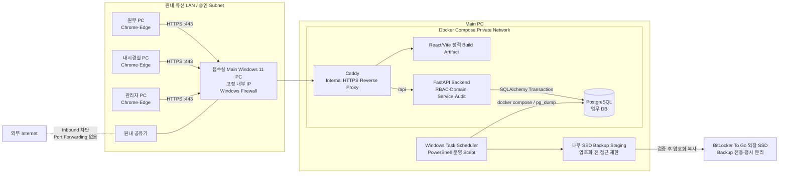
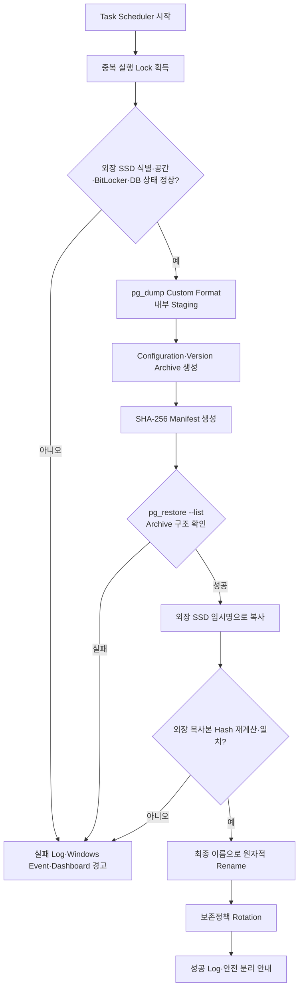

# Clinic Endoscopy Operations System 아키텍처·데이터베이스·스케줄링 설계서

- 문서 Version: 0.1
- 문서 상태: Phase 2 검토 초안
- 작성일: 2026-07-30
- 적용 단계: Phase 2 — Architecture, Database and Scheduling Engine
- 선행 문서: [02-product-requirements-document.md](./02-product-requirements-document.md)
- 구현 상태: 설계만 완료, Source Code·Migration·배포 Script 미작성

## 0. 설계 기준과 표기

| 구분 | 이 문서의 처리 |
|---|---|
| 확정된 요구사항 | 사용자가 명시했거나 Phase 1 Decision Log에서 승인된 규칙 |
| 설계상 가정 | 구현 가능한 Schema와 Interface를 만들기 위한 권장안. 운영 전 확인 필요 |
| 설정 가능한 항목 | Source Code가 아니라 Version이 있는 설정 데이터 또는 환경변수로 관리 |
| 추가 확인 필요 | 값에 따라 업무가 달라져 임의 확정하지 않은 항목 |
| 구현 완료 | Phase 2 설계 문서와 논리적 검증 |
| 미구현 | 실행 가능한 Application, Migration, Script, Test |

다음 안전 불변조건(Invariant)은 관리자 Override로도 우회할 수 없다.

1. 동일 Resource의 활성 예약 시간 중복 금지
2. 위·대장 시행 여부와 각 수면 여부의 분리 저장
3. Patient에 현재 나이값을 저장하지 않음
4. 의사 확인 없이 약 중단 여부를 시스템이 결정하지 않음
5. 취소·No-show·변경·확인·Audit 원본의 물리 삭제 금지
6. 조직검사 외부 접수번호는 `검사기관 + 접수번호` 조합으로 중복 금지

---

## 1. Architecture Summary

### 1.1 권장 Architecture

초기 운영은 **원내 접수실 Main Windows PC 한 대의 Modular Monolith**를 권장한다. 직원 PC는 같은 유선 LAN에서 Browser로 접속하고, 서버 PC의 Caddy가 내부 HTTPS의 유일한 진입점이 된다.

| 계층 | 구성 | 책임 | 외부 노출 |
|---|---|---|---|
| Client | Chrome 또는 Microsoft Edge | 화면 표시, 입력, 서버 응답의 사용자 경고 | 원내 LAN에서만 사용 |
| Edge | Caddy | HTTPS 종료, React 정적 파일 제공, `/api` Reverse Proxy, 보안 Header | 서버의 TCP 443만 허용 |
| Frontend | React·TypeScript·Vite Build Artifact | 일정·업무 화면, 입력 검증, Server State 조회 | Caddy를 통해서만 |
| Backend | FastAPI Modular Monolith | 인증, RBAC, 업무 규칙, Scheduling Engine, Transaction, Audit | Docker 내부 Network만 |
| Data | PostgreSQL | 업무 데이터, 제약조건, 동시성 제어 | Host/LAN Port 미공개 |
| Operation | PowerShell + Windows Task Scheduler | 시작·중지·상태·Backup·Restore·월간 복원시험 | 서버 PC 관리자만 |
| Backup | 내부 SSD Staging + BitLocker To Go 외장 SSD | 암호화 Backup, Hash, Rotation, 오프라인 보관 | 파일공유 금지 |

React는 Production에서 Node 개발 서버로 실행하지 않는다. Vite로 생성한 정적 Build Artifact를 Caddy가 제공한다. 이에 따라 장시간 동작하는 Container는 `caddy`, `backend`, `postgres` 세 개가 기본이며, Frontend Build는 배포 시에만 수행한다.

### 1.2 Network Boundary

- 공유기에서 Port Forwarding, UPnP 외부 공개, DMZ 설정을 사용하지 않는다.
- Windows Defender Firewall은 승인된 원내 Subnet에서 서버 TCP 443으로 들어오는 연결만 허용한다.
- PostgreSQL `5432`와 FastAPI 내부 Port는 Host에 Publish하지 않는다.
- Caddy Internal CA의 Root 공개 인증서는 승인된 직원 PC의 신뢰 저장소에 배포한다. Docker 안에서 Caddy를 실행할 때 Client 신뢰 저장소 설치는 자동이 아니므로 수동 배포 절차가 필요하다. 관련 동작은 [Caddy `tls internal` 문서](https://caddyserver.com/docs/caddyfile/directives/tls)와 [Caddy 실행 환경 문서](https://caddyserver.com/docs/running)를 기준으로 한다.
- Server PC가 일반 인터넷을 사용할 수 있더라도 이 Application은 외부에서 시작되는 연결을 받지 않는다. Update Package 반입은 별도 관리자 절차로 제한한다.

### 1.3 논리적 Module 경계

| Module | 주요 Aggregate/Service | 다른 Module과의 원칙 |
|---|---|---|
| Identity & Access | User, Role, Session, StaffProfile | 모든 변경 요청의 Actor와 Permission 제공 |
| Patient | Patient, Restriction | 예약·검사·병리에서 Patient ID만 참조 |
| Scheduling | ScheduleRule, Override, Resource, SchedulingEngine | 임상·금전 데이터에 의존하지 않고 예약 계획만 검증 |
| Appointment | Appointment, Procedure, Verification, D-1 | Scheduling 결과와 상태 전이를 Transaction으로 반영 |
| Safety | PreProcedureAssessment, MedicationReview | 약 중단은 의사 결정값을 기록할 뿐 자동 결정하지 않음 |
| Finance | Deposit, DepositTransaction | 예약 상태와 분리된 불변 금전 원장 |
| Procedure | ProcedureResult | 계획(AppointmentProcedure)과 실제 시행 결과 분리 |
| Pathology | PathologyCase, Specimen, Result, CLOResult, FollowUp | Biopsy·CLO만 신규 시스템 운영 범위 |
| Audit & Operation | AuditLog, BackupLog | 업무 원본과 분리된 Append-only 추적 |

### 1.4 Transaction Boundary

- 예약 생성·변경은 `Scheduling 검증 → DB 충돌 제약 확인 → 예약/검사계획/변경이력/Audit 저장`을 하나의 Database Transaction으로 처리한다.
- 검사 완료에서 조직검사 `있음`을 저장할 때 `ProcedureResult`와 `PathologyCase` 생성을 같은 Transaction으로 처리한다.
- 핵심 정보 변경 시 관련 `PatientVerification`을 무효화하고 변경이력과 Audit를 같은 Transaction에 기록한다.
- 외부 부작용이 없는 내부 시스템이므로 일반 업무에 분산 Transaction은 사용하지 않는다.

### 1.5 Native Windows Service 대체안

Docker Desktop 운영이 장비 정책상 어렵다면 동일 논리 구조를 유지하고 실행 방식만 바꾼다.

| 구성 | Native Windows 대체 |
|---|---|
| Caddy | Windows Service로 등록, `C:\ProgramData\ClinicEndoscopy\caddy` 사용 |
| FastAPI | 전용 Windows 계정으로 Uvicorn Process를 WinSW/NSSM 등 승인된 Service Wrapper로 관리 |
| PostgreSQL | PostgreSQL 공식 Windows Service, LAN Listen 금지 또는 Localhost만 허용 |
| React | Caddy가 `frontend/dist` 배포 Artifact 제공 |
| 환경설정 | ACL이 제한된 `C:\ProgramData\ClinicEndoscopy\config` |
| Backup | Windows Task Scheduler가 Native `pg_dump` 실행 |

Native 방식은 Docker Compose와 **동시에 운영하지 않는다**. 실제 장비에서 재부팅 자동기동, Service 계정 권한, Patch 후 복구를 검증한 뒤 하나를 주 배포방식으로 확정한다.

---

## 2. Architecture Diagram



외부 Internet과 공유기의 점선은 업무 Application으로 들어오는 Route가 없음을 뜻한다. Update 다운로드가 필요할 때도 환자정보를 외부로 전송하지 않는다.

---

## 3. Folder Structure

아래는 구현 단계에서 만들 구조이며, Phase 2에서는 아직 Directory를 생성하지 않는다.

```text
endoscopy-os/
├─ frontend/
│  ├─ src/
│  │  ├─ app/
│  │  ├─ features/
│  │  ├─ components/
│  │  ├─ routes/
│  │  ├─ schemas/
│  │  └─ lib/
│  ├─ public/
│  └─ tests/
├─ backend/
│  ├─ app/
│  │  ├─ api/
│  │  ├─ core/
│  │  ├─ domains/
│  │  │  ├─ identity/
│  │  │  ├─ patient/
│  │  │  ├─ scheduling/
│  │  │  ├─ appointment/
│  │  │  ├─ medication/
│  │  │  ├─ finance/
│  │  │  ├─ procedure/
│  │  │  └─ pathology/
│  │  ├─ models/
│  │  ├─ repositories/
│  │  └─ services/
│  └─ tests/
├─ database/
│  ├─ constraints/
│  ├─ seeds/
│  └─ README.md
├─ migrations/
│  └─ versions/
├─ config/
│  ├─ examples/
│  └─ policies/
├─ scripts/
│  ├─ install-server.ps1
│  ├─ start-server.ps1
│  ├─ stop-server.ps1
│  ├─ restart-server.ps1
│  ├─ server-status.ps1
│  ├─ backup-now.ps1
│  ├─ restore-backup.ps1
│  └─ update-application.ps1
├─ tests/
│  ├─ contract/
│  ├─ scheduling/
│  ├─ security/
│  ├─ backup/
│  └─ fixtures/
├─ docs/
│  ├─ decisions/
│  ├─ operations/
│  └─ diagrams/
├─ backup/
│  ├─ README.md
│  └─ .gitkeep
└─ deployment/
   ├─ docker/
   ├─ caddy/
   ├─ windows-native/
   └─ certificates/
```

| Folder | 책임 | 저장하면 안 되는 것 |
|---|---|---|
| `frontend` | React UI, Route, Form Schema, API Client, Component Test | 환자정보 Fixture, 인증 Token 영구저장 |
| `backend` | FastAPI, Domain Service, Repository, RBAC, Transaction, Audit | 비즈니스 규칙을 Router에 직접 혼합 |
| `database` | PostgreSQL Extension·제약·합성 Seed 지침 | 실제 Dump, 실제 환자 Seed |
| `migrations` | Alembic Revision과 Downgrade 위험 설명 | 운영 DB 수동 수정 SQL |
| `config` | 비밀값 없는 예시와 Version 정책 | `.env`, Password, CA Private Key |
| `scripts` | Windows 설치·운영·Backup·Restore 자동화 | Hard-coded Drive Letter·복구키 |
| `tests` | Domain·API·동시성·보안·복원 Test | 실제 이름·차트번호·검사결과 |
| `docs` | PRD, ADR, Runbook, 장애복구 절차 | 실제 화면 Capture의 개인정보 |
| `backup` | Backup 형식 설명과 빈 Mount 지점 | 운영 Backup 파일 자체 |
| `deployment` | Compose, Caddy, Native Service Template | 발급된 인증서 Private Key와 운영 Secret |

Runtime 데이터는 Repository 밖의 `C:\ProgramData\ClinicEndoscopy\` 아래에 저장하고 Windows ACL로 제한한다. 외장 SSD 경로는 Drive Letter가 아니라 Volume Label 또는 Volume GUID를 기준으로 해석한다.

---

## 4. Database ERD

### 4.1 Modeling 원칙

- Primary Key는 내부 UUID를 사용하고 차트번호·접수번호 같은 업무 식별자를 PK로 사용하지 않는다.
- 시간은 `timestamptz`, 업무일은 `date`, 금액은 원 단위 `integer`를 사용한다.
- 상태는 초기 변경이 잦으므로 PostgreSQL ENUM 대신 `varchar + CHECK` 또는 Reference Table을 사용한다.
- 핵심 업무 필드는 JSONB로 뭉치지 않는다. JSONB는 확인 당시 Snapshot과 변경 전후 Diff처럼 원형 보존이 필요한 데이터에만 사용한다.
- 모든 Foreign Key에는 조회 방향 Index를 둔다. Unique Constraint는 별도 Index 역할을 하므로 중복 Index를 만들지 않는다.
- Mutable Aggregate에는 `row_version integer`를 두어 UI의 오래된 값 덮어쓰기를 차단한다.
- 개인정보(PII/PHI)는 업무 Table에만 저장하고 일반 Application Log에는 남기지 않는다.

### 4.2 ERD

```mermaid
erDiagram
    ROLE ||--o{ USER_ROLE : grants
    USER ||--o{ USER_ROLE : assigned
    ROLE ||--o{ ROLE_PERMISSION : includes
    PERMISSION ||--o{ ROLE_PERMISSION : maps
    USER ||--o{ USER_SESSION : opens
    STAFF_PROFILE ||--o| USER : optional_login

    PATIENT ||--o{ APPOINTMENT : books
    PATIENT ||--o{ PATIENT_RESTRICTION : has
    SCHEDULE_RESOURCE ||--o{ APPOINTMENT : occupied_by
    SCHEDULE_RESOURCE o|--o{ SCHEDULE_DAY_LOCK : optionally_scopes
    SCHEDULE_RULE o|--o{ DATE_OVERRIDE_RULE : optionally_based_on
    SCHEDULE_RESOURCE ||--o{ BLOCKED_TIME_SLOT : blocks
    HOLIDAY o|--o{ DATE_OVERRIDE_RULE : may_drive

    APPOINTMENT ||--|{ APPOINTMENT_PROCEDURE : plans
    APPOINTMENT ||--o| APPOINTMENT_SCREENING_DETAIL : classifies
    APPOINTMENT ||--o{ PATIENT_VERIFICATION : verifies
    APPOINTMENT ||--o| PRE_PROCEDURE_ASSESSMENT : prepares
    PRE_PROCEDURE_ASSESSMENT ||--o{ MEDICATION_REVIEW : reviews
    MEDICATION_REVIEW ||--o{ MEDICATION_ITEM : contains
    MEDICATION_MASTER ||--o{ MEDICATION_ITEM : references
    APPOINTMENT ||--o| BOWEL_PREPARATION : uses
    BOWEL_PREPARATION_PRODUCT ||--o{ BOWEL_PREPARATION : selected
    APPOINTMENT ||--o{ ADDITIONAL_EXAMINATION : adds
    APPOINTMENT ||--o| DEPOSIT : charges
    DEPOSIT ||--o{ DEPOSIT_TRANSACTION : ledger
    APPOINTMENT ||--o{ APPOINTMENT_CONFIRMATION : confirms
    APPOINTMENT ||--o{ APPOINTMENT_CHANGE_HISTORY : changes
    APPOINTMENT ||--o| CANCELLATION : cancels
    APPOINTMENT ||--o{ NO_SHOW_ACTION : follows

    APPOINTMENT_PROCEDURE ||--o| PROCEDURE_RESULT : executes
    APPOINTMENT ||--o{ PATHOLOGY_CASE : creates
    PROCEDURE_RESULT ||--o{ PATHOLOGY_CASE : produces
    EXTERNAL_LABORATORY ||--o{ PATHOLOGY_CASE : receives
    PATHOLOGY_CASE ||--|{ PATHOLOGY_SPECIMEN : contains
    PATHOLOGY_CASE ||--o{ SPECIMEN_TRANSFER : transfers
    PATHOLOGY_CASE ||--o{ PATHOLOGY_RESULT : reports
    APPOINTMENT ||--o{ CLO_RESULT : records
    PROCEDURE_RESULT ||--o| CLO_RESULT : produces
    PATHOLOGY_CASE ||--o{ FOLLOW_UP_TASK : requires
    CLO_RESULT ||--o{ FOLLOW_UP_TASK : requires

    USER ||--o{ AUDIT_LOG : acts
    USER ||--o{ BACKUP_LOG : runs
    BACKUP_LOG ||--|{ BACKUP_ARTIFACT : contains
```



ERD는 관계와 Aggregate 경계를 보여준다. 실제 Foreign Key와 열별 보안·감사 속성은 다음 Table Specification이 기준이다.

---

## 5. Table Specification

### 5.0 공통 규칙

표의 `N/Y`는 Nullable의 No/Yes이다. `PII`는 `직접`(식별정보), `민감`(건강·약제·검사·금전), `간접`(User/Patient ID 등 연결 시 식별), `아니오`로 표기한다.

모든 업무·Master Table은 별도 표기하지 않아도 다음 공통열을 물리적으로 포함한다.

| 적용 대상 | Column | Type | Null | Default | Index | Unique | FK | PII | Audit |
|---|---|---|---|---|---|---|---|---|---|
| 모든 Table | `id` | `uuid` | N | `gen_random_uuid()` | PK | PK | - | 아니오 | 식별자 |
| Mutable Table | `created_at` | `timestamptz` | N | `now()` | - | - | - | 아니오 | 예 |
| Mutable Table | `created_by_user_id` | `uuid` | Y | - | IDX | - | `users.id` | 간접 | 예 |
| Mutable Table | `updated_at` | `timestamptz` | N | `now()` | - | - | - | 아니오 | 예 |
| Mutable Table | `updated_by_user_id` | `uuid` | Y | - | IDX | - | `users.id` | 간접 | 예 |
| Mutable Aggregate | `row_version` | `integer` | N | `1` | - | - | - | 아니오 | 예 |
| Append-only Event | `occurred_at` | `timestamptz` | N | `now()` | IDX | - | - | 아니오 | 원본 |

`created_by_user_id`가 Nullable인 이유는 최초 설치·Migration 같은 System Actor를 허용하기 위해서다. 운영 UI 변경은 항상 User ID가 있어야 한다. Timestamp 갱신과 `row_version + 1`은 Repository가 한 Transaction에서 수행한다.

### 5.1 Identity, Access, Patient

#### `roles`, `permissions`, `user_roles`, `role_permissions`

| Table | Column | Type | Null | Default | Index | Unique | FK | PII | Audit |
|---|---|---|---|---|---|---|---|---|---|
| `roles` | `code` | `varchar(40)` | N | - | UQ | `UQ(role.code)` | - | 아니오 | 예 |
| `roles` | `name_ko` | `varchar(80)` | N | - | - | - | - | 아니오 | 예 |
| `roles` | `is_active` | `boolean` | N | `true` | IDX | - | - | 아니오 | 예 |
| `permissions` | `code` | `varchar(80)` | N | - | UQ | `UQ(permission.code)` | - | 아니오 | 예 |
| `permissions` | `description_ko` | `varchar(200)` | N | - | - | - | - | 아니오 | 예 |
| `user_roles` | `user_id` | `uuid` | N | - | IDX | `UQ(user_id, role_id)` | `users.id` | 간접 | 예 |
| `user_roles` | `role_id` | `uuid` | N | - | IDX | `UQ(user_id, role_id)` | `roles.id` | 아니오 | 예 |
| `user_roles` | `valid_until` | `timestamptz` | Y | - | IDX | - | - | 아니오 | 예 |
| `role_permissions` | `role_id` | `uuid` | N | - | IDX | `UQ(role_id, permission_id)` | `roles.id` | 아니오 | 예 |
| `role_permissions` | `permission_id` | `uuid` | N | - | IDX | `UQ(role_id, permission_id)` | `permissions.id` | 아니오 | 예 |

초기 Role Code는 `ADMIN`, `FRONT_DESK`, `ENDOSCOPY_STAFF`, `READ_ONLY`이다. 사용자는 여러 Role을 가질 수 있지만 실제 권한은 Backend가 Permission 단위로 검사한다. Role은 삭제하지 않고 비활성화한다.

#### `staff_profiles`

로그인 계정과 의료진/업무 담당자 명부를 분리한다. 의사는 로그인하지 않더라도 의사 확인의 대상 Profile이 될 수 있다.

| Column | Type | Null | Default | Index | Unique | FK | PII | Audit |
|---|---|---|---|---|---|---|---|---|
| `display_name` | `varchar(100)` | N | - | IDX | - | - | 직접 | 예 |
| `staff_type` | `varchar(30)` | N | - | IDX | - | - | 아니오 | 예 |
| `employee_code` | `varchar(40)` | Y | - | - | Partial UQ | - | 직접 | 예 |
| `is_active` | `boolean` | N | `true` | IDX | - | - | 아니오 | 예 |
| `deactivated_at` | `timestamptz` | Y | - | - | - | - | 아니오 | 예 |

`staff_type`은 `DOCTOR`, `NURSE`, `ASSISTANT`, `ADMINISTRATIVE`, `OTHER`로 제한한다.

#### `users`

| Column | Type | Null | Default | Index | Unique | FK | PII | Audit |
|---|---|---|---|---|---|---|---|---|
| `login_id_normalized` | `varchar(80)` | N | - | UQ | `UQ(login_id_normalized)` | - | 직접 | 예 |
| `password_hash` | `varchar(255)` | N | - | - | - | - | 보안 | 변경만 |
| `display_name` | `varchar(100)` | N | - | IDX | - | - | 직접 | 예 |
| `staff_profile_id` | `uuid` | Y | - | IDX | `UQ(staff_profile_id)` | `staff_profiles.id` | 간접 | 예 |
| `is_active` | `boolean` | N | `true` | IDX | - | - | 아니오 | 예 |
| `failed_login_count` | `smallint` | N | `0` | - | - | - | 보안 | 예 |
| `locked_until` | `timestamptz` | Y | - | IDX | - | - | 보안 | 예 |
| `password_changed_at` | `timestamptz` | N | `now()` | - | - | - | 보안 | 예 |
| `last_login_at` | `timestamptz` | Y | - | - | - | - | 보안 | 예 |

Password 평문과 복구 가능한 Password는 저장하지 않는다. Password Hash 자체도 Audit의 전·후 값에 복사하지 않고 “변경 발생”만 남긴다.

#### `user_sessions`

| Column | Type | Null | Default | Index | Unique | FK | PII | Audit |
|---|---|---|---|---|---|---|---|---|
| `user_id` | `uuid` | N | - | IDX | - | `users.id` | 간접 | 보안 Event |
| `session_token_hash` | `char(64)` | N | - | UQ | `UQ(token_hash)` | - | 보안 | 원문 금지 |
| `csrf_secret_hash` | `char(64)` | N | - | - | - | - | 보안 | 원문 금지 |
| `created_ip` | `inet` | N | - | IDX | - | - | 간접 | 보안 Event |
| `user_agent_summary` | `varchar(200)` | Y | - | - | - | - | 간접 | 보안 Event |
| `last_seen_at` | `timestamptz` | N | `now()` | IDX | - | - | 간접 | 보안 Event |
| `idle_expires_at` | `timestamptz` | N | - | IDX | - | - | 아니오 | 보안 Event |
| `absolute_expires_at` | `timestamptz` | N | - | IDX | - | - | 아니오 | 보안 Event |
| `revoked_at` | `timestamptz` | Y | - | IDX | - | - | 아니오 | 보안 Event |
| `revoke_reason` | `varchar(100)` | Y | - | - | - | - | 아니오 | 보안 Event |

Browser Cookie에는 원본 Opaque Token만 넣고 Database에는 Hash만 둔다.

#### `patients`

| Column | Type | Null | Default | Index | Unique | FK | PII | Audit |
|---|---|---|---|---|---|---|---|---|
| `chart_number` | `varchar(40)` | N | - | - | - | - | 직접 | 예 |
| `chart_number_normalized` | `varchar(40)` | N | - | UQ | `UQ(chart_number_normalized)` | - | 직접 | 예 |
| `name` | `varchar(100)` | N | - | IDX | - | - | 직접 | 예 |
| `birth_date` | `date` | N | - | IDX | - | - | 직접 | 예 |
| `sex` | `varchar(10)` | N | - | IDX | - | - | 직접 | 예 |
| `phone_ciphertext` | `bytea` | Y | - | - | - | - | 직접 | 예 |
| `special_notes_ciphertext` | `bytea` | Y | - | - | - | - | 민감 | 예 |
| `cancellation_count_cache` | `integer` | N | `0` | IDX | - | - | 간접 | 파생값 |
| `no_show_count_cache` | `integer` | N | `0` | IDX | - | - | 간접 | 파생값 |
| `is_active` | `boolean` | N | `true` | IDX | - | - | 아니오 | 예 |

나이 Column은 없다. Cache Count는 원본 `cancellations`·`no_show_actions`에서 재생성 가능해야 하며 경고 성능을 위한 값이다.

#### `patient_restrictions`

| Column | Type | Null | Default | Index | Unique | FK | PII | Audit |
|---|---|---|---|---|---|---|---|---|
| `patient_id` | `uuid` | N | - | IDX | - | `patients.id` | 간접 | 예 |
| `status` | `varchar(20)` | N | `UNDER_REVIEW` | IDX | - | - | 민감 | 예 |
| `reason` | `text` | N | - | - | - | - | 민감 | 예 |
| `starts_on` | `date` | N | `current_date` | IDX | - | - | 간접 | 예 |
| `ends_on` | `date` | Y | - | IDX | - | - | 간접 | 예 |
| `approved_by_user_id` | `uuid` | Y | - | IDX | - | `users.id` | 간접 | 예 |
| `approved_at` | `timestamptz` | Y | - | - | - | - | 아니오 | 예 |
| `released_at` | `timestamptz` | Y | - | - | - | - | 아니오 | 예 |

`status`는 `UNDER_REVIEW`, `RESTRICTED`, `ALLOWED`, `EXPIRED`, `RELEASED`이다. 취소·No-show 3회 경고는 이 Table을 자동 생성하지 않고 검토 후보만 제시한다.

### 5.2 Schedule Policy와 Appointment

#### `schedule_resources`

| Column | Type | Null | Default | Index | Unique | FK | PII | Audit |
|---|---|---|---|---|---|---|---|---|
| `code` | `varchar(40)` | N | - | UQ | `UQ(code)` | - | 아니오 | 예 |
| `name` | `varchar(100)` | N | - | - | - | - | 아니오 | 예 |
| `capacity_units` | `smallint` | N | `1` | - | - | - | 아니오 | 예 |
| `is_active` | `boolean` | N | `true` | IDX | - | - | 아니오 | 예 |

MVP에는 `capacity_units=1`인 Resource 한 개만 활성화한다. Resource 수를 늘려도 개별 Resource는 한 시간구간에 한 예약만 점유한다.

#### `schedule_rules`

| Column | Type | Null | Default | Index | Unique | FK | PII | Audit |
|---|---|---|---|---|---|---|---|---|
| `resource_id` | `uuid` | Y | - | IDX | - | `schedule_resources.id` | 아니오 | 예 |
| `weekday_iso` | `smallint` | N | - | IDX | - | - | 아니오 | 예 |
| `rule_name` | `varchar(100)` | N | - | - | - | - | 아니오 | 예 |
| `morning_start_time` | `time` | N | - | - | - | - | 아니오 | 예 |
| `morning_end_time` | `time` | N | - | - | - | - | 아니오 | 예 |
| `slot_minutes` | `smallint` | N | `30` | - | - | - | 아니오 | 예 |
| `upper_duration_minutes` | `smallint` | N | `30` | - | - | - | 아니오 | 예 |
| `colon_duration_minutes` | `smallint` | N | `60` | - | - | - | 아니오 | 예 |
| `combined_duration_minutes` | `smallint` | N | `60` | - | - | - | 아니오 | 예 |
| `max_occupied_minutes` | `smallint` | Y | - | - | - | - | 아니오 | 예 |
| `upper_capacity` | `smallint` | Y | - | - | - | - | 아니오 | 예 |
| `colon_capacity` | `smallint` | Y | - | - | - | - | 아니오 | 예 |
| `afternoon_allowed` | `boolean` | N | `false` | - | - | - | 아니오 | 예 |
| `afternoon_start_time` | `time` | N | `14:00` | - | - | - | 아니오 | 예 |
| `afternoon_patient_capacity` | `smallint` | N | `1` | - | - | - | 아니오 | 예 |
| `effective_from` | `date` | N | - | IDX | `UQ(resource_id, weekday_iso, effective_from, version)` | - | 아니오 | 예 |
| `effective_to` | `date` | Y | - | IDX | - | - | 아니오 | 예 |
| `version` | `integer` | N | `1` | - | `UQ(resource_id, weekday_iso, effective_from, version)` | - | 아니오 | 예 |
| `is_active` | `boolean` | N | `true` | IDX | - | - | 아니오 | 예 |

수·토의 `upper_capacity`와 `colon_capacity`는 기본적으로 Null(별도 건수 제한 없음)이고 `max_occupied_minutes=120`과 Resource 점유가 한계를 만든다. Duration과 Slot은 모두 양수이며 Slot 배수인지 CHECK한다. 일요일 Rule은 만들지 않거나 비활성으로 둔다.

#### `schedule_day_locks`

수용량은 단순 CHECK나 시간 겹침 제약만으로 동시 요청을 완전히 막을 수 없으므로 날짜별 직렬화 잠금행을 둔다.

| Column | Type | Null | Default | Index | Unique | FK | PII | Audit |
|---|---|---|---|---|---|---|---|---|
| `service_date` | `date` | N | - | PK | `UQ(service_date, capacity_scope)` | - | 아니오 | 아니오 |
| `capacity_scope` | `varchar(80)` | N | `CLINIC` | PK | `UQ(service_date, capacity_scope)` | - | 아니오 | 아니오 |
| `resource_id` | `uuid` | Y | - | IDX | - | `schedule_resources.id` | 아니오 | 아니오 |
| `touched_at` | `timestamptz` | N | `now()` | - | - | - | 아니오 | 아니오 |

예약 생성·시간변경·검사종류변경·취소 Transaction은 먼저 해당 행을 `SELECT ... FOR UPDATE`로 잠그고 현재 활성 예약을 다시 집계한다. Counter를 진실 원본으로 저장하지 않는다. MVP의 `capacity_scope`는 의원 전체인 `CLINIC` 하나이며, Resource 증설 시 전체/Resource별 범위는 DEC-18 승인 후 확장한다.

#### `holidays`

| Column | Type | Null | Default | Index | Unique | FK | PII | Audit |
|---|---|---|---|---|---|---|---|---|
| `holiday_date` | `date` | N | - | UQ | `UQ(holiday_date)` | - | 아니오 | 예 |
| `name` | `varchar(100)` | N | - | - | - | - | 아니오 | 예 |
| `closure_type` | `varchar(30)` | N | `FULL_CLOSED` | IDX | - | - | 아니오 | 예 |
| `reason` | `text` | N | - | - | - | - | 아니오 | 예 |
| `is_active` | `boolean` | N | `true` | IDX | - | - | 아니오 | 예 |

#### `date_override_rules`

| Column | Type | Null | Default | Index | Unique | FK | PII | Audit |
|---|---|---|---|---|---|---|---|---|
| `resource_id` | `uuid` | Y | - | IDX | - | `schedule_resources.id` | 아니오 | 예 |
| `base_schedule_rule_id` | `uuid` | Y | - | IDX | - | `schedule_rules.id` | 아니오 | 예 |
| `holiday_id` | `uuid` | Y | - | IDX | - | `holidays.id` | 아니오 | 예 |
| `rule_type` | `varchar(40)` | N | - | IDX | - | - | 아니오 | 예 |
| `valid_from` | `date` | N | - | IDX | - | - | 아니오 | 예 |
| `valid_to` | `date` | N | - | IDX | - | - | 아니오 | 예 |
| `old_value` | `jsonb` | Y | - | GIN 선택 | - | - | 아니오 | 원본 |
| `new_value` | `jsonb` | N | - | GIN 선택 | - | - | 아니오 | 원본 |
| `override_start_time` | `time` | Y | - | - | - | - | 아니오 | 원본 |
| `override_end_time` | `time` | Y | - | - | - | - | 아니오 | 원본 |
| `override_upper_capacity` | `smallint` | Y | - | - | - | - | 아니오 | 원본 |
| `override_colon_capacity` | `smallint` | Y | - | - | - | - | 아니오 | 원본 |
| `override_afternoon_allowed` | `boolean` | Y | - | - | - | - | 아니오 | 원본 |
| `reason` | `text` | N | - | - | - | - | 간접 | 원본 |
| `status` | `varchar(20)` | N | `PENDING` | IDX | - | - | 아니오 | 원본 |
| `approved_by_user_id` | `uuid` | Y | - | IDX | - | `users.id` | 간접 | 원본 |
| `approved_at` | `timestamptz` | Y | - | - | - | - | 아니오 | 원본 |
| `superseded_by_id` | `uuid` | Y | - | IDX | - | `date_override_rules.id` | 아니오 | 원본 |

`rule_type`은 `CLOSED`, `EXAM_UNAVAILABLE`, `OPERATING_HOURS`, `CAPACITY`, `AFTERNOON_POLICY`, `ADD_SLOT`, `ADMIN_FORCE` 등으로 제한한다. Scheduling Engine은 typed `override_*` 열을 판정에 사용하고 JSONB는 기존·변경값 Snapshot과 설명용으로만 사용한다. `rule_type`별 필수 typed 열 조합을 CHECK한다. 승인된 Rule은 덮어쓰지 않고 새 Version이 기존 Rule을 `superseded_by_id`로 대체한다.

#### `blocked_time_slots`

| Column | Type | Null | Default | Index | Unique | FK | PII | Audit |
|---|---|---|---|---|---|---|---|---|
| `resource_id` | `uuid` | N | - | IDX | - | `schedule_resources.id` | 아니오 | 예 |
| `date_override_rule_id` | `uuid` | Y | - | IDX | - | `date_override_rules.id` | 아니오 | 예 |
| `starts_at` | `timestamptz` | N | - | GiST | - | - | 아니오 | 예 |
| `ends_at` | `timestamptz` | N | - | GiST | - | - | 아니오 | 예 |
| `block_type` | `varchar(30)` | N | - | IDX | - | - | 아니오 | 예 |
| `reason` | `text` | N | - | - | - | - | 간접 | 예 |
| `is_active` | `boolean` | N | `true` | IDX | - | - | 아니오 | 예 |

`CHECK (starts_at < ends_at)`를 적용한다. 차단 중첩은 허용하되 Scheduling Policy에서 Union으로 합친다.

#### `appointments`

| Column | Type | Null | Default | Index | Unique | FK | PII | Audit |
|---|---|---|---|---|---|---|---|---|
| `patient_id` | `uuid` | N | - | IDX | - | `patients.id` | 간접 | 예 |
| `resource_id` | `uuid` | N | - | IDX | - | `schedule_resources.id` | 아니오 | 예 |
| `related_previous_appointment_id` | `uuid` | Y | - | IDX | - | `appointments.id` | 간접 | 예 |
| `booking_bucket` | `varchar(30)` | N | `STANDARD_MORNING` | IDX | - | - | 아니오 | 예 |
| `care_type` | `varchar(20)` | N | - | IDX | - | - | 민감 | 예 |
| `screening_copay_type` | `varchar(20)` | Y | - | - | - | - | 민감 | 예 |
| `service_date` | `date` | N | - | IDX | - | - | 간접 | 예 |
| `scheduled_start_at` | `timestamptz` | N | - | GiST | - | - | 간접 | 예 |
| `scheduled_end_at` | `timestamptz` | N | - | GiST | - | - | 간접 | 예 |
| `workflow_state` | `varchar(30)` | N | `DRAFT` | IDX | - | - | 간접 | 예 |
| `occupies_slot` | `boolean generated` | N | 상태식 | Partial GiST | - | - | 아니오 | 파생 |
| `schedule_policy_version` | `varchar(80)` | N | - | IDX | - | - | 아니오 | 예 |
| `procedure_set` | `varchar(20)` | Y | - | - | - | - | 아니오 | 예 |
| `exception_reason` | `text` | Y | - | - | - | - | 민감 | 예 |
| `exception_registered_by_user_id` | `uuid` | Y | - | IDX | - | `users.id` | 간접 | 예 |
| `exception_confirmed_by_user_id` | `uuid` | Y | - | IDX | - | `users.id` | 간접 | 예 |
| `exception_confirmed_at` | `timestamptz` | Y | - | - | - | - | 아니오 | 예 |
| `exception_memo` | `text` | Y | - | - | - | - | 민감 | 예 |
| `hold_expires_at` | `timestamptz` | Y | - | IDX | - | - | 아니오 | 예 |

`care_type`은 `SCREENING` 또는 `GENERAL`이다. 검진은 `year(service_date)-year(birth_date)`, 일반은 생일 경과 여부를 반영한 만 나이를 조회 시 계산한다. `procedure_set`은 위·대장 동시검사에서만 `SET_60` 또는 `SET_90`으로 저장하며, 사람 이름이 아닌 예약 점유시간 운영 구분이다. 위 단독은 30분, 대장 단독은 60분으로 고정한다.

`occupies_slot=true` 상태는 `BOOKED`, `D1_REQUIRED`, `RECONFIRM_REQUIRED`, `ARRIVED`, `PREP_READY`, `IN_PROGRESS`, `COMPLETED`, `ON_HOLD`, `NO_SHOW_PENDING`이다. `DRAFT`, `CANCELLED`, 확정 `NO_SHOW`는 점유하지 않는다. 완료 검사는 과거 실제 점유구간을 보존하며 같은 과거 시간으로 Backdate 입력하는 것을 차단한다.

다음 DB 제약을 필수로 한다.

```text
CHECK (scheduled_start_at < scheduled_end_at)
CHECK (booking_bucket IN ('STANDARD_MORNING', 'AFTERNOON_EXCEPTION'))
CHECK (care_type IN ('SCREENING', 'GENERAL'))

EXCLUDE USING gist (
  resource_id WITH =,
  tstzrange(scheduled_start_at, scheduled_end_at, '[)') WITH &&
)
WHERE (occupies_slot)
```

이 배타 제약(Exclusion Constraint)은 PostgreSQL `btree_gist` Extension을 사용한다. Range 겹침과 Scalar Resource ID를 한 제약에서 결합하는 방식은 [PostgreSQL Range Type 문서](https://www.postgresql.org/docs/18/rangetypes.html#RANGETYPES-CONSTRAINT)와 [Constraint 문서](https://www.postgresql.org/docs/18/ddl-constraints.html)를 따른다. Frontend/Backend 검증을 통과한 두 동시 요청도 마지막에는 이 제약으로 한 건만 성공한다.

#### `appointment_procedures`

| Column | Type | Null | Default | Index | Unique | FK | PII | Audit |
|---|---|---|---|---|---|---|---|---|
| `appointment_id` | `uuid` | N | - | IDX | `UQ(appointment_id, procedure_code)` | `appointments.id` | 간접 | 예 |
| `procedure_code` | `varchar(20)` | N | - | IDX | `UQ(appointment_id, procedure_code)` | - | 민감 | 예 |
| `sedation_mode` | `varchar(20)` | N | - | IDX | - | - | 민감 | 예 |
| `planned_case_count` | `smallint` | N | `1` | - | - | - | 민감 | 예 |

`procedure_code`은 `UPPER` 또는 `COLON`이고, `sedation_mode`는 `SEDATED` 또는 `NON_SEDATED`이다. 한 예약에 두 행이 있으면 위·대장 동시 검사이며 환자 수는 여전히 1명이다. 적어도 한 Procedure가 있어야 한다는 조건은 Transaction 종료 전 Domain Service로 보장한다.

#### `patient_verifications`

| Column | Type | Null | Default | Index | Unique | FK | PII | Audit |
|---|---|---|---|---|---|---|---|---|
| `appointment_id` | `uuid` | N | - | IDX | - | `appointments.id` | 간접 | 원본 |
| `verification_stage` | `varchar(30)` | N | - | IDX | - | - | 민감 | 원본 |
| `computed_age` | `smallint` | N | - | - | - | - | 직접 | 원본 |
| `age_calculation_method` | `varchar(40)` | N | - | IDX | - | - | 직접 | 원본 |
| `age_reference_date` | `date` | N | - | - | - | - | 직접 | 원본 |
| `verified_by_user_id` | `uuid` | N | - | IDX | - | `users.id` | 간접 | 원본 |
| `verified_at` | `timestamptz` | N | `now()` | IDX | - | - | 간접 | 원본 |
| `method` | `varchar(40)` | N | - | - | - | - | 민감 | 원본 |
| `memo` | `text` | Y | - | - | - | - | 민감 | 원본 |
| `snapshot_json` | `jsonb` | N | - | - | - | - | 직접·민감 | 원본 |
| `snapshot_hash` | `char(64)` | N | - | IDX | - | - | 보안 | 원본 |
| `is_valid` | `boolean` | N | `true` | IDX | - | - | 간접 | 원본 |
| `invalidated_at` | `timestamptz` | Y | - | IDX | - | - | 간접 | 원본 |
| `invalidated_by_user_id` | `uuid` | Y | - | IDX | - | `users.id` | 간접 | 원본 |
| `invalidation_reason` | `text` | Y | - | - | - | - | 민감 | 원본 |

Snapshot에는 이름·차트번호·생년월일·성별·검사일·검사별 시행/수면과 계산된 나이·`age_method`·기준일을 저장한다. `age_method`는 `SCREENING_YEAR_AGE` 또는 `FULL_AGE`이다. 1차·2차·PACS 확인의 현재 유효행은 Stage별 Partial Unique Index를 두되 무효행은 모두 보존한다.

나이 계산식은 다음과 같다.

```text
SCREENING_YEAR_AGE =
    year(service_date) - year(birth_date)

FULL_AGE =
    year(service_date) - year(birth_date)
    - (service_date의 월·일이 생일의 월·일보다 앞서면 1, 아니면 0)
```

`service_date < birth_date`, 결과가 0 미만 또는 운영상 허용범위를 벗어나면 저장을 거절한다. 2월 29일 출생자의 비윤년 생일 경계는 PostgreSQL `age(service_date, birth_date)`와 승인된 업무 기대값을 Test로 고정한다. 현재 표시값은 계산하지만 확인 당시 값은 재현성을 위해 Verification Snapshot에 보존한다.

#### `appointment_screening_details`

| Column | Type | Null | Default | Index | Unique | FK | PII | Audit |
|---|---|---|---|---|---|---|---|---|
| `appointment_id` | `uuid` | N | - | UQ | `UQ(appointment_id)` | `appointments.id` | 간접 | 예 |
| `general_screening_proceeded` | `boolean` | N | `false` | - | - | - | 민감 | 예 |
| `fecal_occult_blood_tested` | `boolean` | N | `false` | - | - | - | 민감 | 예 |
| `fecal_occult_blood_positive` | `boolean` | Y | - | IDX | - | - | 민감 | 예 |
| `positive_fobt_colonoscopy_proceeded` | `boolean` | Y | - | IDX | - | - | 민감 | 예 |
| `copay_explained` | `boolean` | N | `false` | - | - | - | 민감 | 예 |

`care_type=SCREENING` 예약에서 사용한다. Stool 전용 관리대장·Follow-up Table은 만들지 않지만 예약 당시 검진 판단정보는 이 Table에 보존한다.

#### `appointment_change_history`

| Column | Type | Null | Default | Index | Unique | FK | PII | Audit |
|---|---|---|---|---|---|---|---|---|
| `appointment_id` | `uuid` | N | - | IDX | - | `appointments.id` | 간접 | 원본 |
| `changed_by_user_id` | `uuid` | N | - | IDX | - | `users.id` | 간접 | 원본 |
| `change_reason` | `text` | N | - | - | - | - | 민감 | 원본 |
| `changed_fields` | `jsonb` | N | - | GIN 선택 | - | - | 민감 | 원본 |
| `before_snapshot` | `jsonb` | N | - | - | - | - | 직접·민감 | 원본 |
| `after_snapshot` | `jsonb` | N | - | - | - | - | 직접·민감 | 원본 |
| `schedule_validation_trace` | `jsonb` | Y | - | - | - | - | 간접 | 원본 |

이 Table은 Append-only이다. 민감 Snapshot 접근은 관리자와 업무상 해당 권한으로 제한한다.

### 5.3 검사 전 안전, 추가검사, 예약금, 연락

#### `pre_procedure_assessments`

| Column | Type | Null | Default | Index | Unique | FK | PII | Audit |
|---|---|---|---|---|---|---|---|---|
| `appointment_id` | `uuid` | N | - | UQ | `UQ(appointment_id)` | `appointments.id` | 간접 | 예 |
| `all_medications_checked` | `boolean` | N | `false` | IDX | - | - | 민감 | 예 |
| `anticoagulant_present` | `boolean` | N | `false` | - | - | - | 민감 | 예 |
| `antiplatelet_present` | `boolean` | N | `false` | - | - | - | 민감 | 예 |
| `circulation_drug_present` | `boolean` | N | `false` | - | - | - | 민감 | 예 |
| `cardiac_drug_present` | `boolean` | N | `false` | - | - | - | 민감 | 예 |
| `neurologic_drug_present` | `boolean` | N | `false` | - | - | - | 민감 | 예 |
| `chronic_disease_drug_present` | `boolean` | N | `false` | - | - | - | 민감 | 예 |
| `surgery_history_ciphertext` | `bytea` | Y | - | - | - | - | 민감 | 예 |
| `cardiovascular_procedure_history_ciphertext` | `bytea` | Y | - | - | - | - | 민감 | 예 |
| `emr_recorded` | `boolean` | N | `false` | IDX | - | - | 민감 | 예 |
| `assessment_status` | `varchar(30)` | N | `PENDING` | IDX | - | - | 민감 | 예 |
| `completed_by_user_id` | `uuid` | Y | - | IDX | - | `users.id` | 간접 | 예 |
| `completed_at` | `timestamptz` | Y | - | - | - | - | 간접 | 예 |
| `staff_memo_ciphertext` | `bytea` | Y | - | - | - | - | 민감 | 예 |

대장내시경이 포함되면 이 Assessment와 Medication Review가 필수이다. Category Boolean은 직원 Checklist 상태이고 실제 약 목록의 원본은 `medication_items`이다.

#### `medication_masters`

| Column | Type | Null | Default | Index | Unique | FK | PII | Audit |
|---|---|---|---|---|---|---|---|---|
| `ingredient_name` | `varchar(160)` | N | - | IDX | - | - | 아니오 | 예 |
| `brand_name` | `varchar(160)` | Y | - | IDX | - | - | 아니오 | 예 |
| `classification` | `varchar(60)` | N | - | IDX | - | - | 아니오 | 예 |
| `reference_hold_days` | `smallint` | Y | - | - | - | - | 아니오 | 예 |
| `caution` | `text` | N | - | - | - | - | 아니오 | 예 |
| `reference_source` | `text` | N | - | - | - | - | 아니오 | 예 |
| `last_reviewed_on` | `date` | N | - | IDX | - | - | 아니오 | 예 |
| `reviewed_by_staff_profile_id` | `uuid` | N | - | IDX | - | `staff_profiles.id` | 간접 | 예 |
| `is_active` | `boolean` | N | `true` | IDX | - | - | 아니오 | 예 |

`UQ(lower(ingredient_name), lower(coalesce(brand_name,'')), version)`에 해당하는 정규화 Unique 정책은 Migration에서 구현한다. `reference_hold_days`는 참고 표시만 하며 환자별 결정값으로 복사하거나 자동 적용하지 않는다.

#### `medication_reviews`

| Column | Type | Null | Default | Index | Unique | FK | PII | Audit |
|---|---|---|---|---|---|---|---|---|
| `pre_assessment_id` | `uuid` | N | - | UQ | `UQ(pre_assessment_id)` | `pre_procedure_assessments.id` | 간접 | 예 |
| `hold_review_required` | `boolean` | N | `false` | IDX | - | - | 민감 | 예 |
| `doctor_confirmed` | `boolean` | N | `false` | IDX | - | - | 민감 | 예 |
| `doctor_staff_profile_id` | `uuid` | Y | - | IDX | - | `staff_profiles.id` | 간접 | 예 |
| `doctor_confirmed_on` | `date` | Y | - | IDX | - | - | 민감 | 예 |
| `decision_summary_ciphertext` | `bytea` | Y | - | - | - | - | 민감 | 예 |
| `patient_notified` | `boolean` | N | `false` | IDX | - | - | 민감 | 예 |
| `patient_notified_at` | `timestamptz` | Y | - | - | - | - | 민감 | 예 |
| `notified_by_user_id` | `uuid` | Y | - | IDX | - | `users.id` | 간접 | 예 |
| `review_status` | `varchar(30)` | N | `PENDING` | IDX | - | - | 민감 | 예 |

`hold_review_required=true`이면서 `doctor_confirmed=false`이면 “약제 중단 여부는 담당 의사의 확인이 필요합니다.” 경고를 표시하고 준비 완료를 차단한다.

#### `medication_items`

| Column | Type | Null | Default | Index | Unique | FK | PII | Audit |
|---|---|---|---|---|---|---|---|---|
| `medication_review_id` | `uuid` | N | - | IDX | - | `medication_reviews.id` | 간접 | 예 |
| `medication_master_id` | `uuid` | Y | - | IDX | - | `medication_masters.id` | 간접 | 예 |
| `actual_medication_name_ciphertext` | `bytea` | N | - | - | - | - | 민감 | 예 |
| `classification_at_review` | `varchar(60)` | Y | - | IDX | - | - | 민감 | 예 |
| `hold_review_needed` | `boolean` | N | `false` | IDX | - | - | 민감 | 예 |
| `doctor_decision` | `varchar(30)` | Y | - | IDX | - | - | 민감 | 예 |
| `doctor_decided_hold_days` | `smallint` | Y | - | - | - | - | 민감 | 예 |
| `planned_hold_date` | `date` | Y | - | IDX | - | - | 민감 | 예 |
| `actual_hold_confirmed_on` | `date` | Y | - | IDX | - | - | 민감 | 예 |
| `exception_rationale_ciphertext` | `bytea` | Y | - | - | - | - | 민감 | 예 |
| `confirmed_by_user_id` | `uuid` | Y | - | IDX | - | `users.id` | 간접 | 예 |
| `confirmed_at` | `timestamptz` | Y | - | - | - | - | 간접 | 예 |

`doctor_decision`은 `CONTINUE`, `HOLD`, `NO_CHANGE`, `NOT_APPLICABLE` 중 하나다. Aspirin을 지속하는 경우처럼 개별 판단은 `CONTINUE + exception_rationale`로 기록한다. `doctor_decided_hold_days`가 Master 참고기간과 달라도 자동 수정하지 않는다.

#### `bowel_preparation_products`, `bowel_preparations`

| Table | Column | Type | Null | Default | Index | Unique | FK | PII | Audit |
|---|---|---|---|---|---|---|---|---|---|
| `bowel_preparation_products` | `name` | `varchar(100)` | N | - | UQ | `UQ(normalized_name)` | - | 아니오 | 예 |
| `bowel_preparation_products` | `normalized_name` | `varchar(100)` | N | - | UQ | `UQ(normalized_name)` | - | 아니오 | 예 |
| `bowel_preparation_products` | `is_active` | `boolean` | N | `true` | IDX | - | - | 아니오 | 예 |
| `bowel_preparations` | `appointment_id` | `uuid` | N | - | UQ | `UQ(appointment_id)` | `appointments.id` | 간접 | 예 |
| `bowel_preparations` | `product_id` | `uuid` | Y | - | IDX | - | `bowel_preparation_products.id` | 민감 | 예 |
| `bowel_preparations` | `other_product_name` | `varchar(100)` | Y | - | - | - | - | 민감 | 예 |
| `bowel_preparations` | `received` | `boolean` | N | `false` | IDX | - | - | 민감 | 예 |
| `bowel_preparations` | `instructions_given` | `boolean` | N | `false` | IDX | - | - | 민감 | 예 |
| `bowel_preparations` | `poor_prep_reexamination` | `boolean` | N | `false` | IDX | - | - | 민감 | 예 |
| `bowel_preparations` | `reexamination_reason` | `text` | Y | - | - | - | - | 민감 | 예 |

대장내시경이 없는 예약에는 `bowel_preparations`를 생성하지 않는다. `product_id`와 `other_product_name`은 정확히 하나만 선택하도록 CHECK를 둔다.

#### `additional_examinations`

| Column | Type | Null | Default | Index | Unique | FK | PII | Audit |
|---|---|---|---|---|---|---|---|---|
| `appointment_id` | `uuid` | N | - | IDX | `UQ(appointment_id, exam_code)` | `appointments.id` | 간접 | 예 |
| `exam_code` | `varchar(40)` | N | - | IDX | `UQ(appointment_id, exam_code)` | - | 민감 | 예 |
| `planned` | `boolean` | N | `true` | - | - | - | 민감 | 예 |
| `result_flag` | `varchar(30)` | Y | - | IDX | - | - | 민감 | 예 |
| `patient_cost_explained` | `boolean` | N | `false` | - | - | - | 민감 | 예 |
| `memo_ciphertext` | `bytea` | Y | - | - | - | - | 민감 | 예 |

`exam_code`은 `BLOOD`, `CLO`, `ABDOMINAL_US`, `THYROID_US`, `CAROTID_US`, `CARDIAC_US`, `LIVER_CANCER_SCREENING`, `FOBT` 등을 사용한다. Stool 별도 관리대장은 만들지 않지만 검진 업무의 FOBT 시행·양성·대장내시경 진행 여부는 예약 단위로 보존한다.

#### `deposits`, `deposit_transactions`

| Table | Column | Type | Null | Default | Index | Unique | FK | PII | Audit |
|---|---|---|---|---|---|---|---|---|---|
| `deposits` | `appointment_id` | `uuid` | N | - | UQ | `UQ(appointment_id)` | `appointments.id` | 간접 | 예 |
| `deposits` | `is_required` | `boolean` | N | `false` | IDX | - | - | 민감 | 예 |
| `deposits` | `policy_version` | `varchar(40)` | Y | - | IDX | - | - | 아니오 | 예 |
| `deposits` | `expected_amount_krw` | `integer` | N | `20000` | - | - | - | 민감 | 예 |
| `deposits` | `actual_paid_amount_krw` | `integer` | N | `0` | - | - | - | 민감 | 예 |
| `deposits` | `paid_on` | `date` | Y | - | IDX | - | - | 민감 | 예 |
| `deposits` | `payment_method` | `varchar(30)` | Y | - | IDX | - | - | 민감 | 예 |
| `deposits` | `policy_notified` | `boolean` | N | `false` | - | - | - | 민감 | 예 |
| `deposits` | `patient_consented` | `boolean` | N | `false` | - | - | - | 민감 | 예 |
| `deposits` | `deposit_status` | `varchar(30)` | N | `NOT_REQUIRED` | IDX | - | - | 민감 | 예 |
| `deposits` | `staff_memo_ciphertext` | `bytea` | Y | - | - | - | - | 민감 | 예 |
| `deposit_transactions` | `deposit_id` | `uuid` | N | - | IDX | - | `deposits.id` | 간접 | 원본 |
| `deposit_transactions` | `transaction_type` | `varchar(30)` | N | - | IDX | - | - | 민감 | 원본 |
| `deposit_transactions` | `amount_krw` | `integer` | N | - | - | - | - | 민감 | 원본 |
| `deposit_transactions` | `transaction_on` | `date` | N | `current_date` | IDX | - | - | 민감 | 원본 |
| `deposit_transactions` | `method` | `varchar(30)` | Y | - | - | - | - | 민감 | 원본 |
| `deposit_transactions` | `reason` | `text` | Y | - | - | - | - | 민감 | 원본 |
| `deposit_transactions` | `recorded_by_user_id` | `uuid` | N | - | IDX | - | `users.id` | 간접 | 원본 |

환불완료·보류·불가·예외환불은 `deposit_status`와 Append-only Transaction으로 표현한다. 금액은 음수가 아닌 원 단위 정수이며, 환불 총액이 납부액을 넘지 않도록 Transaction에서 잠금 후 검증한다.

#### `appointment_confirmations`

| Column | Type | Null | Default | Index | Unique | FK | PII | Audit |
|---|---|---|---|---|---|---|---|---|
| `appointment_id` | `uuid` | N | - | IDX | - | `appointments.id` | 간접 | 원본 |
| `task_type` | `varchar(20)` | N | `D1` | IDX | - | - | 간접 | 원본 |
| `due_at` | `timestamptz` | N | - | IDX | - | - | 간접 | 원본 |
| `contact_needed` | `boolean` | N | `true` | - | - | - | 민감 | 원본 |
| `first_contact_attempted` | `boolean` | N | `false` | - | - | - | 민감 | 원본 |
| `call_completed` | `boolean` | N | `false` | - | - | - | 민감 | 원본 |
| `message_guidance` | `boolean` | N | `false` | - | - | - | 민감 | 원본 |
| `unreachable` | `boolean` | N | `false` | - | - | - | 민감 | 원본 |
| `proceeding_confirmed` | `boolean` | N | `false` | - | - | - | 민감 | 원본 |
| `change_requested` | `boolean` | N | `false` | - | - | - | 민감 | 원본 |
| `cancel_requested` | `boolean` | N | `false` | - | - | - | 민감 | 원본 |
| `fasting_confirmed` | `boolean` | N | `false` | - | - | - | 민감 | 원본 |
| `bowel_prep_confirmed` | `boolean` | N | `false` | - | - | - | 민감 | 원본 |
| `medication_hold_confirmed` | `boolean` | N | `false` | - | - | - | 민감 | 원본 |
| `arrival_time_reinformed` | `boolean` | N | `false` | - | - | - | 민감 | 원본 |
| `status` | `varchar(20)` | N | `PENDING` | IDX | - | - | 민감 | 원본 |
| `handled_by_user_id` | `uuid` | Y | - | IDX | - | `users.id` | 간접 | 원본 |
| `confirmed_at` | `timestamptz` | Y | - | IDX | - | - | 간접 | 원본 |
| `recall_at` | `timestamptz` | Y | - | IDX | - | - | 간접 | 원본 |
| `memo_ciphertext` | `bytea` | Y | - | - | - | - | 민감 | 원본 |

연락 시도 자체를 여러 번 보존하려면 동일 Appointment에 여러 Event 행을 허용한다. 현재 상태는 가장 최근 Event 또는 별도 View로 계산한다.

#### `cancellations`, `no_show_actions`

| Table | Column | Type | Null | Default | Index | Unique | FK | PII | Audit |
|---|---|---|---|---|---|---|---|---|---|
| `cancellations` | `appointment_id` | `uuid` | N | - | UQ | `UQ(appointment_id)` | `appointments.id` | 간접 | 원본 |
| `cancellations` | `cancelled_at` | `timestamptz` | N | `now()` | IDX | - | - | 간접 | 원본 |
| `cancellations` | `requester_type` | `varchar(30)` | N | - | IDX | - | - | 민감 | 원본 |
| `cancellations` | `reason` | `text` | N | - | - | - | - | 민감 | 원본 |
| `cancellations` | `same_day` | `boolean` | N | 계산값 | IDX | - | - | 간접 | 원본 |
| `cancellations` | `deposit_disposition` | `varchar(30)` | N | - | IDX | - | - | 민감 | 원본 |
| `cancellations` | `staff_response_ciphertext` | `bytea` | Y | - | - | - | - | 민감 | 원본 |
| `cancellations` | `rebooking_allowed` | `boolean` | N | `true` | - | - | - | 민감 | 원본 |
| `cancellations` | `recorded_by_user_id` | `uuid` | N | - | IDX | - | `users.id` | 간접 | 원본 |
| `no_show_actions` | `appointment_id` | `uuid` | N | - | IDX | - | `appointments.id` | 간접 | 원본 |
| `no_show_actions` | `action_type` | `varchar(30)` | N | - | IDX | - | - | 민감 | 원본 |
| `no_show_actions` | `contact_attempted_at` | `timestamptz` | Y | - | IDX | - | - | 간접 | 원본 |
| `no_show_actions` | `contact_result` | `varchar(40)` | Y | - | IDX | - | - | 민감 | 원본 |
| `no_show_actions` | `deposit_disposition` | `varchar(30)` | Y | - | - | - | - | 민감 | 원본 |
| `no_show_actions` | `rebooking_guidance` | `boolean` | N | `false` | - | - | - | 민감 | 원본 |
| `no_show_actions` | `restriction_review_requested` | `boolean` | N | `false` | IDX | - | - | 민감 | 원본 |
| `no_show_actions` | `assigned_to_user_id` | `uuid` | Y | - | IDX | - | `users.id` | 간접 | 원본 |
| `no_show_actions` | `completed` | `boolean` | N | `false` | IDX | - | - | 간접 | 원본 |
| `no_show_actions` | `completed_at` | `timestamptz` | Y | - | - | - | - | 간접 | 원본 |
| `no_show_actions` | `memo_ciphertext` | `bytea` | Y | - | - | - | - | 민감 | 원본 |

예약 취소와 No-show 원본 행은 수정 대신 정정 Event를 추가하는 정책을 사용한다. 3회 경고 Count의 포함·제외 기준은 DEC-15 확정 전까지 설정값 없이 자동 제한으로 이어지지 않는다.

### 5.4 실제 검사, Biopsy, CLO, Follow-up

#### `procedure_results`

계획 건수와 실제 검사 건수를 분리하기 위해 `appointment_procedures` 한 행당 최대 한 결과행을 둔다.

| Column | Type | Null | Default | Index | Unique | FK | PII | Audit |
|---|---|---|---|---|---|---|---|---|
| `appointment_procedure_id` | `uuid` | N | - | UQ | `UQ(appointment_procedure_id)` | `appointment_procedures.id` | 간접 | 예 |
| `actually_performed` | `boolean` | N | `false` | IDX | - | - | 민감 | 예 |
| `actual_start_at` | `timestamptz` | Y | - | IDX | - | - | 민감 | 예 |
| `actual_end_at` | `timestamptz` | Y | - | IDX | - | - | 민감 | 예 |
| `completion_status` | `varchar(30)` | N | `NOT_STARTED` | IDX | - | - | 민감 | 예 |
| `bowel_prep_quality` | `varchar(30)` | Y | - | IDX | - | - | 민감 | 예 |
| `aborted` | `boolean` | N | `false` | IDX | - | - | 민감 | 예 |
| `abort_reason_ciphertext` | `bytea` | Y | - | - | - | - | 민감 | 예 |
| `biopsy_performed` | `boolean` | N | `false` | IDX | - | - | 민감 | 예 |
| `clo_performed` | `boolean` | N | `false` | IDX | - | - | 민감 | 예 |
| `reexamination_needed` | `boolean` | N | `false` | IDX | - | - | 민감 | 예 |
| `reexamination_recommended_on` | `date` | Y | - | IDX | - | - | 민감 | 예 |
| `staff_memo_ciphertext` | `bytea` | Y | - | - | - | - | 민감 | 예 |
| `recorded_by_user_id` | `uuid` | N | - | IDX | - | `users.id` | 간접 | 예 |

`actual_start_at < actual_end_at`을 검사한다. 조직검사 `biopsy_performed=true` 저장 시 `pathology_cases` 생성까지 같은 Transaction에서 성공해야 한다.

#### `external_laboratories`

| Column | Type | Null | Default | Index | Unique | FK | PII | Audit |
|---|---|---|---|---|---|---|---|---|
| `code` | `varchar(40)` | N | - | UQ | `UQ(code)` | - | 아니오 | 예 |
| `name` | `varchar(120)` | N | - | UQ | `UQ(normalized_name)` | - | 아니오 | 예 |
| `normalized_name` | `varchar(120)` | N | - | UQ | `UQ(normalized_name)` | - | 아니오 | 예 |
| `is_active` | `boolean` | N | `true` | IDX | - | - | 아니오 | 예 |

초기 Master에는 승인 후 씨젠을 등록한다. 기관 이름을 자유문자열로 Case마다 반복하지 않는다.

#### `pathology_cases`

| Column | Type | Null | Default | Index | Unique | FK | PII | Audit |
|---|---|---|---|---|---|---|---|---|
| `appointment_id` | `uuid` | N | - | IDX | - | `appointments.id` | 간접 | 예 |
| `source_procedure_result_id` | `uuid` | N | - | IDX | - | `procedure_results.id` | 간접 | 예 |
| `external_laboratory_id` | `uuid` | Y | - | IDX | `Partial UQ(lab_id, accession_number)` | `external_laboratories.id` | 간접 | 예 |
| `accession_number` | `varchar(100)` | Y | - | IDX | `Partial UQ(lab_id, accession_number)` | - | 민감 | 예 |
| `case_status` | `varchar(40)` | N | `PLANNED` | IDX | - | - | 민감 | 예 |
| `specimen_collected_on` | `date` | N | - | IDX | - | - | 민감 | 예 |
| `requested_on` | `date` | Y | - | IDX | - | - | 민감 | 예 |
| `institution_sent_on` | `date` | Y | - | IDX | - | - | 민감 | 예 |
| `responsible_doctor_profile_id` | `uuid` | Y | - | IDX | - | `staff_profiles.id` | 간접 | 예 |
| `doctor_confirmed` | `boolean` | N | `false` | IDX | - | - | 민감 | 예 |
| `doctor_confirmed_at` | `timestamptz` | Y | - | IDX | - | - | 민감 | 예 |
| `doctor_confirmation_recorded_by_user_id` | `uuid` | Y | - | IDX | - | `users.id` | 간접 | 예 |
| `patient_notified` | `boolean` | N | `false` | IDX | - | - | 민감 | 예 |
| `patient_notified_on` | `date` | Y | - | IDX | - | - | 민감 | 예 |
| `notification_method` | `varchar(30)` | Y | - | - | - | - | 민감 | 예 |
| `follow_up_owner_user_id` | `uuid` | Y | - | IDX | - | `users.id` | 간접 | 예 |
| `completed_at` | `timestamptz` | Y | - | IDX | - | - | 민감 | 예 |
| `memo_ciphertext` | `bytea` | Y | - | - | - | - | 민감 | 예 |

`external_laboratory_id`와 `accession_number`는 둘 다 Null이거나 둘 다 값이 있어야 한다. 값이 부여된 뒤에는 `(external_laboratory_id, accession_number)` Partial Unique Constraint가 중복 Case를 차단한다. 접수번호는 Specimen이 아니라 Case에 귀속한다.

`case_status`는 `PLANNED`, `REQUESTED`, `RESULT_PENDING`, `RESULT_PUBLISHED`, `DOCTOR_REVIEW_PENDING`, `PATIENT_NOTIFICATION_PENDING`, `FOLLOW_UP_PLANNED`, `COMPLETED`이다. “원내 결과 도착” 상태는 만들지 않는다.

#### `pathology_specimens`

| Column | Type | Null | Default | Index | Unique | FK | PII | Audit |
|---|---|---|---|---|---|---|---|---|
| `pathology_case_id` | `uuid` | N | - | IDX | `UQ(case_id, specimen_sequence)` | `pathology_cases.id` | 간접 | 예 |
| `specimen_sequence` | `smallint` | N | `1` | - | `UQ(case_id, specimen_sequence)` | - | 민감 | 예 |
| `procedure_code` | `varchar(20)` | N | - | IDX | - | - | 민감 | 예 |
| `collection_site_ciphertext` | `bytea` | N | - | - | - | - | 민감 | 예 |
| `container_count` | `smallint` | N | `1` | - | - | - | 민감 | 예 |
| `storage_location` | `varchar(100)` | Y | - | IDX | - | - | 민감 | 예 |
| `label_verified` | `boolean` | N | `false` | IDX | - | - | 민감 | 예 |

한 검사에서 여러 채취 부위가 있으면 Case 1개 아래 Specimen을 여러 행으로 둔다. `container_count > 0`을 검사한다.

#### `specimen_transfers`

| Column | Type | Null | Default | Index | Unique | FK | PII | Audit |
|---|---|---|---|---|---|---|---|---|
| `pathology_case_id` | `uuid` | N | - | IDX | - | `pathology_cases.id` | 간접 | 원본 |
| `transfer_type` | `varchar(30)` | N | - | IDX | - | - | 민감 | 원본 |
| `from_staff_profile_id` | `uuid` | Y | - | IDX | - | `staff_profiles.id` | 간접 | 원본 |
| `to_staff_profile_id` | `uuid` | Y | - | IDX | - | `staff_profiles.id` | 간접 | 원본 |
| `transferred_at` | `timestamptz` | N | - | IDX | - | - | 민감 | 원본 |
| `confirmed_by_admin_user_id` | `uuid` | N | - | IDX | - | `users.id` | 간접 | 원본 |
| `confirmed_at` | `timestamptz` | N | `now()` | IDX | - | - | 간접 | 원본 |
| `memo_ciphertext` | `bytea` | Y | - | - | - | - | 민감 | 원본 |

DEC-29에 따라 인계자·인수자 각각의 로그인 서명은 요구하지 않는다. 관리자 User가 사실관계를 확인해 한 Append-only Event로 기록하며, 실제 인계·인수자는 `StaffProfile`로 남긴다.

#### `pathology_results`

| Column | Type | Null | Default | Index | Unique | FK | PII | Audit |
|---|---|---|---|---|---|---|---|---|
| `pathology_case_id` | `uuid` | N | - | IDX | `UQ(pathology_case_id, version_no)` | `pathology_cases.id` | 간접 | 원본 |
| `version_no` | `smallint` | N | `1` | - | `UQ(pathology_case_id, version_no)` | - | 아니오 | 원본 |
| `result_reported_on` | `date` | N | - | IDX | - | - | 민감 | 원본 |
| `report_source` | `varchar(30)` | N | `SEEGENE_SITE` | IDX | - | - | 민감 | 원본 |
| `result_summary_ciphertext` | `bytea` | N | - | - | - | - | 민감 | 원본 |
| `recorded_by_user_id` | `uuid` | N | - | IDX | - | `users.id` | 간접 | 원본 |
| `recorded_at` | `timestamptz` | N | `now()` | IDX | - | - | 간접 | 원본 |
| `corrects_result_id` | `uuid` | Y | - | IDX | - | `pathology_results.id` | 간접 | 원본 |

`result_reported_on`은 **씨젠 사이트에 최초 결과가 게시된 날짜**다. `result_received_on`, `internal_arrived_on` 같은 원내 도착일 Column은 만들지 않는다. 결과 정정이 필요하면 기존 행을 덮어쓰지 않고 `version_no+1`과 `corrects_result_id`로 새 행을 추가한다. 모든 Version의 `result_reported_on`은 최초 게시일과 같아야 하며 현재 결과는 가장 큰 Version으로 조회한다.

#### `clo_results`

| Column | Type | Null | Default | Index | Unique | FK | PII | Audit |
|---|---|---|---|---|---|---|---|---|
| `appointment_id` | `uuid` | N | - | IDX | - | `appointments.id` | 간접 | 예 |
| `source_procedure_result_id` | `uuid` | N | - | UQ | `UQ(source_procedure_result_id)` | `procedure_results.id` | 간접 | 예 |
| `performed_on` | `date` | N | - | IDX | - | - | 민감 | 예 |
| `result_status` | `varchar(20)` | N | `PENDING` | IDX | - | - | 민감 | 예 |
| `result_confirmed_on` | `date` | Y | - | IDX | - | - | 민감 | 예 |
| `recorded_by_user_id` | `uuid` | N | - | IDX | - | `users.id` | 간접 | 예 |
| `memo_ciphertext` | `bytea` | Y | - | - | - | - | 민감 | 예 |

`result_status`는 `PENDING`, `NEGATIVE`, `POSITIVE`, `INDETERMINATE`, `NOT_PERFORMED`이다. CLO는 Biopsy Case와 구분해 관리하되 같은 환자·예약 History에서 함께 조회한다.

#### `follow_up_tasks`

| Column | Type | Null | Default | Index | Unique | FK | PII | Audit |
|---|---|---|---|---|---|---|---|---|
| `pathology_case_id` | `uuid` | Y | - | IDX | - | `pathology_cases.id` | 간접 | 예 |
| `clo_result_id` | `uuid` | Y | - | IDX | - | `clo_results.id` | 간접 | 예 |
| `task_type` | `varchar(40)` | N | - | IDX | - | - | 민감 | 예 |
| `status` | `varchar(20)` | N | `OPEN` | IDX | - | - | 민감 | 예 |
| `due_on` | `date` | N | - | IDX | - | - | 민감 | 예 |
| `reexamination_due_on` | `date` | Y | - | IDX | - | - | 민감 | 예 |
| `assigned_to_user_id` | `uuid` | N | - | IDX | - | `users.id` | 간접 | 예 |
| `completed_at` | `timestamptz` | Y | - | IDX | - | - | 민감 | 예 |
| `completed_by_user_id` | `uuid` | Y | - | IDX | - | `users.id` | 간접 | 예 |
| `completion_note_ciphertext` | `bytea` | Y | - | - | - | - | 민감 | 예 |

`CHECK (num_nonnulls(pathology_case_id, clo_result_id)=1)`로 소유 대상을 정확히 하나만 허용한다. `status != COMPLETED AND due_on < current_date`인지는 Stored 상태가 아니라 Query/View에서 `is_overdue`로 계산한다.

### 5.5 Audit와 Backup

#### `audit_logs`

| Column | Type | Null | Default | Index | Unique | FK | PII | Audit |
|---|---|---|---|---|---|---|---|---|
| `actor_user_id` | `uuid` | Y | - | IDX | - | `users.id` | 간접 | 자체 |
| `actor_type` | `varchar(20)` | N | `USER` | IDX | - | - | 아니오 | 자체 |
| `action` | `varchar(60)` | N | - | IDX | - | - | 아니오 | 자체 |
| `entity_type` | `varchar(60)` | N | - | IDX | - | - | 아니오 | 자체 |
| `entity_id` | `uuid` | Y | - | IDX | - | - | 간접 | 자체 |
| `patient_id` | `uuid` | Y | - | IDX | - | `patients.id` | 간접 | 자체 |
| `reason` | `text` | Y | - | - | - | - | 민감 가능 | 자체 |
| `before_data_redacted` | `jsonb` | Y | - | - | - | - | 간접 | 자체 |
| `after_data_redacted` | `jsonb` | Y | - | - | - | - | 간접 | 자체 |
| `request_id` | `uuid` | N | - | IDX | - | - | 아니오 | 자체 |
| `source_ip` | `inet` | N | - | IDX | - | - | 간접 | 자체 |
| `result` | `varchar(20)` | N | - | IDX | - | - | 아니오 | 자체 |
| `previous_record_hash` | `char(64)` | Y | - | - | - | - | 보안 | 자체 |
| `record_hash` | `char(64)` | N | - | UQ | `UQ(record_hash)` | - | 보안 | 자체 |

Audit에는 이름·생년월일·전화번호·복용약 원문을 반복 저장하지 않는다. 바뀐 Field 이름, 업무 ID, 마스킹된 값, 사유를 남긴다. Application DB 계정은 INSERT/SELECT만 가지고 UPDATE/DELETE 권한을 갖지 않는다. Hash Chain은 변조 징후를 탐지하지만 Database 관리자까지 완전히 방지하는 전자서명은 아니다.

#### `backup_logs`

| Column | Type | Null | Default | Index | Unique | FK | PII | Audit |
|---|---|---|---|---|---|---|---|---|
| `backup_run_id` | `uuid` | N | `gen_random_uuid()` | UQ | `UQ(backup_run_id)` | - | 아니오 | 운영 원본 |
| `backup_type` | `varchar(30)` | N | - | IDX | - | - | 아니오 | 운영 원본 |
| `started_at` | `timestamptz` | N | - | IDX | - | - | 아니오 | 운영 원본 |
| `finished_at` | `timestamptz` | Y | - | IDX | - | - | 아니오 | 운영 원본 |
| `status` | `varchar(20)` | N | `RUNNING` | IDX | - | - | 아니오 | 운영 원본 |
| `database_file_name` | `varchar(260)` | Y | - | - | - | - | 간접 | 운영 원본 |
| `config_archive_name` | `varchar(260)` | Y | - | - | - | - | 보안 | 운영 원본 |
| `destination_volume_id` | `varchar(120)` | Y | - | IDX | - | - | 보안 | 운영 원본 |
| `size_bytes` | `bigint` | Y | - | - | - | - | 아니오 | 운영 원본 |
| `sha256` | `char(64)` | Y | - | IDX | - | - | 보안 | 운영 원본 |
| `integrity_check_status` | `varchar(20)` | N | `PENDING` | IDX | - | - | 아니오 | 운영 원본 |
| `restore_test_status` | `varchar(20)` | N | `NOT_TESTED` | IDX | - | - | 아니오 | 운영 원본 |
| `restore_tested_at` | `timestamptz` | Y | - | IDX | - | - | 아니오 | 운영 원본 |
| `triggered_by_user_id` | `uuid` | Y | - | IDX | - | `users.id` | 간접 | 운영 원본 |
| `error_code` | `varchar(80)` | Y | - | IDX | - | - | 보안 | 운영 원본 |
| `error_summary_redacted` | `text` | Y | - | - | - | - | 보안 | 운영 원본 |

Backup Log에는 Dump 내용, Database Password, BitLocker 복구키, 환자 이름을 저장하지 않는다. Database 자체가 손상된 경우에도 확인할 수 있도록 동일한 비식별 실행 결과를 Windows Event Log 또는 ACL 제한 JSONL에도 이중 기록한다.

#### `backup_artifacts`

| Column | Type | Null | Default | Index | Unique | FK | PII | Audit |
|---|---|---|---|---|---|---|---|---|
| `backup_log_id` | `uuid` | N | - | IDX | `UQ(backup_log_id, artifact_type)` | `backup_logs.id` | 아니오 | 운영 원본 |
| `artifact_type` | `varchar(30)` | N | - | IDX | `UQ(backup_log_id, artifact_type)` | - | 아니오 | 운영 원본 |
| `relative_file_name` | `varchar(260)` | N | - | - | - | - | 보안 | 운영 원본 |
| `size_bytes` | `bigint` | N | - | - | - | - | 아니오 | 운영 원본 |
| `sha256` | `char(64)` | N | - | IDX | - | - | 보안 | 운영 원본 |
| `encryption_method` | `varchar(40)` | N | - | - | - | - | 보안 | 운영 원본 |
| `integrity_status` | `varchar(20)` | N | `PENDING` | IDX | - | - | 아니오 | 운영 원본 |
| `verified_at` | `timestamptz` | Y | - | - | - | - | 아니오 | 운영 원본 |

`artifact_type`은 `DATABASE_DUMP`, `CONFIG_ARCHIVE`, `MANIFEST`, `LOG_EXPORT`이다. `backup_logs.sha256`은 Manifest 자체의 Hash이고 각 파일 Hash는 이 Table에 둔다.

### 5.6 참조 무결성과 삭제 정책

| 대상 | 삭제 정책 |
|---|---|
| User, Role, Staff, Master, Resource | `is_active=false`; 참조 중 Hard Delete 금지 |
| Patient | 법적·내부 보존정책 확정 전 Hard Delete 금지 |
| Appointment 및 모든 업무 Event | Hard Delete 금지 |
| Verification, Change, Cancellation, No-show, DepositTransaction, Transfer, Result, Audit | Append-only; 정정 Event 추가 |
| Schedule Override | 승인 후 덮어쓰기 금지; 새 Version으로 대체 |
| BackupLog | 보존정책에 따른 Archive는 가능하나 실패이력 임의삭제 금지 |

Foreign Key의 기본은 `ON DELETE RESTRICT`이다. 단순 `CASCADE`는 운영 데이터 손실 범위를 키우므로 테스트용 임시 데이터 외에는 사용하지 않는다.

---

## 6. Scheduling Algorithm

### 6.1 Domain Service 경계

`SchedulingEngine`은 환자정보, 약제, 예약금, 병리 결과를 직접 수정하지 않는다. 날짜와 검사계획을 받아 **가능 Slot, 적용 정책, 오류 Code, 저장에 필요한 검증 Version**을 반환하는 독립 Domain Service다.

```text
ProcedureSelection
  gastroscopy: boolean
  colonoscopy: boolean

CapacityBucket
  STANDARD_MORNING
  AFTERNOON_EXCEPTION

TimeInterval
  [start_at, end_at)  // 시작 포함, 종료 제외

ScheduleCandidate
  appointment_id?     // 변경이면 존재
  patient_id
  service_date
  requested_start_at
  resource_id
  capacity_bucket
  procedures
  expected_row_version?
  expected_policy_version
  approved_override_id?
```

수면 여부는 `AppointmentProcedure`에 각각 저장하지만 점유시간 계산에는 영향을 주지 않는다.

### 6.2 Capacity Bucket과 통계

`STANDARD_MORNING`과 `AFTERNOON_EXCEPTION`은 검증·집계 모두에서 섞지 않는다.

| Field | 계산 |
|---|---|
| `standard_patient_count` | 활성 일반 오전 Appointment 수 |
| `standard_gastroscopy_count` | 일반 오전의 `UPPER` Procedure 행 수 |
| `standard_colonoscopy_count` | 일반 오전의 `COLON` Procedure 행 수 |
| `exception_patient_count` | 활성 오후 예외 Appointment 수 |
| `exception_gastroscopy_count` | 오후 예외의 `UPPER` Procedure 행 수 |
| `exception_colonoscopy_count` | 오후 예외의 `COLON` Procedure 행 수 |
| `total_patient_count` | 두 Bucket의 환자 수 합 |
| `total_gastroscopy_count` | `standard_gastroscopy_count + exception_gastroscopy_count` |
| `total_colonoscopy_count` | `standard_colonoscopy_count + exception_colonoscopy_count` |
| `total_procedure_count` | `total_gastroscopy_count + total_colonoscopy_count` |

위·대장 동시 예약은 환자 1명, 위 1건, 대장 1건, 점유 60분이다. 계획 통계는 활성 예약 기준이고 실제 검사 통계는 `ProcedureResult.actually_performed=true` 기준으로 별도 계산한다.

### 6.3 기본 요일 규칙

| 요일 | 운영 구간 | 위 단독 | 대장 단독 | 위·대장 동시 | 일반 Capacity |
|---|---|---:|---:|---:|---|
| 월·화·목·금 | `[09:00, 12:00)` | 30분, 마지막 11:30 | 60분, 마지막 11:00 | 60분, 마지막 11:00 | 위 5, 대장 3 |
| 수·토 | `[09:00, 11:00)` | 30분, 마지막 10:30 | 60분, 마지막 10:00 | 60분, 마지막 10:00 | 120분 점유와 종료시각으로 결정 |
| 일 | 휴진 | 불가 | 불가 | 불가 | 0 |

마지막 시작시각은 고정 문자열을 별도로 비교하지 않고 `resolved_end_time - calculated_duration`으로 계산한다. 기본 Rule에서는 위 표의 값과 정확히 일치하며, 날짜별 운영 종료 변경에도 자동 대응한다.

월·화·목·금에 위 단독만 배치하면 시간상 6개 Slot이 있어도 위 Capacity 5 때문에 여섯 번째는 거절한다. 수·토는 환자 수 상한을 두지 않아 위 단독 4명이 자연스럽게 최대가 된다.

### 6.4 오후 14시 예외

- 날짜별 `AFTERNOON_ALLOW` 승인이 있어야 기본 14:00 Candidate를 생성한다.
- 검사 종류와 무관하게 오후 예외 환자 Capacity는 기본 1이다.
- 오전 위 5건 또는 대장 3건이 가득 차도 오후 예외는 독립 Bucket이므로 추가할 수 있다.
- 확인 대기 상태의 오후 예약도 다른 직원이 두 번째 예약을 넣지 못하도록 Slot과 오후 Capacity를 점유한다.
- 사유, 등록자, 확인자, 확인시각, 메모가 모두 있어야 최종 확정한다.
- 추가 오후 예약은 승인된 `ADD_SLOT`과 Capacity 증가가 함께 있을 때만 가능하며, 동일 Resource 중복은 여전히 금지한다.

### 6.5 수·토 4-Slot Algorithm

기본 구간을 30분 단위 4-bit Mask로 표현한다.

| Bit Index | 시간 | Bit |
|---:|---|---:|
| 0 | 09:00~09:30 | `0001` |
| 1 | 09:30~10:00 | `0010` |
| 2 | 10:00~10:30 | `0100` |
| 3 | 10:30~11:00 | `1000` |

| 시작 | 위 단독 Mask | 대장·동시 Mask |
|---|---:|---:|
| 09:00 | `0001` | `0011` |
| 09:30 | `0010` | `0110` |
| 10:00 | `0100` | `1100` |
| 10:30 | `1000` | 불가 |

Candidate가 가능한 조건은 다음 세 가지를 모두 만족하는 것이다.

```text
(candidate_mask AND NOT open_mask) == 0
(candidate_mask AND blocked_mask) == 0
(candidate_mask AND occupied_mask) == 0
```

최종 점유는 `occupied_mask OR candidate_mask`로 계산한다. OR 연산은 등록순서와 무관하므로 기존 예약이 어떤 순서로 입력되었든 같은 Slot Map을 만든다. 기본 수·토 외에 운영시간이 바뀐 날짜는 동일 원리의 동적 Bitset 또는 일반 Interval 계산을 사용한다.

### 6.6 수·토 Slot Map 예시

| 조합 | 배치 | Slot Map: 09:00 / 09:30 / 10:00 / 10:30 | 환자 | 위 | 대장 | 점유 |
|---|---|---|---:|---:|---:|---:|
| 위 + 위 + 위·대장 | 위 09:00, 위 09:30, 동시 10:00 | `위 A / 위 B / 동시 C / 동시 C` | 3 | 3 | 1 | 120분 |
| 위 + 위 + 위 + 위 | 각 30분 연속 | `위 A / 위 B / 위 C / 위 D` | 4 | 4 | 0 | 120분 |
| 위·대장 + 위·대장 | 동시 09:00, 동시 10:00 | `동시 A / 동시 A / 동시 B / 동시 B` | 2 | 2 | 2 | 120분 |
| 위 + 대장 + 위 | 위 09:00, 대장 09:30, 위 10:30 | `위 A / 대장 B / 대장 B / 위 C` | 3 | 2 | 1 | 120분 |
| 선택시간 충돌 | 기존 동시 09:00, 신규 위 09:30 | 기존 `0011`과 신규 `0010`이 겹침 | - | - | - | 신규 거절 |
| 총시간 불가 | 대장 3명 | 60분×3 = 180분 | 3 | 0 | 3 | 120분 초과로 배치 불가 |

사용자가 시간을 지정하지 않으면 시작시각·Resource ID 오름차순의 첫 유효 Slot을 추천한다. 사용자가 시간을 지정하면 Engine은 그 시간을 검증할 뿐 임의로 이동시키지 않는다.

### 6.7 Service Interface

| Function | 핵심 입력 | 반환 | 주요 오류 |
|---|---|---|---|
| `get_available_slots` | 날짜, 검사선택, Bucket, Resource 선택 | 정렬된 Slot, 최초 Slot, Policy Version | `DATE_CLOSED`, `NO_AVAILABLE_SLOT` |
| `validate_appointment` | ScheduleCandidate, 현재 Context | Valid 여부, Interval, 적용 Rule Trace, 전후 Count | `TIME_CONFLICT`, `CAPACITY_EXCEEDED` |
| `calculate_procedure_duration` | 위·대장 Boolean | 분, 각 검사 Count 증가량 | `PROCEDURE_REQUIRED` |
| `calculate_daily_counts` | 날짜, Count Basis, 제외 Appointment | Bucket별 환자·위·대장 Count | `INVALID_COUNT_BASIS` |
| `detect_time_conflict` | Resource, `[start,end)`, 제외 Appointment | 충돌 여부와 충돌 Appointment ID | `INVALID_INTERVAL` |
| `apply_date_override` | 날짜, 기본 Rule, 승인 예외 | `ResolvedDayPolicy`, Rule Trace | `CONFLICTING_OVERRIDES` |
| `validate_afternoon_exception` | Candidate, Metadata, Policy | Valid 여부와 오후 Count | `AFTERNOON_LIMIT_EXCEEDED` |
| `recommend_alternative_slots` | 실패 Candidate, 검색종료일, 최대개수 | 결정적으로 정렬된 대안 | `NO_ALTERNATIVE_SLOT` |
| `release_cancelled_slot` | Appointment, 취소 Command | 상태전이·Count 변화·Audit 계획 | `APPOINTMENT_NOT_ACTIVE` |
| `revalidate_changed_appointment` | 현재 Appointment, 변경 Command | 검증결과·Diff·확인무효화 계획 | `STALE_ROW_VERSION` |

### 6.8 동시성 제어

Availability 조회는 참고 결과이며 저장 성공을 예약하지 않는다. 최종 등록·변경·취소는 다음 순서로 처리한다.

1. Database Transaction 시작
2. `schedule_day_locks`의 대상 날짜·Scope 행을 `FOR UPDATE`로 잠금
3. Appointment `row_version`과 Schedule Policy Version 재확인
4. 승인 Rule과 활성 예약을 다시 조회
5. 시간충돌·Capacity·오후 예외를 다시 검증
6. Appointment와 Procedure, 변경이력, 확인무효화, Audit를 원자적으로 저장
7. PostgreSQL Exclusion Constraint 최종 확인
8. Commit

다른 요청이 먼저 저장되면 뒤 요청은 `STALE_ROW_VERSION`, `CAPACITY_EXCEEDED`, 또는 PostgreSQL `23P01`을 변환한 `TIME_CONFLICT`로 실패한다. 실패 시 기존 예약을 변경하지 않고 최신 Context로 대체 Slot을 다시 조회한다.

---

## 7. Pseudocode

### 7.1 `calculate_procedure_duration`

```text
FUNCTION calculate_procedure_duration(procedures):
    IF NOT procedures.gastroscopy AND NOT procedures.colonoscopy:
        RETURN ERROR(PROCEDURE_REQUIRED)

    IF procedures.gastroscopy AND procedures.colonoscopy:
        minutes = 90 IF procedures.procedure_set == SET_90 ELSE 60
        RETURN {minutes: minutes, gastroscopy_increment: 1,
                colonoscopy_increment: 1, patient_increment: 1}

    IF procedures.gastroscopy:
        RETURN {minutes: 30, gastroscopy_increment: 1,
                colonoscopy_increment: 0, patient_increment: 1}

    RETURN {minutes: 60, gastroscopy_increment: 0,
            colonoscopy_increment: 1, patient_increment: 1}
```

### 7.2 `apply_date_override`

```text
FUNCTION apply_date_override(date, base_rule, approved_overrides):
    applicable = FILTER approved_overrides
                 WHERE valid_from <= date <= valid_to

    IF conflicting_values_exist_at_same_priority(applicable):
        RETURN ERROR(CONFLICTING_OVERRIDES)

    policy = build_from(base_rule)
    policy.rule_trace = []

    IF exists(CLOSED or EXAM_UNAVAILABLE):
        RETURN closed_policy_with_trace()

    policy.operating_intervals =
        apply_typed_operating_hours(policy, applicable)
    policy.capacities =
        apply_typed_capacity_changes(policy, applicable)
    policy.afternoon =
        apply_afternoon_allow_or_block(policy, applicable)

    blocked = union(all SLOT_BLOCK intervals)
    policy.operating_intervals -= blocked
    policy.additional_slots -= blocked

    admin_force = find(ADMIN_FORCE)
    IF admin_force exists:
        require reason, approver, scope, valid period
        require referenced approved ADD_SLOT or CAPACITY rule
        record in rule_trace
        // closed day, blocked slot, invalid time and overlap are not bypassed

    RETURN policy
```

### 7.3 `detect_time_conflict`

```text
FUNCTION detect_time_conflict(resource_id, candidate, existing, exclude_id):
    REQUIRE candidate.start < candidate.end
    conflicts = []

    FOR appointment IN existing:
        IF appointment.id == exclude_id: CONTINUE
        IF appointment.resource_id != resource_id: CONTINUE
        IF NOT appointment.occupies_slot: CONTINUE

        overlaps =
            candidate.start < appointment.end
            AND appointment.start < candidate.end

        IF overlaps: conflicts.ADD(appointment.id)

    RETURN {has_conflict: conflicts NOT EMPTY, appointment_ids: conflicts}
```

### 7.4 `calculate_daily_counts`

```text
FUNCTION calculate_daily_counts(date, appointments, basis, exclude_id):
    counts = all_zero_counts()

    FOR appointment IN appointments:
        IF appointment.service_date != date: CONTINUE
        IF appointment.id == exclude_id: CONTINUE
        IF NOT qualifies_for_basis(appointment, basis): CONTINUE

        IF appointment.bucket == STANDARD_MORNING:
            counts.standard_patient_count += 1
            IF has_upper(appointment):
                counts.standard_gastroscopy_count += 1
            IF has_colon(appointment):
                counts.standard_colonoscopy_count += 1
        ELSE IF appointment.bucket == AFTERNOON_EXCEPTION:
            counts.exception_patient_count += 1
            IF has_upper(appointment):
                counts.exception_gastroscopy_count += 1
            IF has_colon(appointment):
                counts.exception_colonoscopy_count += 1
        ELSE:
            RETURN ERROR(UNKNOWN_CAPACITY_BUCKET)

    derive_total_fields(counts)
    RETURN counts
```

### 7.5 `validate_afternoon_exception`

```text
FUNCTION validate_afternoon_exception(candidate, policy, appointments):
    errors = []

    IF NOT policy.afternoon_allowed:
        errors.ADD(AFTERNOON_DISABLED)

    permitted_starts = {14:00} UNION policy.approved_additional_starts
    IF candidate.start NOT IN permitted_starts:
        errors.ADD(INVALID_AFTERNOON_START)

    REQUIRE candidate.exception_reason
    REQUIRE candidate.registered_by
    REQUIRE candidate.confirmed_by
    REQUIRE candidate.confirmed_at
    REQUIRE candidate.exception_memo

    counts = calculate_daily_counts(
        candidate.date, appointments, SCHEDULING_CAPACITY, candidate.id
    )
    IF counts.exception_patient_count + 1
       > policy.afternoon_patient_capacity:
        errors.ADD(AFTERNOON_LIMIT_EXCEEDED)

    IF overlaps_blocked_slot(candidate): errors.ADD(SLOT_BLOCKED)
    IF detect_time_conflict(...).has_conflict: errors.ADD(TIME_CONFLICT)

    // 오전 Count는 여기서 검사하지 않는다.
    RETURN result(errors)
```

### 7.6 `validate_appointment`

```text
FUNCTION validate_appointment(candidate, context):
    errors = []
    duration = calculate_procedure_duration(candidate.procedures)
    policy = apply_date_override(candidate.date, context.rules, context.overrides)

    IF candidate.expected_policy_version != policy.version:
        RETURN ERROR(STALE_POLICY_VERSION)
    IF policy.closed: RETURN ERROR(DATE_CLOSED)
    IF candidate.start NOT ALIGNED TO policy.slot_minutes:
        errors.ADD(INVALID_SLOT_ALIGNMENT)

    interval = [candidate.start, candidate.start + duration.minutes)
    IF interval overlaps policy.blocked_intervals:
        errors.ADD(SLOT_BLOCKED)
    IF detect_time_conflict(
        candidate.resource_id, interval, context.appointments, candidate.id
    ).has_conflict:
        errors.ADD(TIME_CONFLICT)

    IF candidate.bucket == AFTERNOON_EXCEPTION:
        errors.ADD_ALL(validate_afternoon_exception(...).errors)
    ELSE:
        IF interval NOT contained in policy.standard_intervals:
            errors.ADD(OUTSIDE_OPERATING_WINDOW)

        before = calculate_daily_counts(
            candidate.date, context.appointments,
            SCHEDULING_CAPACITY, candidate.id
        )
        after = add_candidate(before, candidate)

        IF policy.upper_capacity exists
           AND after.standard_gastroscopy_count > policy.upper_capacity:
            errors.ADD(GASTROSCOPY_CAPACITY_EXCEEDED)
        IF policy.colon_capacity exists
           AND after.standard_colonoscopy_count > policy.colon_capacity:
            errors.ADD(COLONOSCOPY_CAPACITY_EXCEEDED)
        IF policy.max_occupied_minutes exists
           AND occupied_minutes_after(candidate) > policy.max_occupied_minutes:
            errors.ADD(OCCUPIED_MINUTES_EXCEEDED)

    RETURN {valid: errors EMPTY, interval, before, after,
            policy_version: policy.version, rule_trace, errors}
```

### 7.7 `get_available_slots`

```text
FUNCTION get_available_slots(query, context):
    duration = calculate_procedure_duration(query.procedures)
    policy = apply_date_override(query.date, context.rules, context.overrides)
    IF policy.closed: RETURN []

    IF query.bucket == STANDARD_MORNING:
        starts = enumerate_aligned_starts(
            policy.standard_intervals, duration.minutes, policy.slot_minutes
        )
    ELSE:
        starts = {14:00} UNION policy.approved_additional_starts

    available = []
    FOR start IN SORT_ASC(starts):
        FOR resource IN SORT_BY_ID(requested_or_active_resources):
            candidate = build_candidate(start, resource, query)
            result = validate_appointment(candidate, context)
            IF result.valid: available.ADD(candidate WITH result.rule_trace)

    RETURN {
        slots: SORT_BY_DATE_TIME_RESOURCE(available),
        first_available: first_or_null(available),
        policy_version: policy.version
    }
```

### 7.8 `recommend_alternative_slots`

```text
FUNCTION recommend_alternative_slots(failed, end_date, max_results, context):
    alternatives = []

    FOR date FROM failed.date TO end_date:
        IF date is Sunday: CONTINUE
        alternatives.ADD_ALL(
            get_available_slots(same_procedure_and_bucket(date), context)
        )
        IF alternatives.size >= max_results: BREAK

    // 오전 실패를 오후 예외로 자동 변환하지 않는다.
    RETURN TAKE(
        SORT_BY_DATE_TIME_RESOURCE(alternatives),
        max_results
    )
```

### 7.9 `release_cancelled_slot`

```text
FUNCTION release_cancelled_slot(appointment, command):
    REQUIRE command.reason
    REQUIRE command.expected_row_version == appointment.row_version

    IF appointment.state == CANCELLED:
        RETURN IDEMPOTENT_ALREADY_RELEASED
    IF NOT appointment.occupies_slot:
        RETURN ERROR(APPOINTMENT_NOT_ACTIVE)

    RETURN atomic_plan(
        set appointment.state = CANCELLED,
        insert Cancellation original event,
        insert AppointmentChangeHistory,
        insert AuditLog
    )
```

### 7.10 `revalidate_changed_appointment`

```text
FUNCTION revalidate_changed_appointment(current, command, context):
    REQUIRE command.reason
    REQUIRE command.expected_row_version == current.row_version
    REQUIRE current.state not in {IN_PROGRESS, COMPLETED, CANCELLED, NO_SHOW}

    candidate = merge(current, command.changes)
    validation = validate_appointment(
        candidate,
        context excluding current.appointment_id
    )
    IF NOT validation.valid: RETURN validation.errors

    core_changed = fingerprint(
        patient name, chart number, birth date, sex,
        care type, service date, each procedure and sedation
    ) changed

    RETURN atomic_plan(
        update current Appointment and AppointmentProcedure,
        insert before/after AppointmentChangeHistory,
        IF core_changed:
            mark current verifications invalid with reason,
        IF date/time/procedure changed:
            create or reset D-1 confirmation,
        IF colonoscopy newly added:
            create bowel preparation and medication checklist,
        insert AuditLog
    )
```

---

## 8. 예외 규칙 처리

### 8.1 우선순위

숫자가 작을수록 우선한다. Resource 중복 금지는 이 목록보다 상위인 Hard Invariant다.

| 우선순위 | Rule | 적용 방식 | 하위 Rule의 우회 |
|---:|---|---|---|
| 0 | 동일 Resource 시간중복 금지 | PostgreSQL Exclusion Constraint | 불가 |
| 1 | 휴진·검사 불가 | 해당 날짜 Policy를 즉시 Closed로 종료 | 불가 |
| 2 | 날짜별 Slot 차단 | 운영구간·추가 Slot에서 차단구간 차감 | 불가 |
| 3 | 날짜별 운영시간 변경·Slot 추가 | 승인된 typed 시작·종료 구간으로 변경 | 하위 Rule로 불가 |
| 4 | 날짜별 Capacity 변경 | 위·대장·오후 환자 Capacity 교체 | 요일 기본값보다 우선 |
| 5 | 일반 요일 규칙 | 상위 날짜 Rule이 없는 속성의 기본값 | 상위 Rule이 대체 |
| 6 | 오후 예외 예약 | 별도 Bucket과 승인된 날짜에서만 적용 | 오전 Capacity와 독립 |
| 7 | 관리자 강제 Override | 승인된 추가 Slot/Capacity Rule을 특정 예약이 사용하도록 연결 | 0~2 및 승인 없는 규칙 우회 불가 |

관리자 강제 Override는 “무조건 저장” 기능이 아니다. 다음을 모두 만족해야 한다.

- `reason`: 구체 사유
- `approved_by_user_id`와 `approved_at`
- `scope`: 날짜, Resource, 허용 Slot 또는 Capacity 항목
- `valid_from`, `valid_to`
- 연결된 승인 상태의 `ADD_SLOT` 또는 `CAPACITY` Rule
- 변경 전·후 값과 영향받는 기존 Appointment 목록
- Audit Log와 Rule Trace

### 8.2 Rule 등록·승인 검증

| 검증 | 거절 조건 | 결과 |
|---|---|---|
| 기간 | 종료일이 시작일보다 빠름 | `INVALID_OVERRIDE_PERIOD` |
| 승인 | 승인자 없음, 비활성 User, Permission 없음 | `OVERRIDE_APPROVER_REQUIRED` |
| 값 | 음수 Capacity, 끝≤시작, 30분 Grid 위반 | `INVALID_OVERRIDE_VALUE` |
| 동일 우선순위 | 같은 날짜·Resource·속성에 서로 다른 승인값 | `CONFLICTING_OVERRIDES` |
| 기존 예약 영향 | 새 휴진·차단이 활성 예약과 겹침 | 자동 취소하지 않고 영향목록 확인 필요 |
| Resource 중복 | 추가 Slot이 기존 예약과 겹침 | Rule 승인과 별개로 예약 저장 거절 |
| 사유 | 공백 또는 환자 직접식별자를 불필요하게 포함 | 저장 거절·수정 요청 |

Rule 승인 전에 `dry-run impact`를 수행해 영향받는 예약 ID, 시간, 검사종류만 보여준다. 환자 이름은 승인 화면에서 최소 권한 사용자에게만 별도 조회한다. 이미 존재하는 예약은 Rule 승인으로 자동 취소·이동하지 않고 `SCHEDULE_POLICY_CONFLICT` 업무대상으로 표시한다.

### 8.3 같은 우선순위 충돌

- 더 최근에 입력했다는 이유로 자동 승자(Last Write Wins)를 정하지 않는다.
- 상충하는 두 Rule은 승인 단계 또는 Policy 해석 단계에서 오류로 처리한다.
- 기존 Rule 변경은 원본 UPDATE가 아니라 새 Rule이 `superseded_by_id`로 대체한다.
- 승인 취소도 원본 삭제가 아니라 `REVOKED` Decision과 Audit를 추가한다.

### 8.4 취소와 일정 변경

- 취소는 `workflow_state=CANCELLED` 전환으로 Slot을 해제하며 Appointment·Procedure·Cancellation을 삭제하지 않는다.
- 일정 변경은 새 일정을 먼저 재검증하고, 성공할 때만 현재 값을 변경하면서 Before/After History를 추가한다.
- 변경 검증에서는 자기 Appointment ID를 충돌 조회에서 제외한다.
- 검사일·검사종류·수면·검진/일반 구분을 포함한 핵심정보 변경은 유효한 1·2차 및 PACS 확인을 무효화한다.
- 일정 변경 실패 시 기존 Slot과 확인상태에는 아무 변화가 없다.

---

## 9. Security 설계

### 9.1 인증 방식

MVP는 JWT를 Browser에 저장하지 않고 **Server-side Session + HttpOnly Cookie**를 사용한다.

| 항목 | 설계 |
|---|---|
| Cookie 이름 | `__Host-clinic_session` |
| Cookie 속성 | `Secure; HttpOnly; SameSite=Strict; Path=/`, `Domain` 미설정 |
| Cookie 값 | 256-bit 이상 CSPRNG Opaque Token |
| DB 저장 | 원본이 아닌 SHA-256/HMAC Hash |
| Session 만료 | 설정 가능한 Idle Timeout + Absolute Timeout |
| 강제 무효화 | Logout, Password 변경, Role 변경, 계정 비활성화, 관리자 폐기 |
| IP | 요청마다 승인 Subnet 확인; IP가 바뀌면 재로그인 또는 폐기 |

Session ID는 의미 없는 난수여야 하고 URL이나 LocalStorage에 두지 않는다. Session 만료·회전 원칙은 [OWASP Session Management Cheat Sheet](https://cheatsheetseries.owasp.org/cheatsheets/Session_Management_Cheat_Sheet.html)를 기준으로 한다.

### 9.2 Password와 로그인 실패

- Password는 Argon2id Hash로 저장한다. FastAPI 공식 Security 예시도 `pwdlib`의 권장 설정과 Argon2를 사용한다: [FastAPI Password Hashing 문서](https://fastapi.tiangolo.com/tutorial/security/oauth2-jwt/).
- 구체 Memory/Iteration 값은 Main PC에서 로그인 지연과 동시 사용성을 Benchmark한 후 Security Policy Version에 저장한다.
- Login ID 존재 여부, Password 오류, 계정 비활성 여부를 외부 응답에서 구분하지 않는다.
- 계정별·Source IP별 실패 횟수를 함께 제한하고 잠금은 설정 가능한 시간 후 해제하거나 관리자가 해제한다.
- 최초 관리자 Bootstrap Password는 화면·Log에 남기지 않고 첫 로그인 때 변경한다.

### 9.3 CSRF와 Browser 보안

- 상태 변경 API는 GET을 사용하지 않는다.
- Session과 별도의 Synchronizer CSRF Token을 Memory에만 유지하고 Custom Header로 전송한다.
- Backend는 CSRF Token, `Origin`, 필요 시 `Referer`가 내부 HTTPS Origin과 일치하는지 확인한다.
- `SameSite` Cookie만을 단독 방어로 간주하지 않는다. 상세 패턴은 [OWASP CSRF Prevention Cheat Sheet](https://cheatsheetseries.owasp.org/cheatsheets/Cross-Site_Request_Forgery_Prevention_Cheat_Sheet.html)를 따른다.
- Caddy에서 CSP, `X-Content-Type-Options: nosniff`, `Referrer-Policy: no-referrer`, Frame 차단 Header를 적용한다.
- React의 기본 Escaping을 유지하고 직원 Memo를 HTML로 직접 렌더링하지 않는다.
- Browser LocalStorage·IndexedDB·Service Worker Cache에 환자정보나 Session을 영구 저장하지 않는다. TanStack Query Cache는 Memory에만 두고 Logout 시 제거한다.

### 9.4 Backend RBAC

| 작업 | Permission 예 | 기본 Role |
|---|---|---|
| 일정·환자 조회 | `appointment.read`, `patient.read` | 모든 Role |
| 환자·예약 생성 | `patient.create`, `appointment.create` | 관리자, 원무 |
| 예약 변경·취소·No-show | `appointment.update`, `appointment.cancel`, `appointment.no_show` | 관리자, 원무 |
| 2차·PACS 확인 | `verification.secondary`, `verification.pacs` | 관리자, 내시경 |
| 검사결과·Biopsy·CLO | `procedure.write`, `pathology.write` | 관리자, 내시경 |
| 예외 승인 | `schedule_override.approve` | 관리자 |
| 약제 Master | `medication_master.manage` | 관리자 |
| User·Role | `identity.manage` | 관리자 |
| Audit 조회 | `audit.read` | 관리자 |
| Backup 상태·수동실행 | `backup.read`, `backup.run` | 관리자 |

Frontend 메뉴 숨김은 편의 기능일 뿐 권한검사가 아니다. Backend Dependency와 Domain Service가 매 요청마다 Permission, 대상 상태, 본인 Session을 다시 검사한다.

### 9.5 Network 다중 방어

1. 공유기: 외부 Port Forwarding·DMZ·UPnP 공개 없음
2. Windows Firewall: 승인 Subnet → 서버 TCP 443만 Inbound 허용
3. Caddy: 승인 Hostname과 Subnet만 허용, 다른 Host Header 거절
4. Backend: Caddy Proxy Network에서 온 요청만 신뢰하고 Client IP가 허용 Subnet인지 재검사
5. Docker: PostgreSQL·FastAPI Port를 Host에 Publish하지 않음

Windows Firewall은 명시적 Block가 Allow보다 우선할 수 있으므로 모호한 다중 Rule을 만들지 않고 대상 Profile·Subnet·Port를 좁힌 단일 Inbound Allow Rule을 사용한다. Microsoft의 [Windows Firewall Rule 동작 문서](https://learn.microsoft.com/en-us/windows/security/operating-system-security/network-security/windows-firewall/rules)를 설치 Runbook의 기준으로 삼는다.

### 9.6 개인정보와 Encryption

- Server의 운영 Volume과 외장 SSD는 BitLocker를 적용한다. 이동식 Drive는 BitLocker To Go 대상이다: [Microsoft BitLocker FAQ](https://learn.microsoft.com/en-us/windows/security/operating-system-security/data-protection/bitlocker/faq).
- 전화번호, 자유서술 특이사항, 약 이름, 수술력, 결과요약 등 검색할 필요가 적은 필드는 Application-level Envelope Encryption을 적용한다.
- `bytea` Envelope에는 Key Version, Nonce, Ciphertext, Authentication Tag를 포함하고 Master Key는 Database 밖 ACL 제한 Secret Store에 둔다.
- 이름·차트번호·생년월일·성별은 이중확인과 검색에 필요하므로 평문 업무열이지만 DB/LAN/Backup의 Volume·전송 Encryption과 RBAC로 보호한다.
- Encryption Key 복구 Package를 Backup에서 누락하면 데이터가 복원되지 않으므로 운영 Key Rotation·Recovery 절차를 별도 Runbook으로 검증한다.

### 9.7 Log와 Audit 분리

| 종류 | 허용 | 금지 |
|---|---|---|
| Application Log | Request ID, Endpoint Template, Status, 지연, 오류 Code | 이름, 차트번호, 생년월일, 전화, 약제, Result, Request Body |
| Security Event | User ID, 시간, Source IP, 성공/실패, Generic 사유 | 입력 Password, Session/CSRF 원문 |
| Audit Log | Actor, Entity ID, Action, 마스킹 Diff, 사유 | 불필요한 임상 원문 반복 |
| Backup Log | 실행 ID, 파일명, 크기, Hash, 결과 | Dump 내용, Password, 복구키 |

Database Role은 `migration_owner`, `application_runtime`, `backup_operator`, `audit_reader`로 분리한다. Runtime 계정에 DDL·Superuser·Audit UPDATE/DELETE 권한을 주지 않는다.

### 9.8 자동 Logout과 화면 보호

- Idle 경고 후 만료시키되 경고창 자체가 Session을 연장하지 않는다.
- 사용자의 실제 API 활동만 `last_seen_at`을 제한된 주기로 갱신한다.
- Logout·Session 만료 시 Query Cache와 열린 Detail Drawer의 환자정보를 즉시 제거한다.
- 일정 시간 비활성화 시 화면을 잠그고 다시 Password를 요구하는 정책은 설정 가능 항목으로 둔다.
- 공유 계정 사용을 금지하고 Windows 계정과 Application 계정을 모두 개인별로 운영하는 것을 원칙으로 한다.

---

## 10. Backup 설계

### 10.1 Backup Set

한 회차 Backup은 같은 `backup_run_id`를 가진 다음 파일로 구성한다.

| Artifact | 내용 | 개인정보 | 복원 필수 |
|---|---|---|---|
| Database Dump | PostgreSQL Custom-format Dump | 있음 | 필수 |
| Configuration Archive | Compose/Caddy 설정·Caddy PKI State, Application Version, Alembic Revision, 복구에 필요한 암호화 Key Package | 보안민감 | 필수 |
| Manifest | 파일명, 크기, SHA-256, DB Version, Schema Revision, 생성시각 | 없음 | 필수 |
| Backup Log Export | 실행결과와 오류 Code의 비식별 JSONL | 없음 | 권장 |

PostgreSQL Dump는 같은 Major Version의 `pg_dump --format=custom --no-owner --no-acl`을 사용한다. Custom Format은 `pg_restore`에서 선택적·병렬 복원을 지원하는 Archive 형식이다. 상세 옵션은 [PostgreSQL `pg_dump` 문서](https://www.postgresql.org/docs/18/app-pgdump.html)를 따른다.

과거 Excel은 신규 Database로 Import하지 않는다. 운영 시작일에 마지막 파일을 Read-only Legacy Archive로 봉인하고 SHA-256, 보관 위치, 접근권한을 기록한다. 이후 매일 바뀌는 Application Backup Set에는 반복 포함하지 않고 별도 암호화 보존정책을 적용한다.

### 10.2 저장 위치와 암호화

```text
운영 DB:       내부 SSD / PostgreSQL Data Volume
임시 Staging:  내부 BitLocker Volume / ACL 제한 임시 Directory
최종 Backup:   BitLocker To Go 외장 SSD / ClinicEndoscopyBackup/<연도>/<회차>
```

- System/업무 Volume과 외장 SSD가 암호화되지 않았거나 외장 SSD가 잠긴 상태면 Backup Script는 성공으로 기록하지 않는다.
- 외장 SSD는 Backup 시에만 연결·Unlock하고 검증 후 안전 분리한다.
- BitLocker Recovery Key는 외장 SSD나 Main PC 안의 같은 폴더에 저장하지 않는다.
- Application-level Encryption Key Recovery Package는 Configuration Archive에 포함하되, 별도 Recovery 절차 없이는 사용할 수 없도록 보호한다.
- 임시 파일은 성공·실패와 관계없이 ACL 제한을 유지하고, 성공 확인 후 정리한다. SSD의 삭제는 완전한 물리소거를 보장하지 않으므로 Volume Encryption을 전제로 한다.

### 10.3 자동 Backup 흐름



실행 순서:

1. Script 중복실행 Lock과 충분한 여유공간을 확인한다.
2. Volume Label/GUID로 승인 외장 SSD인지 확인하고 BitLocker 보호상태를 검사한다.
3. `pg_dump`의 Exit Code와 Stderr를 확인한다.
4. 구성파일과 Version Manifest를 묶는다.
5. 각 파일의 SHA-256을 계산한다.
6. `pg_restore --list`가 Archive를 읽을 수 있는지 구조 검증한다.
7. 외장 SSD에는 `.partial` 임시명으로 복사한다.
8. 외장 파일을 다시 Hash한 뒤 일치할 때만 최종 이름으로 바꾼다.
9. 보존정책을 적용하되 현재 회차와 마지막 성공 회차는 삭제하지 않는다.
10. Database `backup_logs`, ACL 제한 JSONL, Windows Event Log에 결과를 남긴다.
11. 사용자에게 BitLocker Lock 및 Windows “안전하게 제거” 수행을 안내한다.

### 10.4 일정과 Rotation

| 항목 | 권장 초기값 | 설정 방식 |
|---|---:|---|
| 일일 자동 Backup | 업무 중 1회 | Task Scheduler |
| 업무 종료 최종 Backup | 매 영업일 종료 후 | Task Scheduler 또는 관리자 수동 확인 |
| Daily 보존 | 30세대 | 환경설정 |
| Monthly 보존 | 12세대 | 환경설정 |
| Restore Test | 월 1회 | 별도 Task/Runbook |
| 최소 여유공간 | 다음 예상 Backup 크기의 2배 + 안전여유 | 동적 계산 |

세대수는 DEC-24에서 최종 확정한다. Script는 SSD 총용량을 1TB 또는 4TB로 분기하지 않고 실제 Free Space와 보존정책만 사용하므로 두 용량에서 동일하게 동작한다.

### 10.5 Restore 절차

실제 Restore는 기존 운영 DB 위에 바로 덮어쓰지 않는다.

1. 장애범위와 선택할 Backup의 `backup_run_id`를 확인한다.
2. Manifest와 SHA-256, 외장 SSD ID, Backup 상태를 검증한다.
3. Caddy를 Maintenance Mode로 전환해 신규 쓰기를 차단한다.
4. 현재 손상 의심 DB를 삭제하지 않고 접근차단·보존한다.
5. 동일 PostgreSQL Major Version의 새 빈 Database에 `pg_restore --exit-on-error`로 복원한다.
6. Alembic Revision, 필수 Extension, Row Count 범위, FK/Constraint, 관리자 로그인, 합성환자 조회를 검증한다.
7. Scheduling Smoke Test로 같은 Resource 충돌과 Capacity 초과가 차단되는지 확인한다.
8. Backup 이후 누락 가능 기간(RPO)을 관리자에게 명시하고 운영 DB 연결을 새 Database로 전환한다.
9. 사용자 PC 1대에서 HTTPS·로그인·오늘 일정·Audit를 확인한 뒤 Maintenance를 해제한다.
10. Restore 실행·승인·검증결과를 Audit와 Backup Log에 기록한다.

`restore-backup.ps1`은 기본 모드에서 Restore 대상 새 Database만 생성한다. 운영 Database 전환은 대상 Server·Database·Backup ID를 화면에 재표시하고 관리자 확인을 받은 별도 단계로 둔다.

### 10.6 월간 Restore Test

- 실제 환자 운영 DB에 Test Restore를 덮어쓰지 않는다.
- 격리된 임시 Database와 Backend Test Profile에서 복원한다.
- Test 담당자는 Hash, 복원시간, Schema Version, 필수 Table/Constraint, 합성 Smoke Test 결과를 기록한다.
- 검증 종료 후 임시 Database 삭제는 정확한 이름과 비운영 환경임을 재확인하고 수행한다.
- 실패하면 마지막 성공 Restore Test 일자를 Dashboard에 빨간 경고로 계속 표시한다.

### 10.7 실패 알림

외부 Cloud·문자 연동이 없으므로 초기 알림은 다음 세 경로를 사용한다.

1. 관리자 Dashboard 상단의 지속 경고
2. Windows Event Log Error와 Task Scheduler 실패 Exit Code
3. Server PC의 관리자용 Local Notification 및 `server-status.ps1` 출력

외장 SSD 미연결, BitLocker 잠김, 공간 부족, Dump 실패, Hash 불일치, Rotation 실패를 서로 다른 오류 Code로 기록한다. 실패했다고 마지막 정상 Backup을 삭제하거나 성공으로 표시하지 않는다.

### 10.8 Native Windows 방식

Native 배포에서도 Backup Set과 검증 절차는 같다. 차이는 Container 내부 `pg_dump` 대신 설치된 PostgreSQL의 Version-matched Binary를 사용한다는 점뿐이다. Docker 방식과 Native 방식의 Dump를 섞어서 Version이 달라지지 않도록 Manifest에 `server_version`, `pg_dump_version`, `deployment_mode`를 기록한다.

---

## 11. Architecture Decision Record

### 11.1 Phase 2 ADR

| ADR | 상태 | 결정 | 이유·Trade-off |
|---|---|---|---|
| ADR-001 | 승인 권장 | 초기에는 Modular Monolith | 단일 PC 운영·Backup·장애분석이 단순하며 Domain Module로 향후 분리 가능 |
| ADR-002 | 승인 권장 | Docker Compose를 주 배포, Native Windows Service를 대체안으로 유지 | 재현성 우수. 단 Docker Desktop/WSL2 재부팅 동작은 실장비 검증 필요 |
| ADR-003 | 승인 권장 | Caddy Same-origin HTTPS, LAN에는 443만 노출 | CORS·Cookie 경계 단순화. Internal CA 배포 작업 필요 |
| ADR-004 | 승인 권장 | Server-side Opaque Session + HttpOnly Cookie | Browser 저장 Token 노출 감소. Session Table 운영 필요 |
| ADR-005 | 승인 권장 | PostgreSQL Range Exclusion + 날짜별 Row Lock | 시간중복과 동시 Capacity 초과를 DB까지 방어. Transaction 설계가 필수 |
| ADR-006 | 설계상 가정 | Appointment 현재행 + Append-only Change History | 조회와 Exclusion이 단순. 완전 Revision 모델 여부는 DEC-16 확정 후 재검토 |
| ADR-007 | 확정 반영 | 위·대장을 Procedure 행으로 분리, 수면도 행별 저장 | 검사 종류 단일 문자열과 수면 통합을 방지하고 통계 정확성 확보 |
| ADR-008 | 확정 반영 | 검진/일반의 나이 계산법을 분리하고 Patient에 나이 미저장 | 검진은 연도차, 일반은 검사일 기준 만 나이. 확인 Snapshot만 당시 값 보존 |
| ADR-009 | 확정 반영 | 오전과 오후 예외 Capacity Bucket 분리 | 오전 정원 완료 후 14시 예외 1명 허용과 통계 분리 |
| ADR-010 | 확정 반영 | Biopsy와 CLO만 신규 대장 범위 | Stool 대장 Table은 만들지 않고 검진 FOBT 정보만 예약에 보존 |
| ADR-011 | 확정 반영 | 씨젠 최초 게시일 하나만 결과보고일로 저장 | 원내 도착일 개념을 제거하고 업무 기준을 단일화 |
| ADR-012 | 확정 반영 | `검사기관+접수번호` Case Unique | 기관 간 번호 충돌을 허용하면서 같은 기관 중복 Case 방지 |
| ADR-013 | 확정 반영 | 관리자 1인이 검체 인계·인수를 확인해 기록 | 별도 로그인 서명 없이 실제 인계·인수 StaffProfile과 기록 관리자 분리 |
| ADR-014 | 확정 반영 | Go-live 이후 새 시스템 단일입력, 과거 Excel은 Read-only | 위험한 실데이터 Migration과 이중입력 불일치를 피함 |
| ADR-015 | 승인 권장 | BitLocker Volume + Custom-format Dump + Hash + 월간 Restore Test | 별도 Cloud 없이 내부망에서 암호화·무결성·복구가능성 확보 |

### 11.2 이 단계에서 확정하지 않는 결정

- D-1 Task의 휴일·월요일 산정일
- 취소·No-show 3회 경고의 산정기간과 병원 사정 취소 제외 기준
- PACS 수기 확인을 검사 시작의 Hard Gate로 둘지
- 의사의 직접 로그인 여부
- 병리 의뢰·씨젠 게시·의사확인·통보·재검 단계별 목표기한
- 환불 자동판정 정책
- 다중 Resource 전환 시 Capacity의 의원 전체/Resource별 범위
- Session Timeout, 잠금횟수, Audit 보존, RPO/RTO, Backup 세대

---

## 12. 구현 전 확인사항

### 12.1 확정된 요구사항

- 원내 유선 LAN, 외부 공개 금지, Caddy 내부 HTTPS
- React·FastAPI·PostgreSQL의 Same-origin Modular Monolith
- Resource 1개, 30분 Slot, 위 30분·대장 60분·동시 60분
- 월·화·목·금 오전 위 5·대장 3, 수·토 120분 점유
- 일반 오전과 오후 14시 예외 Capacity 분리
- 날짜별 승인 예외와 우선순위, Resource 중복의 절대 금지
- 검진 연도차 나이와 일반 만 나이 계산의 분리
- Biopsy·CLO 대장, 씨젠 최초 게시 결과보고일, 기관+접수번호 Unique
- 관리자 검체 인계·인수 기록, 신규 운영일 이후 새 시스템 단일입력
- Server-side Session, Backend RBAC, Audit, 암호화 Backup·Restore Test

### 12.2 설계상 가정

- Appointment는 현재행을 갱신하고 모든 Before/After를 Append-only History로 보존한다.
- Biopsy 한 Case에 여러 Specimen을 둘 수 있다.
- 전화·자유서술·약제·결과요약은 Application-level Envelope Encryption을 사용한다.
- Caddy가 React 정적 Build를 직접 제공해 Production Node Process를 두지 않는다.
- Backup 초기 Rotation은 Daily 30, Monthly 12를 권장하되 설정으로 둔다.
- 오후 예외 확인 대기 예약도 Slot과 Capacity를 점유한다.

### 12.3 설정 가능한 항목

- Resource, 요일별 운영시간, Slot, Duration, Capacity
- 날짜별 휴진·차단·추가 Slot·Capacity·오후 허용
- 장정결제·약제 Master, 예약금·환불 Policy Version
- Session Idle/Absolute Timeout, 로그인 실패 제한, 허용 Subnet
- 병리 단계별 기한과 Risk Dashboard 기준
- Backup 일정·보존세대·Volume Label·최소 여유공간

### 12.4 추가 확인이 필요한 항목

1. Go-live 날짜와 과거 Excel 최종 Read-only 봉인 날짜·보관 책임자
2. 내부 Hostname, 고정 IP, 실제 Subnet, 직원 PC의 Caddy Root 인증서 배포 방식
3. Main PC의 Windows Edition, CPU/RAM/SSD, Docker Desktop·WSL2 사용 가능 여부와 재부팅 자동기동
4. 외장 SSD 수량, Volume Label, BitLocker Recovery Key의 분리 보관 책임자
5. D-1 휴일 규칙, 반복 취소 산정기간, 오후 등록자/확인자 분리 여부
6. PACS Gate, 의사 직접 로그인 여부, 병리 단계별 목표기한
7. RPO·RTO, Audit·환자·Backup 보존기간, 초기 Rotation 세대
8. Application Encryption Key의 생성·교대·복구 승인자
9. 운영시간·차단 Rule이 기존 예약과 충돌할 때 누가 환자 연락과 재예약을 완료할지
10. 검진의 “현재년도”를 이 설계처럼 **검사 예정일이 속한 연도**로 볼지(다음 해 선예약에서 등록연도와 달라질 수 있음)

### 12.5 구현 완료 항목

- Phase 1 PRD에 DEC-25~29와 나이 계산 Decision 반영
- 내부망 Architecture와 Docker/Native 경계 설계
- ERD, Table별 Column·Type·Null·Default·Index·Unique·FK·PII·Audit 명세
- Scheduling Engine Interface, 수·토 Slot Algorithm, 동시성·DB 제약 설계
- 예외 우선순위, 인증·보안, Backup·Restore Architecture

### 12.6 미구현 항목

- 실제 Folder·Docker Compose·Caddyfile·환경설정
- SQLAlchemy Model, Alembic Migration, PostgreSQL Constraint
- FastAPI API, Scheduling Domain Service, 인증·RBAC·Audit
- React 화면과 Form
- PowerShell 설치·운영·Backup·Restore Script
- Unit·Property·Concurrency·Security·Restore Test

### 12.7 알려진 제한사항

- 단일 Main PC는 High Availability를 제공하지 않는다.
- Docker Desktop은 Windows 로그인·WSL2·Update 상태의 영향을 받을 수 있어 실장비 Boot Test가 필수다.
- Internal CA 인증서를 배포하지 않은 직원 PC에는 HTTPS 경고가 발생한다.
- 과거 Excel은 새 시스템 검색·통계에 포함되지 않으며 별도 조회가 필요하다.
- Application-level Encryption을 적용한 자유서술 필드는 일반 SQL 부분검색이 불가능하다.
- Audit Hash Chain은 변조 탐지 보조수단이며 독립 전자서명이나 WORM Storage를 대체하지 않는다.
- 실제 복구시간과 허용 데이터 손실은 월간 Restore Test 전에는 보장할 수 없다.

이 문서는 Phase 2의 설계 산출물이며 Source Code나 운영 데이터 변경을 포함하지 않는다.
