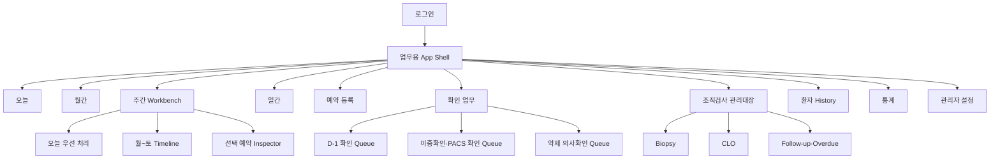

# Clinic Endoscopy Operations System UI/UX 설계 및 Prototype 명세

- 문서 상태: Phase 3 UI/UX 기준안
- 작성일: 2026-07-30
- 적용 기준: Phase 1 PRD, Phase 2 Architecture·Database·Scheduling Engine
- 선택한 시각 방향: Option 2 `Queue-First Workbench`
- Prototype 범위: 합성 데이터만 사용하는 Desktop 중심 Clickable Frontend
- Backend 연동 상태: 미연동

## 0. 확정된 UX 기준

### 0.1 확정된 요구사항

- 화면은 화려한 Dashboard보다 직원의 다음 업무와 오류 방지를 우선한다.
- 기본 업무 화면은 `오늘 우선 처리 Queue + 월~토 주간 일정 + 선택 예약 Inspector`를 한 Workbench에 배치한다.
- 주간 일정은 월요일부터 토요일까지 6개 열을 한 화면에서 유지한다.
- 환자 카드의 나이 숫자 바로 옆에 성별을 `남` 또는 `여`로 표시한다.
- 나이는 Patient의 고정값으로 저장하거나 직접 입력하지 않는다.
  - 검진: `검사 예정일 연도 - 출생연도`
  - 일반: 생년월일과 검사 예정일 기준 만 나이
- 화면에서는 나이 계산방식의 혼동을 막기 위해 다음 형식을 사용한다.
  - 검진 예: `검진 47세 · 여`
  - 일반 예: `일반 만 46세 · 남`
- 현재 의원은 원장 1명과 내시경실 1개만 운영하므로 의사, 내시경실, Resource를 선택하거나 색으로 구분하는 UI를 두지 않는다.
- 상세정보는 Drawer, Modal 또는 하단 Inspector에 단계적으로 노출한다.
- 상태는 색상만으로 표현하지 않고 Text, Icon, Badge를 함께 사용한다.
- 실제 환자정보는 Prototype, Test, Seed, Screenshot에 사용하지 않는다.

### 0.2 설계상 가정

- 주간 일정은 가장 자주 사용하는 기본 화면이다.
- `오늘 우선 처리` Queue에는 시간순 일정 전체가 아니라 직원의 조치가 필요한 항목만 표시한다.
- Prototype의 로그인 역할은 화면 확인용으로 단순화하되, 실제 제품의 권한은 Backend RBAC가 판정한다.
- 조회 전용 사용자는 같은 화면을 보되 수정 Action이 숨김 또는 비활성화되고, 실제 제품에서는 Backend가 다시 거부한다.
- Prototype의 상태와 변경은 Browser Memory에만 유지하며 새로고침하면 합성 초기 데이터로 복원한다.

### 0.3 현재 UI에서 의도적으로 제외하는 항목

- 의사 선택, 원장 선택, 의사별 일정 열
- 내시경실 선택, 검사실별 일정 열
- Resource 선택, Resource 수용량 Legend
- 과거 Excel Import 및 과거 Excel과 신규 시스템의 동시 입력
- EMR, PACS, 씨젠 사이트, 문자발송 시스템의 실제 연동

단일 Resource 개념은 Phase 2 Scheduling Domain 내부에는 유지한다. 향후 의사 또는 내시경실이 증가할 때만 별도 UX 설계를 거쳐 화면에 노출한다.

---

## 1. Information Architecture

### 1.1 전체 구조



### 1.2 메뉴와 업무 목적

| 상단·좌측 메뉴 | 기본 사용자 | 핵심 목적 | 기본 진입 상태 |
|---|---|---|---|
| 오늘 | 전 역할 | 오늘 건수와 미완료 Risk 요약 | 오늘 날짜 |
| 월간 | 전 역할 | 날짜별 밀도, 잔여 Capacity, 휴진·예외 확인 | 현재 월 |
| 주간 | 전 역할 | 종이표와 유사한 월~토 일정 파악과 빠른 조치 | 현재 주, 오늘 강조 |
| 일간 | 전 역할 | 시간순 검사 진행과 PACS·이중확인 | 오늘 |
| 예약 등록 | 관리자, 원무 | 환자 확인부터 최종 예약까지 단계 입력 | 환자 확인 Step |
| 확인 업무 | 관리자, 원무, 내시경 | D-1, 약제, 2차·PACS 확인 Queue 처리 | 미완료 우선 |
| 조직검사 관리대장 | 관리자, 내시경, 허용된 조회 사용자 | Biopsy·CLO·결과·통보·재검 Follow-up | 미완료 Case |
| 환자 History | 전 역할, 역할별 상세 제한 | 과거 예약·변경·취소·No-show·검사 조회 | 환자 검색 |
| 통계 | 관리자, 조회 허용 사용자 | 일반·오후 예외·실제 검사 건수 분리 | 이번 달 |
| 관리자 설정 | 관리자 | 운영시간, 날짜별 예외, Master, 권한, Backup 상태 | 운영 설정 |

### 1.3 Queue-First Workbench 정보 우선순위

```text
1순위  환자 안전       이중확인, 약제 의사확인, PACS 입력, 핵심정보 변경
2순위  시간 민감 업무  시간 충돌, D-1 미완료, 재연락, 오늘 검사 준비
3순위  운영 예외       14:00 오후 예외, 휴진·차단·추가 Slot, 승인 대기
4순위  후속 관리       조직검사 결과, 의사 확인, 환자 통보, 재검 Overdue
5순위  행정 업무       예약금 미처리, 환불 보류, 반복 취소 검토
```

Queue 항목은 하나의 `현재 문제`, 하나의 `마감 또는 검사시각`, 하나의 `바로 실행할 Action`만 우선 노출한다. 상세 설명과 이력은 선택 후 Inspector 또는 Drawer에서 연다.

---

## 2. 화면별 Wireframe

### 2.1 로그인

```text
┌──────────────────────────────────────────────────────────────┐
│ Clinic Endoscopy Operations System                           │
│ 원내 내부망 전용 · 승인된 직원만 사용                        │
│                                                              │
│                 ┌──────────────────────────┐                 │
│                 │ ID                       │                 │
│                 │ [______________________] │                 │
│                 │ Password                 │                 │
│                 │ [______________________] │                 │
│                 │ [ 로그인 ]               │                 │
│                 │ 실패 안내 / 남은 시도    │                 │
│                 └──────────────────────────┘                 │
│ 일정 시간 미사용 시 자동 로그아웃됩니다.                     │
└──────────────────────────────────────────────────────────────┘
```

- Password 내용은 표시하지 않으며 Browser 저장을 권장하는 문구를 넣지 않는다.
- 실패 사유는 ID 존재 여부를 노출하지 않는 공통 문구로 표시한다.
- Prototype은 인증 모양과 실패·성공 상태만 시연하고 실제 Session Security를 구현하지 않는다.

### 2.2 오늘 Dashboard

```text
┌ Rail ┬ 오늘 2026-07-30 ───────────────────────── [환자 검색] ┐
│      │ [환자 8] [위 6] [대장 3] [일반 7] [오후 예외 1]      │
│      ├────────────────────────────────────────────────────────┤
│      │ 즉시 확인                                               │
│      │ [이중확인 2] [약제 1] [D-1 3] [예약금 1] [F/U 지연 2] │
│      ├──────────────────────┬─────────────────────────────────┤
│      │ 오늘 시간순 검사     │ 우선 처리 Queue                 │
│      │ 09:00 ...            │ 09:00 이중확인 필요 [확인]      │
│      │ 09:30 ...            │ 10:00 약제 의사확인 [열기]      │
│      │ 10:00 ...            │ 조직 결과 통보 지연 [처리]      │
│      └──────────────────────┴─────────────────────────────────┤
│      │ 데이터 기준시각 · 합성 데이터 표시                     │
└──────┴────────────────────────────────────────────────────────┘
```

- 숫자 Card 자체가 끝이 아니라 클릭하면 해당 미완료 Queue로 이동한다.
- `환자 수`, `위 건수`, `대장 건수`를 서로 다른 지표로 표시한다.
- 일반 예약과 오후 예외 예약을 분리하고 합계를 중복 계산하지 않는다.

### 2.3 월간 화면

```text
┌ Rail ┬ 2026년 7월   [이전] [오늘] [다음]       [인쇄] ┐
│      ├────────┬────────┬────────┬────────┬────────┬────────┐
│      │ 월     │ 화     │ 수     │ 목     │ 금     │ 토     │
│      ├────────┼────────┼────────┼────────┼────────┼────────┤
│      │ 27     │ 28     │ 29     │ 30 오늘│ 31     │ 1      │
│      │ 환자 5 │ 환자 6 │ 환자 4 │ 환자 5 │ 환자 4 │ 환자 3 │
│      │ 위4 대2│ 위5 대2│ 위3 대1│ 위4 대2│ 위3 대2│ 위2 대2│
│      │ 잔여 1 │ 마감   │ 잔여 0 │ 예외 1 │ 준비 2 │ 휴진   │
│      └────────┴────────┴────────┴────────┴────────┴────────┘
└──────┴─────────────────────────────────────────────────────────┘
```

날짜 Cell에는 다음 순서만 노출한다.

1. 환자 수
2. 위·대장 검사 건수
3. 잔여 Capacity 또는 마감
4. 오후 예외, 준비 미완료, 취소, No-show 중 존재하는 경고

취소·No-show 건수는 현재 Slot 점유량과 분리해 표시한다.

### 2.4 주간 Workbench

```text
┌──────┬──────────────────────────────────────────────────────────────────────────┐
│ Rail │ 7/27~8/1  [이전 주] [오늘] [다음 주]  [검색 /] [예약 등록 N] [인쇄]    │
├──────┼─────────────────┬────────────────────────────────────────────────────────┤
│ 오늘 │ 오늘 우선 처리  │  월       화       수       목       금       토      │
│ 월간 │ [안전 2]        │  7/27     7/28     7/29     7/30     7/31     8/1     │
│ 주간 │ [D-1 3]         │  잔여...  마감...  120분... 예외...  잔여...  120분...│
│ 일간 │                 ├────────────────────────────────────────────────────────┤
│ 예약 │ 09:00 확인필요  │09:00 [예약 Card] [예약 Card] [예약 Card] ...         │
│ 확인 │  검진 47세 · 여 │09:30 [예약 Card] [예약 Card] [예약 Card] ...         │
│ 조직 │  위·대장        │10:00 [60분────────] [60분────────] ...               │
│ 이력 │  [확인하기]     │10:30 [예약 Card] [예약 Card] [비활성] ...            │
│ 통계 │                 │11:00 [예약 Card] [예약 Card] [비활성] ...            │
│ 설정 │ 10:00 약제주의  │11:30 [예약 Card] [예약 Card] [비활성] ...            │
│      │  일반 만 62세·남├────────────────────────────────────────────────────────┤
│      │  [열기]         │14:00 오후 예외 ┃ [예외 Card] [빈 Slot] ...          │
├──────┴─────────────────┴────────────────────────────────────────────────────────┤
│ 선택 예약 Inspector: 환자 식별 | 검사·수면 | 준비 | 확인 | 빠른 Action        │
│ 합성환자01(SYN-26001) · 검진 47세 · 여 | 위 수면·대장 비수면 | D-1 완료 | 2차 필요 │
└─────────────────────────────────────────────────────────────────────────────────┘
```

#### 주간 Card 규칙

- 위 단독은 30분 높이, 대장 단독과 위·대장 동시는 60분 높이로 표시한다.
- 카드 첫 줄: `09:00 이름 · 차트번호`
- 카드 둘째 줄: `검진 47세 · 여` 또는 `일반 만 46세 · 남`
- 카드 셋째 줄: `위 수면`, `대장 비수면`, `위 수면·대장 수면`
- 카드 하단: 예약금, 약제, D-1, 이중확인, 오후 예외 중 필요한 Badge만 표시한다.
- 수요일·토요일 11:00 이후 오전 영역은 `운영 종료` Hatch와 Text로 비활성화한다.
- 14:00은 오전 Timeline과 시각적으로 분리된 `오후 예외` Section에 둔다.
- 날짜별 예외가 있으면 날짜 Header에 `운영 예외` Badge와 변경 요약을 표시한다.
- 의사·실·Resource를 나타내는 열, 필터, Badge는 두지 않는다.

### 2.5 일간 화면

```text
┌ Rail ┬ 7월 30일 목요일 [이전] [오늘] [다음]  [예약 등록] ┐
│      ├──────────────┬──────────────────────┬─────────────────┤
│      │ Timeline     │ 선택 환자 상세       │ PACS 입력 확인 │
│      │ 09:00 예약   │ 이름 / 차트번호      │ 이름     [✓/!] │
│      │ 09:30 예약   │ 생년월일 / 성별      │ 차트번호 [✓/!] │
│      │ 10:00 예약   │ 일반 만 46세 · 남    │ 생년월일 [✓/!] │
│      │ 11:00 예약   │ 위 수면·대장 비수면  │ 성별     [✓/!] │
│      │              │ 준비·약제·D-1        │ 나이     [✓/!] │
│      │ 14:00 예외   │ [내원] [준비완료]    │ 검사/수면[✓/!] │
│      │              │ [검사시작] [완료]    │ [2차 확인]      │
│      │              │                      │ [PACS 완료]     │
└──────┴──────────────┴──────────────────────┴─────────────────┘
```

- PACS Panel은 정확성 우선 화면이므로 이름, 차트번호, 생년월일, 성별, 계산 나이, 검사별 시행·수면 여부를 전체 표시한다.
- 계산 나이 옆에 `검진 연도차` 또는 `일반 만 나이`의 근거를 보조문구로 표시한다.
- 핵심정보 변경으로 확인이 무효화되면 이전 확인을 삭제하지 않고 `재확인 필요`를 표시한다.
- 검사 시작 Gate의 최종 강제 여부는 `DEC-31` 확정 전에는 경고 상태로 표현한다.

### 2.6 예약 등록 Step Form

```text
┌ Rail ┬ 예약 등록                                                     ┐
│      │ ①환자  ②검사·일정  ③검진  ④장정결  ⑤약제·수술  ⑥추가검사  │
│      │ ⑦예약금  ⑧최종확인                                          │
│      ├───────────────────────────────────────────────────────────────┤
│      │ 현재 Step의 필수 입력                                         │
│      │ [입력......................................................] │
│      │                                                               │
│      │ 선택 요약                                                     │
│      │ 환자: 합성환자 · 검진 47세 · 여                               │
│      │ 검사: 위 수면 + 대장 비수면 · 60분                            │
│      │ 일정: 7/30 10:00 · STANDARD_MORNING                           │
│      │                                                               │
│      │ [이전]                                      [임시저장] [다음] │
└──────┴───────────────────────────────────────────────────────────────┘
```

Step별 규칙:

1. 환자 확인: 차트번호 우선 검색, 이름·생년월일·성별 교차확인, 신규등록 분기
2. 검사 종류와 일정: 위·대장 시행 여부와 수면 여부를 각각 입력, Slot 검증
3. 검진 정보: 일반·검진과 검진 관련 항목, 계산 나이 Preview
4. 장정결제: 대장 포함 시 필수, 장정결제와 안내·수령 상태
5. 복용약·수술이력: 대장 포함 시 필수, 의사 확인 전 안전 경고
6. 추가 검사: Blood, CLO, 초음파 등
7. 예약금: 대상, 금액, 납부, 정책 고지·동의
8. 최종 확인: 핵심정보, 충돌·Capacity, 누락, 오후 예외 승인정보 확인

충돌은 선택한 Slot 옆에 표시하고 `예약 저장`을 차단한다. 가능한 대체 Slot은 가장 빠른 순으로 제안한다. Frontend Prototype의 검증은 시연용이며 실제 제품은 Backend와 Database에서 다시 검증한다.

### 2.7 예약 상세 Drawer

```text
                                    ┌─────────────────────────────┐
                                    │ 예약 상세              [×] │
                                    │ 합성환자 · SYN-26001        │
                                    │ 검진 47세 · 여              │
                                    ├─────────────────────────────┤
                                    │ [기본] [검사] [준비] [약제] │
                                    │ [예약금] [변경] [취소]      │
                                    │ [D-1] [결과] [조직] [F/U]  │
                                    ├─────────────────────────────┤
                                    │ 선택 Tab 내용               │
                                    │ 변경 전/후 및 사유 Timeline │
                                    ├─────────────────────────────┤
                                    │ [예약 변경] [업무 처리]      │
                                    └─────────────────────────────┘
```

- 긴 Form 전체를 한 번에 펼치지 않는다.
- 변경, 취소, No-show, 금전, 확인 이력은 삭제 Action을 제공하지 않는다.
- 예약 변경 시 기존 확인이 무효화될 항목을 저장 전 명시한다.
- 취소는 취소 사유와 예약금 후속상태 입력 Modal을 거쳐야 한다.

### 2.8 D-1 확인 Queue

```text
┌ Rail ┬ D-1 확인  [내일] [재연락] [미완료만] [담당자]         ┐
│      ├──────────┬──────────────┬────────┬────────┬────────────┤
│      │ 환자     │ 검사·시간    │ 연락   │ 준비   │ Action     │
│      │ 합성환자 │ 위·대장 09:00│ 재연락 │ 약제 ! │ [확인 열기]│
│      │          │ 검진 47세·여 │ 15:00  │ 장정결✓│            │
│      ├──────────┴──────────────┴────────┴────────┴────────────┤
│      │ 선택 항목: 통화·문자·연락불가 / 금식 / 장정결 / 약제  │
│      │ 검사 진행 / 변경·취소 요청 / 재연락시각 / 메모        │
│      │                                             [저장]      │
└──────┴──────────────────────────────────────────────────────────┘
```

- 연락 시도와 결과를 한 값으로 덮어쓰지 않고 Timeline으로 누적한다.
- `연락 불가`는 완료가 아니며 재연락 예정시각과 담당자를 요구한다.
- 휴일·월요일 대상일 산정은 `DEC-02` 확정 전 설정 경고를 표시한다.

### 2.9 조직검사 관리대장

```text
┌ Rail ┬ 조직검사 관리대장  [Biopsy] [CLO] [Follow-up]            ┐
│      │ [결과대기] [의사확인대기] [통보대기] [F/U] [Overdue]    │
│      ├────────┬──────────────┬──────────┬────────┬───────────────┤
│      │ 검사일 │ 환자         │ 기관·접수│ 상태   │ 다음 업무      │
│      │ 7/28   │ 합성환자     │ 씨젠     │ 결과대기│ 결과 확인      │
│      │        │ 일반 만58세·남│ SG-1001 │        │               │
│      ├────────┴──────────────┴──────────┴────────┴───────────────┤
│      │ 선택 Case                                                 │
│      │ 검사·검체 부위·수량 / 위탁일 / 인계·인수 기록           │
│      │ 결과보고일: 씨젠 사이트 최초 결과 게시일                 │
│      │ 결과요약 / 의사확인 / 환자통보 / 재검예정 / 담당자       │
│      │ [관리자 확인 후 인계·인수 기록] [상태 진행]              │
└──────┴────────────────────────────────────────────────────────────┘
```

조직검사 화면의 고정 정책:

- 신규 웹 관리대장에는 `Biopsy`와 `CLO`만 포함한다. Stool 관리대장은 만들지 않는다.
- `결과보고일`은 씨젠 사이트에 최초 조직검사 결과가 게시된 날짜 하나만 사용한다.
- `원내 도착일` 입력란, Column, Badge, Filter를 만들지 않는다.
- 외부 검사기관과 접수번호 조합을 Case의 식별 Key로 사용하며 같은 조합의 중복 입력을 차단한다.
- 인계자·인수자의 별도 로그인 서명 Button을 두지 않는다.
- 관리자가 실제 인계·인수 사실을 확인한 뒤 한 Action에서 인계자, 인수자, 시각, 메모를 기록한다.
- 신규 운영일 이후 기록만 새 시스템에서 생성한다. 과거 Excel은 조회용 원본이며 Import 또는 이중입력 대상으로 표시하지 않는다.
- Overdue는 저장 상태가 아니라 단계별 기한을 넘기고 완료되지 않았을 때 계산한 경고로 표시한다.

### 2.10 관리자 설정

```text
┌ Rail ┬ 관리자 설정                                                ┐
│      │ [운영시간] [검사시간] [수용량] [오후예외] [날짜별예외]    │
│      │ [휴진] [장정결제] [약제] [예약금] [사용자·권한] [Backup] │
│      ├─────────────────────────────────────────────────────────────┤
│      │ 선택 설정 목록                         [신규 등록]          │
│      │ 적용기간 / 기존값 / 변경값 / 사유 / 등록자 / 승인자       │
│      │                                                             │
│      │ 날짜별 예외 상세                                            │
│      │ [검사 불가] [Slot 차단] [운영시간] [Capacity] [오후 허용]  │
│      │ 사유* 승인자* 적용기간*                   [승인 후 적용]    │
└──────┴─────────────────────────────────────────────────────────────┘
```

- 의사·내시경실·Resource 관리 Tab은 현재 UI에 제공하지 않는다.
- 날짜별 예외의 기존값, 변경값, 사유, 승인자, 적용기간을 한 화면에서 검토한다.
- 관리자 강제 Override도 시간 충돌 자체를 허용하는 기능으로 표현하지 않는다.

---

## 3. Component 목록

### 3.1 App Shell과 Navigation

| Component | 책임 | 핵심 상태·입력 |
|---|---|---|
| `AppShell` | Rail, Command Bar, Content, Drawer Layer 배치 | 현재 View, Role, Session 경고 |
| `PrimaryRail` | 10개 주요 메뉴 이동 | 활성 메뉴, 권한별 표시 |
| `CommandBar` | 날짜 이동, 검색, 예약등록, 인쇄 | 날짜범위, 검색어, 단축키 Hint |
| `GlobalPatientSearch` | 차트번호 우선 환자 검색 | 검색어, 후보, 접근권한 |
| `SessionTimeoutNotice` | 자동 로그아웃 사전 안내 | 남은 시간, 연장 가능 여부 |
| `SyntheticDataBanner` | Prototype이 합성 데이터임을 지속 표시 | Prototype 환경 |

### 3.2 일정과 Workbench

| Component | 책임 | 핵심 상태·입력 |
|---|---|---|
| `PriorityQueue` | 지금 처리할 안전·시간 민감 업무 정렬 | 유형, 우선순위, dueAt, assignee |
| `PriorityQueueItem` | 문제·환자·다음 Action의 한 줄 표현 | Badge, 환자 요약, Action |
| `WeeklyWorkbench` | Queue, 6일 Timeline, Inspector 조합 | 주 시작일, 선택 예약 |
| `WeeklyTimeline` | 월~토 6열 일정 배치 | 날짜별 예약·Override |
| `DayColumnHeader` | 날짜, 일반 건수, 잔여 Capacity, 예외 표시 | 날짜 정책, Daily Counts |
| `TimeAxis` | 30분 Slot 기준 세로축 | 시작·종료시각 |
| `AppointmentCard` | 핵심 환자·검사·준비 상태 표시 | 시간, `AgeSexLabel`, Procedure, Badge |
| `AgeSexLabel` | 업무구분에 맞는 계산 나이와 성별 표시 | careType, birthDate, serviceDate, sex |
| `AfternoonExceptionBand` | 14:00 예외를 오전과 분리 | 허용 여부, 예약 0/1 |
| `InactiveTimeBand` | 수·토 11시 이후 등 비운영 시간 표시 | 사유, 적용시간 |
| `CapacitySummary` | 환자·위·대장·오후 예외 수를 분리 | standard/exception counts |
| `SelectedAppointmentInspector` | 선택 예약의 핵심상태와 빠른 Action | appointmentId, 권한 |
| `AppointmentDetailDrawer` | 상세정보와 Append-only 이력 조회 | Tab, 권한, 수정 Mode |

`AgeSexLabel`의 표시 규칙은 다음과 같다.

```text
careType = SCREENING → "검진 {검사연도-출생연도}세 · {남|여}"
careType = GENERAL   → "일반 만 {검사일 기준 만 나이}세 · {남|여}"
```

나이 결과는 Component 표시값으로 계산하며 Patient 또는 Appointment의 현재 나이 필드로 저장하지 않는다.

### 3.3 예약 입력과 검증

| Component | 책임 |
|---|---|
| `AppointmentStepper` | 8개 Step의 완료·미완료·오류 상태 표시 |
| `PatientIdentityStep` | 기존 환자 확인, 중복 후보, 신규등록 |
| `ProcedureScheduleStep` | 위·대장 시행·수면을 각각 선택하고 Slot 검증 |
| `ScreeningInfoStep` | 일반·검진과 검진 세부정보, 나이 Preview |
| `BowelPreparationStep` | 대장 포함 시 장정결제와 안내·수령 확인 |
| `MedicationSurgeryStep` | 약제·수술력 Checklist와 의사확인 경고 |
| `AdditionalExamStep` | 추가검사 선택 |
| `DepositStep` | 예약금 대상·납부·정책고지·동의 |
| `FinalReviewStep` | 핵심정보, 준비 누락, Capacity, 예외정보 최종검토 |
| `SlotPicker` | 가능한 Slot, 불가능 사유, 대체 Slot 표시 |
| `ConflictAlert` | 시간 충돌을 대상 Slot과 함께 표시 |
| `CapacityAlert` | 위·대장 수용량 또는 수·토 점유시간 초과 표시 |
| `AfternoonExceptionForm` | 사유, 등록자, 확인자, 확인시각, 메모 요구 |
| `ChangeImpactPreview` | 예약 변경 시 재검증·확인 무효화 영향을 사전 표시 |

### 3.4 확인·검사·병리

| Component | 책임 |
|---|---|
| `VerificationChecklist` | 1차·2차·PACS 확인의 현재 유효상태 표시 |
| `VerificationSnapshotDiff` | 확인 당시 값과 현재 값의 차이 표시 |
| `PacsConfirmationPanel` | PACS 입력용 전체 핵심정보와 확인 Action |
| `D1QueueTable` | 내일 대상과 재연락·미완료 정렬 |
| `D1ConfirmationPanel` | 연락시도, 준비 Checklist, 재연락 |
| `MedicationSafetyNotice` | 의사 확인 전 고정 안전 문구 표시 |
| `ProcedureProgressPanel` | 내원·준비·검사중·완료 Action |
| `PathologyLedger` | Biopsy Case 목록·검색·정렬·Filter |
| `CloLedger` | CLO 시행·결과 목록 |
| `PathologyCasePanel` | Case, Specimen, 결과, 통보, 재검 Detail |
| `ExternalCaseKeyField` | 검사기관+접수번호 중복 여부 표시 |
| `TransferRecordForm` | 관리자 확인 후 인계·인수 사실 기록 |
| `FollowUpQueue` | 결과·의사확인·통보·재검의 다음 업무 |
| `AuditTimeline` | 시간순 변경·확인·무효화 Event 표시 |

### 3.5 공통 Feedback

| Component | 사용 기준 |
|---|---|
| `StatusBadge` | 짧은 상태, Text+Icon+Tone |
| `InlineFieldError` | 입력 바로 아래 구체적인 해결방법 표시 |
| `BlockingAlert` | 저장 또는 상태전이를 막는 오류 |
| `NonBlockingWarning` | 진행은 가능하지만 확인이 필요한 위험 |
| `ConfirmationModal` | 취소, No-show, 예외 승인, 상태 종결 |
| `Toast` | 저장 성공 같은 짧은 결과. 중요한 오류의 유일한 표시로 사용 금지 |
| `EmptyState` | 데이터 없음과 Filter 결과 없음 구분 |
| `LoadingSkeleton` | Layout 이동 없이 Loading 표시 |

---

## 4. 상태와 Badge 체계

### 4.1 표현 원칙

- 모든 Badge는 `Icon + 한국어 Text`를 포함한다.
- 색이 제거된 인쇄물에서도 의미를 이해할 수 있어야 한다.
- 같은 색을 여러 의미에 사용해도 Text와 Icon은 중복되지 않게 한다.
- 빨강은 환자 안전 또는 진행 차단, 주황은 확인 필요, 파랑은 진행 중, 초록은 완료에만 사용한다.
- `Overdue`는 상태 Badge가 아니라 기한 경고 Badge이다.
- 카드에는 최대 4개의 Badge만 표시하고 나머지는 `+N`으로 Inspector에서 확인한다.

### 4.2 Badge Dictionary

| 범주 | Badge Text | Tone | 의미·표시 조건 |
|---|---|---|---|
| 예약 | 예약 | Blue | 활성 예약 |
| 예약 | 일정 변경 | Violet | 변경 이력이 있으며 최신 일정 적용 |
| 예약 | 취소 | Neutral strike | 취소된 과거 기록 |
| 예약 | No-show | Dark red | No-show 확정 |
| 예약 | 보류 | Gray | 업무축 중 보류가 있음 |
| 일정 | 시간 충돌 | Red | 선택 시간에 활성 예약 중복 |
| 일정 | Capacity 초과 | Red | 일반 수용량 또는 점유시간 초과 |
| 일정 | 운영 예외 | Violet | 날짜별 승인 예외 적용 |
| 일정 | 오후 예외 | Purple | `AFTERNOON_EXCEPTION` Bucket |
| 확인 | 1차 완료 | Blue | 유효한 1차 Snapshot 존재 |
| 확인 | 2차 필요 | Orange | 유효한 2차 확인 없음 |
| 확인 | 이중확인 완료 | Green | 유효한 1·2차 확인 |
| 확인 | 재확인 필요 | Red | 핵심정보 변경으로 확인 무효화 |
| 확인 | PACS 미확인 | Orange | PACS 입력 완료 확인 없음 |
| 확인 | PACS 완료 | Green | 유효 PACS 확인 |
| 약제 | 약제 확인 필요 | Orange | 대장 포함, Medication 확인 미완료 |
| 약제 | 의사 확인 필요 | Red | 중단 검토 대상이나 의사 결정 없음 |
| 약제 | 의사 확인 완료 | Green | 환자별 의사 결정 기록 완료 |
| D-1 | D-1 미확인 | Orange | 대상이나 Checklist 미완료 |
| D-1 | 재연락 | Purple | 연락 불가·재연락시각 있음 |
| D-1 | D-1 완료 | Green | 필수 연락·준비 확인 완료 |
| 예약금 | 미처리 | Orange | 대상이나 납부·후속상태 없음 |
| 예약금 | 납부 완료 | Green | 납부 거래 완료 |
| 예약금 | 환불 보류 | Purple | 관리 후속 필요 |
| 검사 | 준비 미완료 | Red | 검사 준비 Gate 미충족 |
| 검사 | 검사 중 | Blue | 실제 시작, 종료 전 |
| 검사 | 검사 완료 | Green | 실제 결과 저장 완료 |
| 병리 | 결과 대기 | Blue | 의뢰 후 최초 게시 전 |
| 병리 | 의사 확인 대기 | Orange | 결과보고일 입력, 의사 미확인 |
| 병리 | 환자 통보 대기 | Orange | 의사 확인, 통보 미완료 |
| 병리 | Follow-up 예정 | Purple | 재검·추적 Task 활성 |
| 병리 | Overdue | Red | 기한 초과 및 미완료 |
| 병리 | 완료 | Green | 필수 Milestone 완료 |
| 환자 | 반복 취소 검토 | Orange | 유효 취소·No-show 합계 3회 이상 |
| 환자 | 예약 제한 | Red | 관리자 결정으로 제한 활성 |

### 4.3 검사·수면 표기

| 검사 구성 | 카드 Text |
|---|---|
| 위 수면 | `위 수면` |
| 위 비수면 | `위 비수면` |
| 대장 수면 | `대장 수면` |
| 대장 비수면 | `대장 비수면` |
| 위 수면 + 대장 비수면 | `위 수면 · 대장 비수면` |

`수면` 하나로 위와 대장을 합쳐 표현하지 않는다. 검사 종류도 `위·대장`이라는 단일 저장값을 가정하지 않고 AppointmentProcedure의 조합을 표시한다.

---

## 5. 반응형 기준

Desktop 전용 업무도구로 설계하며 기준 Viewport는 `1920×1080`과 `1366×768`이다.

### 5.1 Layout Token

| 항목 | 1920×1080 | 1366×768 |
|---|---:|---:|
| Primary Rail | 64px | 56px |
| 오늘 우선 처리 Queue | 280px | 220px |
| Day Column 최소폭 | 약 230px | 약 160px |
| 상단 Command Bar | 56px | 48px |
| 하단 Inspector | 240~280px | 180~220px |
| 기본 본문 Font | 14px | 13px |
| Card 내부 Gap | 6~8px | 4~6px |

### 5.2 1920×1080

- Queue, 월~토 6개 열, Inspector를 동시에 표시한다.
- Appointment Card에는 3개 정보 줄과 최대 4개 Badge를 표시한다.
- Inspector는 하단 고정 영역으로 열어 주간 열 너비를 줄이지 않는다.
- 긴 Drawer는 우측 최대 560px로 열고 배경 일정은 선택 위치를 유지한다.

### 5.3 1366×768

- 월~토 6개 열은 줄바꿈 없이 유지한다.
- Queue 폭을 220px로 줄이고 항목 설명을 2줄로 제한한다.
- Appointment Card는 `시간·이름`, `나이·성별`, `검사`를 유지하고 Badge는 최대 2개와 `+N`으로 축약한다.
- Inspector는 180~220px 높이의 접이식 하단 Panel로 표시한다.
- 사용자가 Inspector를 접으면 Timeline의 세로 공간을 즉시 회복한다.
- Drawer가 열릴 때 Queue를 자동 축소하되 사용자의 일정 Scroll 위치는 유지한다.
- Hover에만 의존하는 정보는 금지하고 Focus 또는 Click으로 같은 정보를 볼 수 있게 한다.

### 5.4 최소 동작 기준

- 1280px 미만은 핵심 지원범위가 아니며 주간 일정에 가로 Scroll을 허용한다.
- Browser Zoom 100%를 기준으로 하되 125%에서 주요 Action과 Text가 잘리지 않아야 한다.
- Touch 전용 UI는 MVP 범위가 아니다.
- Chrome·Edge 최신 원내 배포 Version에서 Keyboard와 인쇄를 검증한다.

---

## 6. Keyboard Workflow

### 6.1 전역 Shortcut

| Shortcut | Action | 보호 규칙 |
|---|---|---|
| `/` | 전역 환자 검색 Focus | 입력 중에는 일반 문자로 동작 |
| `N` | 예약 등록 열기 | 입력 중 무시 |
| `T` | 오늘 날짜로 이동 | 입력 중 무시 |
| `W` | 주간 화면 | 입력 중 무시 |
| `M` | 월간 화면 | 입력 중 무시 |
| `D` | 일간 화면 | 입력 중 무시 |
| `[` / `]` | 이전·다음 날짜 또는 기간 | 현재 View 단위 |
| `Shift + ?` | Shortcut 도움말 | Modal로 표시 |
| `Esc` | Drawer·Modal 닫기 | 미저장 내용이 있으면 확인 |

### 6.2 Queue와 일정

| Shortcut | Action |
|---|---|
| `J` / `K` | Queue 다음·이전 항목 |
| `Enter` | 선택 항목 Inspector 열기 |
| `Tab` | Queue → Timeline → Inspector의 논리적 Focus 순서 |
| 방향키 | 같은 날짜의 이전·다음 Slot 탐색 |
| `Space` | Focus된 가능한 Slot 선택 |
| `Shift + Enter` | 선택 예약 Detail Drawer 열기 |

### 6.3 Form

| Shortcut | Action | 조건 |
|---|---|---|
| `Alt + 1`~`Alt + 8` | 해당 예약 Step 이동 | 이전 필수 Step 오류는 요약 표시 |
| `Ctrl + Enter` | 현재 Step 저장·다음 | 유효성 통과 |
| `Shift + Tab` | 이전 입력 | Browser 기본 동작 유지 |
| `Esc` | 취소 또는 닫기 | 미저장 변경 확인 |

취소, No-show 확정, 예약금 환불, 관리자 Override 같은 위험 Action에는 단일키 Shortcut을 제공하지 않는다. 반드시 사유를 입력하는 Confirmation Dialog를 거친다.

### 6.4 접근성 Focus 규칙

- Focus Ring을 색상과 2px 외곽선으로 명확히 표시한다.
- Modal이 열리면 Focus를 내부에 가두고 닫으면 실행한 Control로 되돌린다.
- 오류 발생 시 첫 오류 입력으로 Focus를 이동하고 상단 오류요약도 제공한다.
- Badge 자체는 Tab Stop으로 만들지 않고 Action이 있을 때 Button으로 구현한다.

---

## 7. A4 가로 Print Layout

### 7.1 인쇄 대상

- 기본 인쇄물은 선택한 주의 월~토 일정이다.
- 인쇄 전용 Header에 의원명, 기간, 출력시각, 출력자를 표시한다.
- 오전 일정과 14:00 오후 예외를 분리한다.
- 날짜별 운영 예외와 휴진을 Text로 출력한다.

```text
┌────────────────────────────────────────────────────────────────────┐
│ 내시경 주간 일정  2026-07-27 ~ 2026-08-01  출력: 2026-07-30 17:30 │
├──────────┬──────────┬──────────┬──────────┬──────────┬─────────────┤
│ 월 7/27  │ 화 7/28  │ 수 7/29  │ 목 7/30  │ 금 7/31  │ 토 8/1     │
├──────────┼──────────┼──────────┼──────────┼──────────┼─────────────┤
│09:00 ... │09:00 ... │09:00 ... │09:00 ... │09:00 ... │09:00 ...   │
│09:30 ... │09:30 ... │09:30 ... │09:30 ... │09:30 ... │09:30 ...   │
│10:00 ... │10:00 ... │10:00 ... │10:00 ... │10:00 ... │10:00 ...   │
│10:30 ... │10:30 ... │10:30 ... │10:30 ... │10:30 ... │10:30 ...   │
│11:00 ... │11:00 ... │운영 종료 │11:00 ... │11:00 ... │운영 종료  │
│11:30 ... │11:30 ... │          │11:30 ... │11:30 ... │            │
├──────────┴──────────┴──────────┴──────────┴──────────┴─────────────┤
│ 14:00 오후 예외: 월 ... / 목 ...                                   │
├────────────────────────────────────────────────────────────────────┤
│ 원내 업무용 개인정보 포함 · 사용 후 지정 절차에 따라 회수·폐기    │
└────────────────────────────────────────────────────────────────────┘
```

### 7.2 인쇄 노출 정보

| 포함 | 제외 |
|---|---|
| 시간, 이름, 차트번호 | 연락처 |
| `검진 47세 · 여` 또는 `일반 만 46세 · 남` | 전체 생년월일 |
| 위·대장 각각의 수면 여부 | 복용약 상세 목록 |
| 장정결제 명칭 | 수술이력 상세 |
| 예약금·약제·D-1·이중확인 상태 Text | 조직검사 결과요약 |
| 오후 예외 여부, 운영 예외 | 자유서술 메모 |

PACS 입력용 전체 정보는 일반 주간 인쇄물에 포함하지 않는다.

### 7.3 CSS 기준

- `@page { size: A4 landscape; margin: 8mm; }`
- Rail, Command Bar, Queue, Drawer, Button, Hover 요소는 숨긴다.
- 색상 배경이 출력되지 않아도 Border, Text, Pattern으로 상태를 구분한다.
- 한 Appointment Card가 Page 경계에서 분할되지 않게 한다.
- 가능하면 한 주를 한 장에 출력하고, 글자를 9pt 미만으로 줄이지 않는다.
- 인쇄 Preview에서 환자정보가 의도치 않게 다음 Page Header에 반복되지 않는지 확인한다.

---

## 8. Frontend Prototype

### 8.1 구현 범위

| 시나리오 | Prototype 상호작용 | 성공 기준 |
|---|---|---|
| 1. 주간 일정 조회 | 주 이동, 오늘 이동, 월~토 Card 표시 | 수·토 비운영 영역과 14:00 분리 |
| 2. 환자 Card 선택 | Card Click/Keyboard 선택 | Inspector 또는 Drawer에 합성 상세 표시 |
| 3. 예약 등록 | 8-Step Form 또는 축약 시연 Form | 필수값·요약·저장 Feedback |
| 4. 가능시간 확인 | 검사 구성과 날짜 선택 | 가능한 Slot과 첫 추천시간 표시 |
| 5. 시간 충돌 경고 | 이미 점유된 Slot 선택 | 충돌 Text·대체 Slot, 저장 차단 |
| 6. 수·토 Slot 검증 | 위 1 Slot, 대장·동시 2 Slot | 09:00~11:00 연속 점유 검증 |
| 7. 오후 예외 예약 | 14:00 선택 | 사유·등록자·확인자·확인시각·메모 확인 |
| 8. 예약 변경 | 날짜·시간·검사 변경 | 재검증과 확인 무효화 Preview |
| 9. 이중확인 상태 | 1차·2차·PACS 상태 변경 시연 | 핵심정보 변경 시 `재확인 필요` |
| 10. 조직검사 Follow-up | Case Filter와 상태 진행 | 결과보고일·통보·재검·Overdue 확인 |

### 8.2 합성 데이터 원칙

- 환자 이름은 명백한 예시 이름만 사용한다.
- 차트번호는 `SYN-26001`처럼 합성 Prefix를 사용한다.
- 연락처가 필요하면 실제 번호 형식과 겹치지 않는 Mask 또는 비연락용 예시를 사용한다.
- 생년월일, 약제, 조직검사 결과도 합성값만 사용한다.
- 화면 상단 또는 Footer에 `합성 데이터 Prototype`을 지속 표시한다.
- 실제 환자정보가 담긴 Excel을 Prototype에 Import하지 않는다.
- Browser LocalStorage, IndexedDB, Service Worker Cache에 환자 데이터를 저장하지 않는다.
- 외부 API, Analytics, Error Tracking, AI API로 데이터를 보내지 않는다.

### 8.3 Scheduling 시연 데이터

Prototype에는 최소 다음 Fixture를 포함한다.

1. 월·화·목·금의 위 수용량 5건과 대장 수용량 3건 경계
2. 수·토 `위 + 위 + 위·대장` 120분 배치
3. 수·토 `위 + 위 + 위 + 위` 120분 배치
4. 수·토 `위·대장 + 위·대장` 120분 배치
5. 기존 예약과 시간이 겹쳐 실패하는 배치
6. 오전 정원이 가득 찼지만 14:00 오후 예외 1건이 허용되는 배치
7. 이미 14:00 예약이 있어 두 번째 오후 예외가 차단되는 배치
8. 날짜별 휴진·Slot 차단·운영시간 변경이 표시되는 날짜

### 8.4 조직검사 시연 데이터

- Biopsy Case와 CLO 결과만 제공한다.
- 씨젠 최초 게시일을 의미하는 `결과보고일`만 제공한다.
- 기관+접수번호가 다른 정상 Case와 같은 조합 중복 경고 Case를 제공한다.
- 결과 대기, 의사 확인 대기, 환자 통보 대기, Follow-up 예정, Overdue, 완료를 각각 1건 이상 제공한다.
- 관리자 확인 후 인계·인수 기록 시연을 제공한다.
- 과거 Excel 데이터는 Fixture에 포함하지 않는다.

### 8.5 Prototype과 실제 제품의 경계

- Prototype의 Scheduling 판정은 UX 시연용이다. 운영에서는 Backend Scheduling Domain Service와 PostgreSQL Transaction·Constraint가 다시 검증해야 한다.
- Prototype의 Role 전환은 권한 화면 시연용이다. 운영 보안은 Backend RBAC와 Server-side Session이 담당한다.
- Prototype의 PACS, 씨젠, 문자 상태는 직원이 직접 입력한 값처럼 시연하며 실제 연동을 가장하지 않는다.
- Prototype은 개인정보 저장, Audit 불변성, Backup, Restore를 구현한 것으로 간주하지 않는다.

---

## 9. 실행방법

### 9.1 개발 실행

Windows PowerShell에서 다음 순서로 실행한다.

```powershell
cd E:\openkiki\codex_root\endoscopy-os\frontend
npm install
npm run dev
```

Terminal에 표시된 Local URL을 Chrome 또는 Microsoft Edge에서 연다. 일반적으로 Vite 기본 주소는 `http://localhost:5173`이다.

### 9.2 Production Build 확인

```powershell
cd E:\openkiki\codex_root\endoscopy-os\frontend
npm run build
```

- Build가 성공하면 정적 산출물은 `frontend/dist`에 생성된다.
- 이 Build는 Frontend Prototype 검증용이며 Caddy, FastAPI, PostgreSQL 운영 배포 완료를 의미하지 않는다.
- Build 오류가 있으면 첫 Error부터 수정하고 다시 실행한다.

### 9.3 수동 확인 순서

1. `합성 데이터 Prototype` 표기가 보이는지 확인한다.
2. 1920×1080에서 Queue·월~토 일정·Inspector가 동시에 보이는지 확인한다.
3. 1366×768에서 월~토 열이 유지되고 주요 Text가 잘리지 않는지 확인한다.
4. Card에서 `나이 · 성별` 형식과 검사별 수면 여부를 확인한다.
5. 수·토 60분 예약과 충돌 예약을 각각 시도한다.
6. 오전 정원과 분리된 14:00 오후 예외를 시도한다.
7. 조직검사 목록에서 결과보고일과 기관+접수번호를 확인한다.
8. A4 가로 인쇄 Preview를 확인한다.

---

## 10. UX 검토 Checklist

### 10.1 업무 속도

- [ ] 로그인 후 1회 이동 이내에 오늘 미완료 업무를 찾을 수 있다.
- [ ] 주간 화면에서 월~토 예약과 14:00 예외를 동시에 구분할 수 있다.
- [ ] Queue 항목마다 현재 문제와 다음 Action이 한눈에 보인다.
- [ ] 환자 Card 선택 후 Drawer 또는 Inspector가 1회 Click으로 열린다.
- [ ] 예약 변경은 기존값을 유지한 채 변경할 항목만 수정할 수 있다.

### 10.2 환자 식별과 나이

- [ ] 모든 주요 환자 표시에서 이름과 차트번호를 함께 확인할 수 있다.
- [ ] 나이 숫자 바로 옆에 `남` 또는 `여`가 표시된다.
- [ ] 검진은 `검진 N세 · 성별`로 표시된다.
- [ ] 일반은 `일반 만 N세 · 성별`로 표시된다.
- [ ] 검사 예정일을 변경하면 나이가 다시 계산된다.
- [ ] 나이를 직접 입력하거나 Patient의 현재 나이로 저장하는 UI가 없다.
- [ ] PACS Panel에 이름·차트번호·생년월일·성별·나이·검사별 시행·수면이 모두 표시된다.

### 10.3 Scheduling

- [ ] 위 30분, 대장 60분, 위·대장 60분이 Card 높이와 Slot 점유에 반영된다.
- [ ] 수·토는 09:00~11:00의 4개 Slot만 활성화된다.
- [ ] 수·토 위 단독 4명이 허용된다.
- [ ] 연속 Slot이 없는 60분 검사는 차단된다.
- [ ] 월·화·목·금 위 5건·대장 3건을 각각 계산한다.
- [ ] 오전 Capacity가 가득 차도 비어 있는 14:00 예외 1건을 추가할 수 있다.
- [ ] 두 번째 14:00 예약은 차단된다.
- [ ] Frontend 경고가 운영상의 최종 검증으로 표현되지 않는다.
- [ ] 의사·내시경실·Resource 선택 또는 구분 UI가 없다.

### 10.4 확인·약제·D-1

- [ ] 색상을 제거해도 Badge Text와 Icon으로 상태를 이해할 수 있다.
- [ ] 이중확인 후 핵심정보 변경 시 `재확인 필요`가 표시된다.
- [ ] 무효화된 확인 이력이 사라진 것처럼 보이지 않는다.
- [ ] 의사 확인 전 “약제 중단 여부는 담당 의사의 확인이 필요합니다.”가 표시된다.
- [ ] 시스템이 약 중단 여부를 자동 결정하거나 지시하는 문구가 없다.
- [ ] D-1 연락 불가는 완료가 아니라 재연락 업무로 표시된다.

### 10.5 조직검사

- [ ] 신규 웹 관리대장에는 Biopsy와 CLO만 있다.
- [ ] Stool 신규 대장이나 Import Action이 없다.
- [ ] 결과보고일은 씨젠 최초 게시일 하나만 있다.
- [ ] 원내 결과 도착일 입력·Column·Filter가 없다.
- [ ] 검사기관+접수번호 조합의 중복 경고가 있다.
- [ ] 접수번호가 Specimen이 아니라 Case에 귀속된 것으로 보인다.
- [ ] 인계자·인수자의 개별 로그인 서명 Action이 없다.
- [ ] 관리자가 확인 후 인계·인수를 기록하는 단일 Workflow가 있다.
- [ ] 환자 통보와 재검 Follow-up의 담당자·기한·완료가 구분된다.
- [ ] Overdue가 완료상태와 혼동되지 않는다.

### 10.6 개인정보와 보안

- [ ] 실제 환자정보가 Prototype·Test·Screenshot에 없다.
- [ ] 합성 데이터임을 화면에서 확인할 수 있다.
- [ ] 일반 Application 화면에 필요한 최소정보만 표시한다.
- [ ] 주간 인쇄물에 연락처·복용약 상세·결과요약이 나오지 않는다.
- [ ] LocalStorage·IndexedDB에 환자정보를 쓰지 않는다.
- [ ] 권한 없는 Action은 숨김뿐 아니라 실제 Backend에서도 차단해야 한다는 경계가 문서화되어 있다.

### 10.7 화면·입력·인쇄

- [ ] 1920×1080과 1366×768에서 내용 겹침이 없다.
- [ ] Keyboard만으로 Queue 선택, Card 열기, Form 진행이 가능하다.
- [ ] Focus Ring과 Modal Focus 복귀가 명확하다.
- [ ] Error가 Toast에서만 사라지지 않고 입력 옆에 남는다.
- [ ] A4 가로 Preview에서 한 주가 읽을 수 있는 크기로 출력된다.
- [ ] 인쇄 시 색상 없이도 상태를 구분할 수 있다.
- [ ] 인쇄물에 개인정보 취급 안내와 출력시각이 표시된다.

---

## 11. 단계 상태

### 11.1 확정된 요구사항

- Option 2 Queue-First Workbench
- 나이 숫자 옆 성별 `남/여` 표시
- 검진 연도차 나이와 일반 만 나이의 구분 표시
- 단일 원장·단일 내시경실 전제의 단일 일정
- 의사·내시경실·Resource 선택·구분 UI 제외
- 월~토 6열, 30분 Slot, 14:00 오후 예외 분리
- Biopsy·CLO만 신규 웹 관리대장에 포함
- 씨젠 최초 게시일 하나를 결과보고일로 사용
- 기관+접수번호 Unique 및 Pathology Case 귀속
- 신규 운영일부터 새 시스템 단일입력, 과거 Excel은 조회용
- 관리자가 확인 후 조직검체 인계·인수 기록

### 11.2 설계상 가정

- 주간 Workbench가 기본 진입 화면이다.
- Queue는 미완료·위험 업무만 표시하며 전체 일정은 Timeline에서 확인한다.
- 1366×768에서도 6개 요일 열을 유지하기 위해 Card Badge를 축약한다.
- Prototype의 합성 상태변경은 Browser Memory에서만 유지한다.
- 병리 단계별 Overdue 기준은 운영정책 확정 전 합성 기준일로 시연한다.

### 11.3 설정 가능한 항목

- 요일별 운영시간, 검사별 점유시간, 일반 수용량
- 오후 예외 허용 여부
- 날짜별 휴진, 검사 불가, Slot 차단·추가, Capacity 변경
- 장정결제·약제 Master, 예약금 정책
- Session Timeout, 병리 단계별 목표기한, 인쇄 Header

### 11.4 추가 확인이 필요한 항목

1. `DEC-02`: 월요일·휴일 검사의 D-1 Task 생성일
2. `DEC-31`: PACS 입력 완료 확인을 검사 시작의 Hard Gate로 강제할지
3. 병리 결과·의사확인·환자통보·재검 단계별 목표기한
4. 조직검사 결과 원문 전체 저장 범위와 역할별 조회 범위
5. Go-live 날짜, 과거 Excel 봉인 위치와 조회 책임자
6. 인쇄물의 이름·차트번호 Masking 여부와 인쇄물 회수·폐기 절차

### 11.5 구현 완료 항목

- Phase 3 Information Architecture
- Option 2 Queue-First Workbench 화면 배치
- 화면별 Wireframe
- Component와 상태·Badge 기준
- 1920×1080·1366×768 반응형 기준
- Keyboard Workflow
- A4 가로 Print Layout
- 합성 데이터 Prototype 범위와 검토 Checklist

Frontend Source의 실제 구현·Build·Browser 검증 여부는 별도 실행 결과로 확인한다.

### 11.6 미구현 항목

- 실제 Backend API, PostgreSQL, 인증·Session, Backend RBAC
- Database 수준 예약충돌·Capacity 동시성 제약
- 실제 Audit Log, Backup·Restore
- EMR·PACS·씨젠·문자발송 연동
- 실제 환자정보 Migration
- 다중 의사·다중 내시경실·다중 Resource UI

### 11.7 알려진 제한사항

- 합성 데이터 Frontend Prototype은 운영용 환자정보 시스템이 아니다.
- Browser Memory 기반 시연 상태는 새로고침 시 초기화된다.
- Frontend Scheduling 검증만으로 동시 예약 충돌을 방지할 수 없다.
- 단일 화면 Prototype은 실제 역할별 Backend 권한을 보장하지 않는다.
- 과거 Excel은 신규 시스템 검색과 통계에 포함되지 않는다.
- 단일 Main PC 장애와 내부망 장애는 UI로 해결할 수 없다.

이 문서는 Phase 3의 UI/UX 기준이며 Backend 구현으로 자동 진행하지 않는다.
